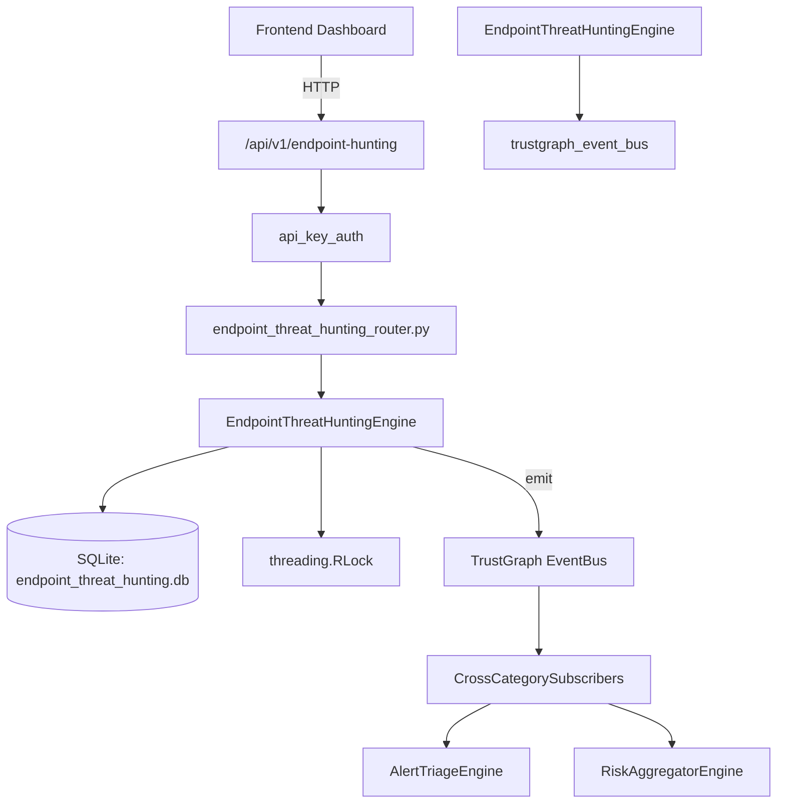

# US-0110: Endpoint Threat Hunting

## Sub-Epic: Advanced
**Master Goal**: ALDECI — $35/mo enterprise security intelligence platform replacing $50K-500K/yr tools

## User Story
As a **James Wilson (Security Engineer)**, I need to enforce endpoint security compliance
so that the platform delivers enterprise-grade advanced capabilities at 1/1000th the cost of legacy tools.

## Why This Matters
Endpoint Threat Hunting replaces functionality found in enterprise tools like CrowdStrike, Wiz, Snyk, and Rapid7.
By building this into ALDECI's $35/mo stack, customers save $50K+/yr on standalone Advanced tooling.

## Architecture

## Current State: 95% Complete
- ✅ `create_hunt()` — Create a new threat hunt campaign. (line 143)
- ✅ `start_hunt()` — Set hunt status to active with started_at timestamp. (line 193)
- ✅ `complete_hunt()` — Mark hunt as completed with endpoint scan count. (line 214)
- ✅ `list_hunts()` — List hunts with optional filters. (line 235)
- ✅ `get_hunt()` — Get a single hunt by ID with org isolation. (line 255)
- ✅ `record_finding()` — Record a threat finding and increment hunt's findings_count. (line 269)
- ❌ TrustGraph event emission — not yet verified

## Key Functions (from `suite-core/core/endpoint_threat_hunting_engine.py` — 466 lines)
- `EndpointThreatHuntingEngine.create_hunt()` — Create a new threat hunt campaign. (line 143)
- `EndpointThreatHuntingEngine.start_hunt()` — Set hunt status to active with started_at timestamp. (line 193)
- `EndpointThreatHuntingEngine.complete_hunt()` — Mark hunt as completed with endpoint scan count. (line 214)
- `EndpointThreatHuntingEngine.list_hunts()` — List hunts with optional filters. (line 235)
- `EndpointThreatHuntingEngine.get_hunt()` — Get a single hunt by ID with org isolation. (line 255)
- `EndpointThreatHuntingEngine.record_finding()` — Record a threat finding and increment hunt's findings_count. (line 269)
- `EndpointThreatHuntingEngine.list_findings()` — List findings with optional filters. (line 315)
- `EndpointThreatHuntingEngine.update_finding_status()` — Update the status of a finding. (line 339)

## Dependencies
- **Depends on**: trustgraph_event_bus
- **Depended by**: Routers, TrustGraph EventBus, CrossCategorySubscribers
- **TrustGraph**: Event emission wired via ResponseInterceptorMiddleware
- **Source file**: `suite-core/core/endpoint_threat_hunting_engine.py` (466 lines)
- **Router file**: `suite-api/apps/api/endpoint_threat_hunting_router.py`

## API Endpoints
| Method | Path | Description |
|--------|------|-------------|
| POST | `/api/v1/endpoint-hunting/hunts` | create hunt |
| GET | `/api/v1/endpoint-hunting/hunts` | list hunts |
| GET | `/api/v1/endpoint-hunting/hunts/{hunt_id}` | get hunt |
| PUT | `/api/v1/endpoint-hunting/hunts/{hunt_id}/start` | start hunt |
| PUT | `/api/v1/endpoint-hunting/hunts/{hunt_id}/complete` | complete hunt |
| POST | `/api/v1/endpoint-hunting/findings` | record finding |
| GET | `/api/v1/endpoint-hunting/findings` | list findings |
| PUT | `/api/v1/endpoint-hunting/findings/{finding_id}/status` | update finding status |
| POST | `/api/v1/endpoint-hunting/iocs` | add ioc |
| GET | `/api/v1/endpoint-hunting/iocs` | list iocs |
| GET | `/api/v1/endpoint-hunting/stats` | get hunting stats |

## Tasks Remaining
1. Verify TrustGraph event emission works end-to-end (2h)
2. Add integration test with real persona workflow (2h)
3. Wire CrossCategorySubscriber consumer chain (1h)
4. Validate with 30-persona walkthrough (1h)
5. Optimize query performance for large datasets (2h)
6. Expand test coverage to edge cases (2h)

## Definition of Done
- [ ] James Wilson (Security Engineer) can access /api/v1/endpoint-hunting and get meaningful data
- [ ] All CRUD operations return correct HTTP status codes
- [ ] TrustGraph receives events from this engine
- [ ] 43+ tests passing in `tests/test_endpoint_threat_hunting_engine.py`
- [ ] 30-persona walkthrough includes this endpoint at 100%
- [ ] No hardcoded org_id — all queries are org-scoped

## Sprint: Wave 45 (est. April 21-23, 2026)

## Test Coverage
- **Test file**: `tests/test_endpoint_threat_hunting_engine.py`
- **Tests**: 43 tests
- **Status**: Passing
