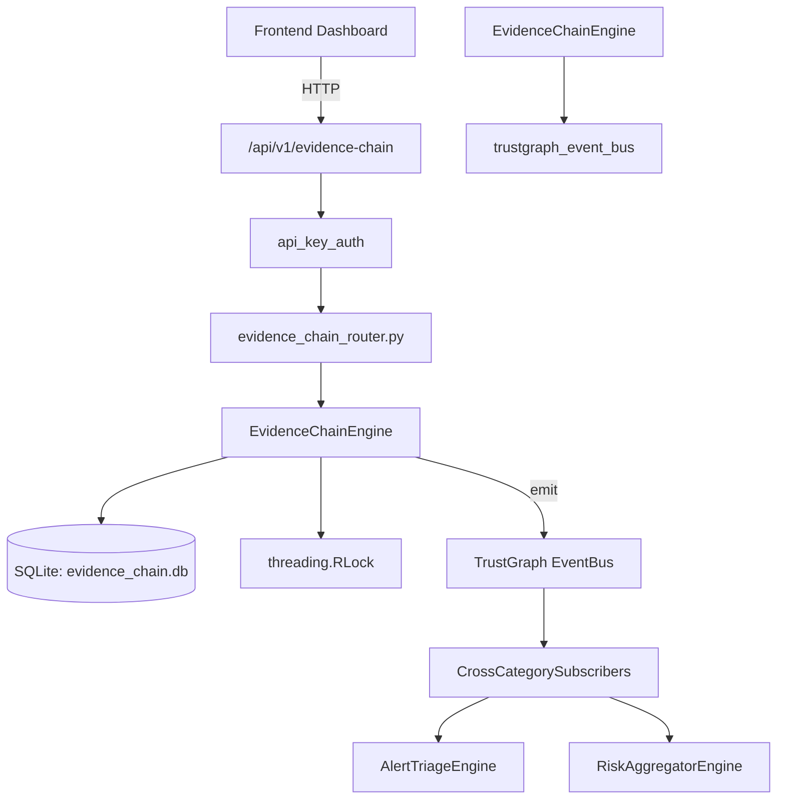

# US-0111: Evidence Chain

## Sub-Epic: GRC
**Master Goal**: ALDECI — $35/mo enterprise security intelligence platform replacing $50K-500K/yr tools

## User Story
As a **Michael Brown (Audit Manager)**, I need to manage evidence chain and vault
so that the platform delivers enterprise-grade grc capabilities at 1/1000th the cost of legacy tools.

## Why This Matters
Evidence Chain replaces functionality found in enterprise tools like CrowdStrike, Wiz, Snyk, and Rapid7.
By building this into ALDECI's $35/mo stack, customers save $50K+/yr on standalone GRC tooling.

## Architecture

## Current State: 95% Complete
- ✅ `create_case()` — Create a new investigation case. (line 135)
- ✅ `list_cases()` — List all cases for an org, optionally filtered by status. (line 181)
- ✅ `close_case()` — Close a case and record its outcome. (line 199)
- ✅ `add_evidence()` — Add an evidence item to a case. (line 222)
- ✅ `list_evidence()` — List all evidence items for a case. (line 268)
- ✅ `transfer_custody()` — Record a custody transfer. Raises ValueError if evidence is sealed. (line 282)
- ❌ TrustGraph event emission — not yet verified

## Key Functions (from `suite-core/core/evidence_chain_engine.py` — 467 lines)
- `EvidenceChainEngine.create_case()` — Create a new investigation case. (line 135)
- `EvidenceChainEngine.list_cases()` — List all cases for an org, optionally filtered by status. (line 181)
- `EvidenceChainEngine.close_case()` — Close a case and record its outcome. (line 199)
- `EvidenceChainEngine.add_evidence()` — Add an evidence item to a case. (line 222)
- `EvidenceChainEngine.list_evidence()` — List all evidence items for a case. (line 268)
- `EvidenceChainEngine.transfer_custody()` — Record a custody transfer. Raises ValueError if evidence is sealed. (line 282)
- `EvidenceChainEngine.get_custody_chain()` — Return the complete custody chain for an evidence item. (line 322)
- `EvidenceChainEngine.seal_evidence()` — Seal evidence, marking it as immutable. (line 366)

## Dependencies
- **Depends on**: trustgraph_event_bus
- **Depended by**: Routers, TrustGraph EventBus, CrossCategorySubscribers
- **TrustGraph**: Event emission wired via ResponseInterceptorMiddleware
- **Source file**: `suite-core/core/evidence_chain_engine.py` (467 lines)
- **Router file**: `suite-api/apps/api/evidence_chain_router.py`

## API Endpoints
| Method | Path | Description |
|--------|------|-------------|
| GET | `/api/v1/evidence-chain/cases` | list cases |
| POST | `/api/v1/evidence-chain/cases` | create case |
| GET | `/api/v1/evidence-chain/cases/{case_id}` | get case |
| POST | `/api/v1/evidence-chain/cases/{case_id}/close` | close case |
| GET | `/api/v1/evidence-chain/cases/{case_id}/evidence` | list evidence |
| POST | `/api/v1/evidence-chain/cases/{case_id}/evidence` | add evidence |
| GET | `/api/v1/evidence-chain/evidence/{evidence_id}/custody` | get custody chain |
| POST | `/api/v1/evidence-chain/evidence/{evidence_id}/custody` | transfer custody |
| POST | `/api/v1/evidence-chain/evidence/{evidence_id}/seal` | seal evidence |
| GET | `/api/v1/evidence-chain/evidence/{evidence_id}/verify` | verify integrity |
| GET | `/api/v1/evidence-chain/stats` | get stats |

## Tasks Remaining
1. Verify TrustGraph event emission works end-to-end (2h)
2. Add integration test with real persona workflow (2h)
3. Wire CrossCategorySubscriber consumer chain (1h)
4. Validate with 30-persona walkthrough (1h)
5. Optimize query performance for large datasets (2h)
6. Expand test coverage to edge cases (2h)

## Definition of Done
- [ ] Michael Brown (Audit Manager) can access /api/v1/evidence-chain and get meaningful data
- [ ] All CRUD operations return correct HTTP status codes
- [ ] TrustGraph receives events from this engine
- [ ] 26+ tests passing in `tests/test_evidence_chain_engine.py`
- [ ] 30-persona walkthrough includes this endpoint at 100%
- [ ] No hardcoded org_id — all queries are org-scoped

## Sprint: Wave 45 (est. April 21-23, 2026)

## Test Coverage
- **Test file**: `tests/test_evidence_chain_engine.py`
- **Tests**: 26 tests
- **Status**: Passing
