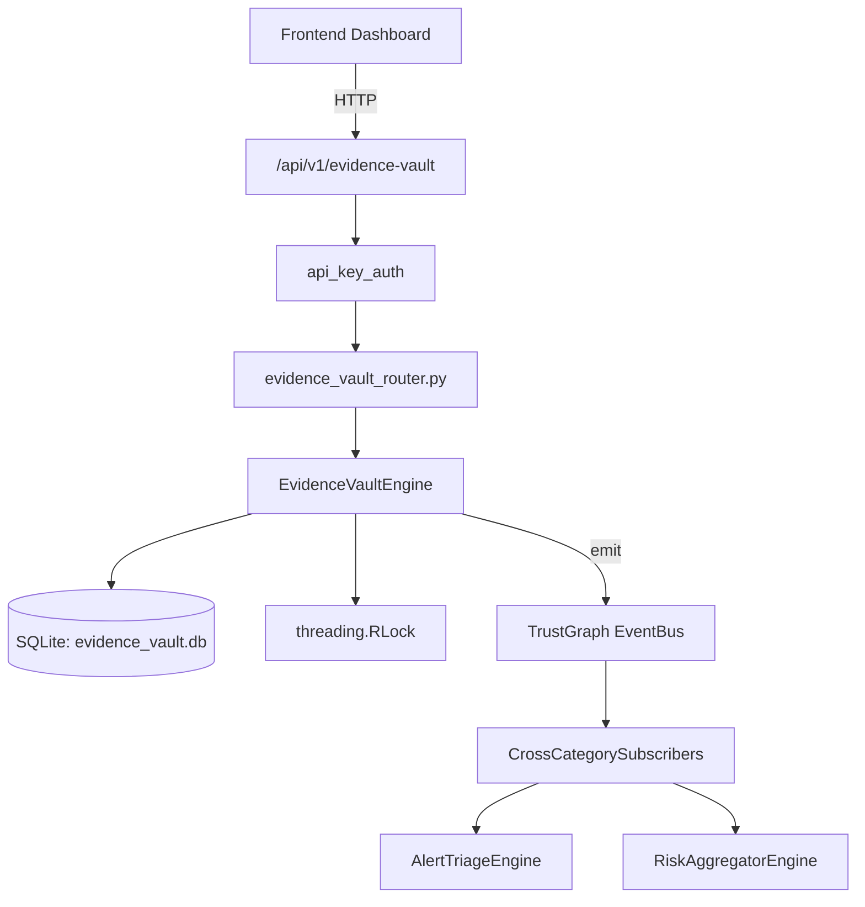

# US-0112: Evidence Vault

## Sub-Epic: GRC
**Master Goal**: ALDECI — $35/mo enterprise security intelligence platform replacing $50K-500K/yr tools

## User Story
As a **Michael Brown (Audit Manager)**, I need to manage evidence chain and vault
so that the platform delivers enterprise-grade grc capabilities at 1/1000th the cost of legacy tools.

## Why This Matters
Evidence Vault replaces functionality found in enterprise tools like CrowdStrike, Wiz, Snyk, and Rapid7.
By building this into ALDECI's $35/mo stack, customers save $50K+/yr on standalone GRC tooling.

## Architecture

## Current State: 95% Complete
- ✅ `store_evidence()` — Store a new compliance evidence artifact. (line 146)
- ✅ `seal_evidence()` — Seal evidence making it immutable. Raises ValueError if already sealed. (line 205)
- ✅ `log_access()` — Log an access event for an evidence item. (line 222)
- ✅ `create_collection()` — Create an evidence collection for an audit. (line 259)
- ✅ `add_to_collection()` — Add an evidence item to a collection. Both must belong to org_id. (line 293)
- ✅ `get_evidence_detail()` — Return evidence details plus last 20 access log entries. (line 339)
- ❌ TrustGraph event emission — not yet verified

## Key Functions (from `suite-core/core/evidence_vault_engine.py` — 452 lines)
- `EvidenceVaultEngine.store_evidence()` — Store a new compliance evidence artifact. (line 146)
- `EvidenceVaultEngine.seal_evidence()` — Seal evidence making it immutable. Raises ValueError if already sealed. (line 205)
- `EvidenceVaultEngine.log_access()` — Log an access event for an evidence item. (line 222)
- `EvidenceVaultEngine.create_collection()` — Create an evidence collection for an audit. (line 259)
- `EvidenceVaultEngine.add_to_collection()` — Add an evidence item to a collection. Both must belong to org_id. (line 293)
- `EvidenceVaultEngine.get_evidence_detail()` — Return evidence details plus last 20 access log entries. (line 339)
- `EvidenceVaultEngine.search_evidence()` — Return filtered evidence list for an org. (line 355)
- `EvidenceVaultEngine.get_vault_summary()` — Return vault statistics for an org. (line 380)

## Dependencies
- **Depends on**: standalone
- **Depended by**: Routers, TrustGraph EventBus, CrossCategorySubscribers
- **TrustGraph**: Event emission wired via ResponseInterceptorMiddleware
- **Source file**: `suite-core/core/evidence_vault_engine.py` (452 lines)
- **Router file**: `suite-api/apps/api/evidence_vault_router.py`

## API Endpoints
| Method | Path | Description |
|--------|------|-------------|
| POST | `/api/v1/evidence-vault/evidence` | store evidence |
| PUT | `/api/v1/evidence-vault/evidence/{evidence_id}/seal` | seal evidence |
| POST | `/api/v1/evidence-vault/evidence/{evidence_id}/access` | log access |
| POST | `/api/v1/evidence-vault/collections` | create collection |
| POST | `/api/v1/evidence-vault/collections/{collection_id}/add-evidence` | add to collection |
| GET | `/api/v1/evidence-vault/evidence/{evidence_id}` | get evidence detail |
| GET | `/api/v1/evidence-vault/search` | search evidence |
| GET | `/api/v1/evidence-vault/summary` | get vault summary |
| POST | `/api/v1/evidence-vault/evidence/{evidence_id}/verify` | verify integrity |

## Tasks Remaining
1. Verify TrustGraph event emission works end-to-end (2h)
2. Add integration test with real persona workflow (2h)
3. Wire CrossCategorySubscriber consumer chain (1h)
4. Validate with 30-persona walkthrough (1h)
5. Optimize query performance for large datasets (2h)
6. Expand test coverage to edge cases (2h)

## Definition of Done
- [ ] Michael Brown (Audit Manager) can access /api/v1/evidence-vault and get meaningful data
- [ ] All CRUD operations return correct HTTP status codes
- [ ] TrustGraph receives events from this engine
- [ ] 34+ tests passing in `tests/test_evidence_vault_engine.py`
- [ ] 30-persona walkthrough includes this endpoint at 100%
- [ ] No hardcoded org_id — all queries are org-scoped

## Sprint: Wave 45 (est. April 21-23, 2026)

## Test Coverage
- **Test file**: `tests/test_evidence_vault_engine.py`
- **Tests**: 34 tests
- **Status**: Passing
