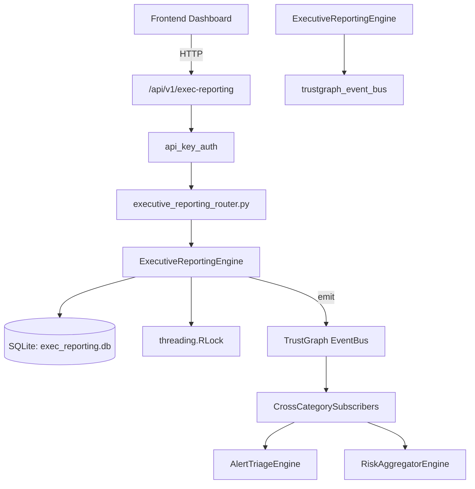

# US-0113: Executive Reporting

## Sub-Epic: Executive
**Master Goal**: ALDECI — $35/mo enterprise security intelligence platform replacing $50K-500K/yr tools

## User Story
As a **Catherine Williams (Board Member)**, I need to generate executive security reports
so that the platform delivers enterprise-grade executive capabilities at 1/1000th the cost of legacy tools.

## Why This Matters
Executive Reporting replaces functionality found in enterprise tools like CrowdStrike, Wiz, Snyk, and Rapid7.
By building this into ALDECI's $35/mo stack, customers save $50K+/yr on standalone Executive tooling.

## Architecture

## Current State: 95% Complete
- ✅ `create_report()` — Create an executive report. (line 164)
- ✅ `list_reports()` — List executive reports with optional filters. (line 206)
- ✅ `get_report()` — Retrieve a report with its metrics. (line 225)
- ✅ `add_metric()` — Add a metric to a report. (line 244)
- ✅ `publish_report()` — Publish a report (draft → published). (line 277)
- ✅ `set_kpi()` — Upsert a KPI. Computes status from value vs target. (line 293)
- ❌ TrustGraph event emission — not yet verified

## Key Functions (from `suite-core/core/executive_reporting_engine.py` — 529 lines)
- `ExecutiveReportingEngine.create_report()` — Create an executive report. (line 164)
- `ExecutiveReportingEngine.list_reports()` — List executive reports with optional filters. (line 206)
- `ExecutiveReportingEngine.get_report()` — Retrieve a report with its metrics. (line 225)
- `ExecutiveReportingEngine.add_metric()` — Add a metric to a report. (line 244)
- `ExecutiveReportingEngine.publish_report()` — Publish a report (draft → published). (line 277)
- `ExecutiveReportingEngine.set_kpi()` — Upsert a KPI. Computes status from value vs target. (line 293)
- `ExecutiveReportingEngine.list_kpis()` — List all KPIs for org. (line 361)
- `ExecutiveReportingEngine.get_kpi()` — Get a single KPI by name. (line 369)

## Dependencies
- **Depends on**: trustgraph_event_bus
- **Depended by**: Routers, TrustGraph EventBus, CrossCategorySubscribers
- **TrustGraph**: Event emission wired via ResponseInterceptorMiddleware
- **Source file**: `suite-core/core/executive_reporting_engine.py` (529 lines)
- **Router file**: `suite-api/apps/api/executive_reporting_router.py`

## API Endpoints
| Method | Path | Description |
|--------|------|-------------|
| POST | `/api/v1/exec-reporting/reports` | create report |
| GET | `/api/v1/exec-reporting/reports` | list reports |
| GET | `/api/v1/exec-reporting/reports/{report_id}` | get report |
| POST | `/api/v1/exec-reporting/reports/{report_id}/metrics` | add metric |
| POST | `/api/v1/exec-reporting/reports/{report_id}/publish` | publish report |
| POST | `/api/v1/exec-reporting/kpis` | set kpi |
| GET | `/api/v1/exec-reporting/kpis` | list kpis |
| GET | `/api/v1/exec-reporting/kpis/{kpi_name}` | get kpi |
| POST | `/api/v1/exec-reporting/board-presentations` | create board presentation |
| GET | `/api/v1/exec-reporting/board-presentations` | list board presentations |
| GET | `/api/v1/exec-reporting/summary` | get exec summary |
| GET | `/api/v1/exec-reporting/context/{entity_id}` | get trustgraph context |

## Tasks Remaining
1. Verify TrustGraph event emission works end-to-end (2h)
2. Add integration test with real persona workflow (2h)
3. Wire CrossCategorySubscriber consumer chain (1h)
4. Validate with 30-persona walkthrough (1h)
5. Optimize query performance for large datasets (2h)
6. Expand test coverage to edge cases (2h)

## Definition of Done
- [ ] Catherine Williams (Board Member) can access /api/v1/exec-reporting and get meaningful data
- [ ] All CRUD operations return correct HTTP status codes
- [ ] TrustGraph receives events from this engine
- [ ] 33+ tests passing in `tests/test_executive_reporting_engine.py`
- [ ] 30-persona walkthrough includes this endpoint at 100%
- [ ] No hardcoded org_id — all queries are org-scoped

## Sprint: Wave 45 (est. April 21-23, 2026)

## Test Coverage
- **Test file**: `tests/test_executive_reporting_engine.py`
- **Tests**: 33 tests
- **Status**: Passing
