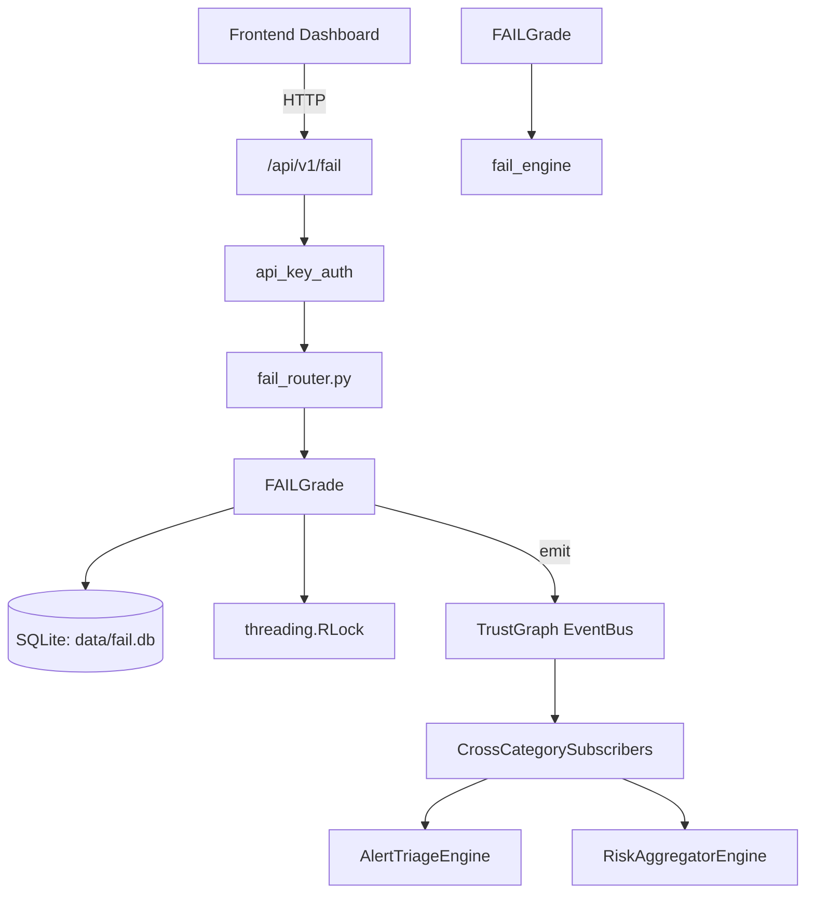

# US-0114: Fail

## Sub-Epic: Advanced
**Master Goal**: ALDECI — $35/mo enterprise security intelligence platform replacing $50K-500K/yr tools

## User Story
As a **Ryan Murphy (Platform Engineer)**, I need to manage failure detection and recovery
so that the platform delivers enterprise-grade advanced capabilities at 1/1000th the cost of legacy tools.

## Why This Matters
Fail replaces functionality found in enterprise tools like CrowdStrike, Wiz, Snyk, and Rapid7.
By building this into ALDECI's $35/mo stack, customers save $50K+/yr on standalone Advanced tooling.

## Architecture

## Current State: 85% Complete
- ✅ `to_dict()` — Serialise to dictionary for API responses. (line 215)
- ✅ `score()` — Compute the FAIL score for a single finding. (line 303)
- ✅ `score_batch()` — Score multiple findings. (line 360)
- ✅ `history()` — Return scoring history. (line 365)
- ✅ `compare()` — Compare two FAIL results for prioritisation. (line 686)
- ✅ `rank()` — Rank FAIL results from highest to lowest score. (line 695)
- ❌ No test file found — needs test coverage
- ❌ TrustGraph event emission — not yet verified

## Key Functions (from `suite-core/core/fail_engine.py` — 718 lines)
- `FAILResult.to_dict()` — Serialise to dictionary for API responses. (line 215)
- `FAILEngine.score()` — Compute the FAIL score for a single finding. (line 303)
- `FAILEngine.score_batch()` — Score multiple findings. (line 360)
- `FAILEngine.history()` — Return scoring history. (line 365)
- `FAILEngine.compare()` — Compare two FAIL results for prioritisation. (line 686)
- `FAILEngine.rank()` — Rank FAIL results from highest to lowest score. (line 695)
- `FAILEngine.stats()` — Return statistics from scoring history. (line 699)

## Dependencies
- **Depends on**: fail_engine
- **Depended by**: Routers, TrustGraph EventBus, CrossCategorySubscribers
- **TrustGraph**: Event emission wired via ResponseInterceptorMiddleware
- **Source file**: `suite-core/core/fail_engine.py` (718 lines)
- **Router file**: `suite-api/apps/api/fail_router.py`

## API Endpoints
| Method | Path | Description |
|--------|------|-------------|
| POST | `/api/v1/fail/inject` | inject vulnerability |
| GET | `/api/v1/fail/drills` | list drills |
| GET | `/api/v1/fail/drills/{drill_id}` | get drill |
| POST | `/api/v1/fail/drills/{drill_id}/detect` | mark detected |
| POST | `/api/v1/fail/drills/{drill_id}/triage` | mark triaged |
| POST | `/api/v1/fail/drills/{drill_id}/remediate` | mark remediated |
| POST | `/api/v1/fail/drills/{drill_id}/grade` | grade drill |
| DELETE | `/api/v1/fail/drills/{drill_id}` | cancel drill |
| GET | `/api/v1/fail/neglect-zones` | get neglect zones |
| GET | `/api/v1/fail/readiness-score` | get readiness score |
| GET | `/api/v1/fail/readiness` | get readiness score |
| GET | `/api/v1/fail/comparison` | get comparison |

## Tasks Remaining
1. Verify TrustGraph event emission works end-to-end (2h)
2. Add integration test with real persona workflow (2h)
3. Wire CrossCategorySubscriber consumer chain (1h)
4. Validate with 30-persona walkthrough (1h)
5. Optimize query performance for large datasets (2h)
6. Write unit tests (4h)

## Definition of Done
- [ ] Ryan Murphy (Platform Engineer) can access /api/v1/fail and get meaningful data
- [ ] All CRUD operations return correct HTTP status codes
- [ ] TrustGraph receives events from this engine
- [ ] 20+ tests passing in `tests/test_fail_engine.py`
- [ ] 30-persona walkthrough includes this endpoint at 100%
- [ ] No hardcoded org_id — all queries are org-scoped

## Sprint: Wave 45 (est. April 21-23, 2026)

## Test Coverage
- **Test file**: `tests/test_fail_engine.py`
- **Tests**: 0 tests
- **Status**: Needs coverage
