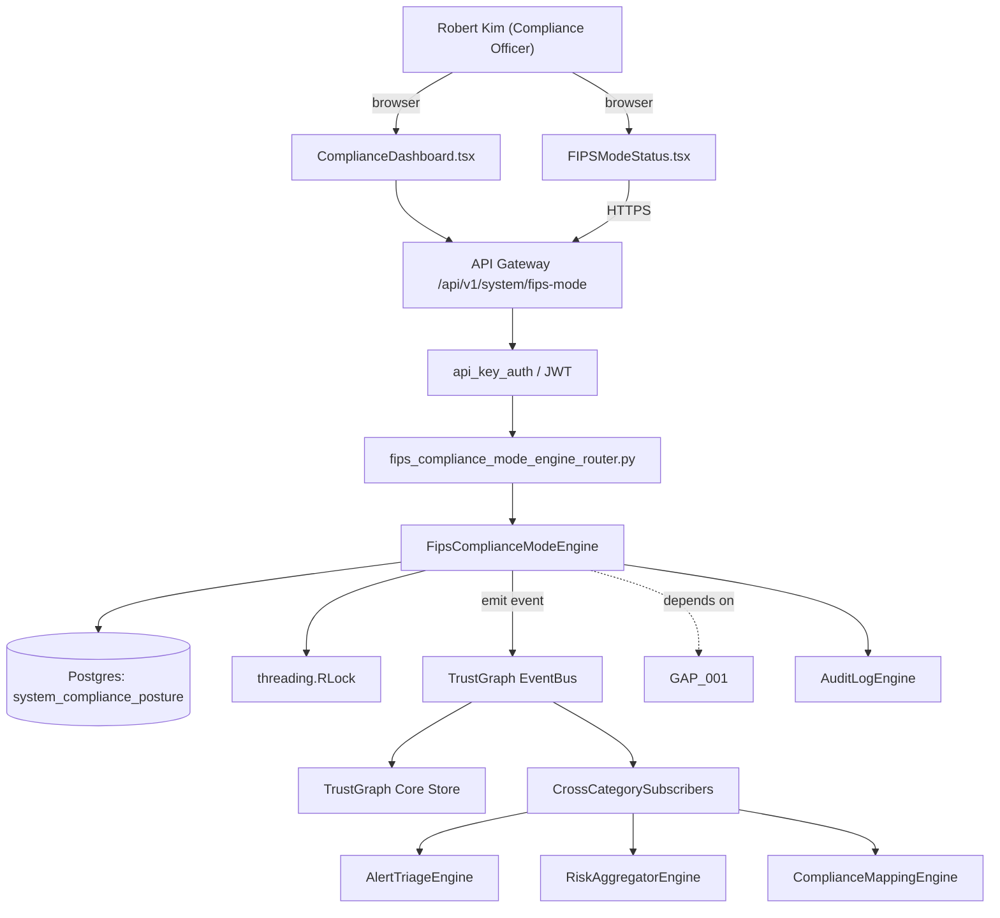

# US-0042: Add FIPS-140 crypto mode + FedRAMP/IL deployment profile

## Sub-Epic: Compliance
**Master Goal**: ALDECI — tiered $199-$1,499/mo enterprise security intelligence platform replacing $50K-$500K/yr tools

## User Story
As a **Robert Kim (Compliance Officer)**, I need to add FIPS-140 crypto mode + FedRAMP/IL deployment profile so that Fixops satisfies SOC2, NIST SP 800-53, FedRAMP, and FIPS-140 controls customers ask for in procurement.

## Why This Matters
Per competitor-sonatype.md §0 and competitor-aspm.md §3, Veracode's regulated-industry presence and Sonatype SAGE target federal/classified. Without a FIPS mode artifact, Fixops fails federal RFPs. Ship a mode flag that forces FIPS-validated crypto providers + signed boot + hardened defaults.

This work is called out as a P0 gap in `competitor-aspm.md, competitor-sonatype.md`. Shipping it is load-bearing for ALDECI's tiered $199-$1,499/mo positioning against $50K-$500K/yr incumbents: every delayed gap becomes a displacement deal we lose.

## Architecture

## Current State: 0% — MISSING (new engine)
- [ ] Engine module `suite-core/core/fips_compliance_mode_engine.py` does not exist yet
- [ ] Router `suite-api/apps/api/fips_compliance_mode_engine_router.py` does not exist yet
- [ ] DB tables listed under Data Model do not exist yet
- [ ] Frontend screens listed under Key Functions do not exist yet
- [ ] No TrustGraph events emitted yet

## Key Functions
**Backend (engine methods):**
- `get_fips_mode()` — backs `GET /api/v1/system/fips-mode`
- `get_compliance_posture()` — backs `GET /api/v1/system/compliance-posture`
- `create_fips_self_test()` — backs `POST /api/v1/system/fips-self-test`

**Frontend screens:**
- `FIPSModeStatus.tsx` — operator-facing UI surface for this gap
- `ComplianceDashboard.tsx` — operator-facing UI surface for this gap

## API Endpoints
| Method | Path | Auth | Purpose |
|--------|------|------|---------|
| GET | `/api/v1/system/fips-mode` | api_key_auth | system fips mode |
| GET | `/api/v1/system/compliance-posture` | api_key_auth | system compliance posture |
| POST | `/api/v1/system/fips-self-test` | api_key_auth | system fips self test |

## Data Model
- add system_compliance_posture table: id, mode, fips_enabled, fedramp_profile, last_self_test_at, attestation_hash

## Dependencies
**Depends on**: GAP-001
**Depended by**: Router layer, TrustGraph EventBus, CrossCategorySubscribers, CrossCategoryEvidenceBuilder, AuditLogEngine
**New engine module**: `suite-core/core/fips_compliance_mode_engine.py`
**New router module**: `suite-api/apps/api/fips_compliance_mode_engine_router.py`
**Master gap id**: `GAP-042` (priority P0, effort L)

## Tasks Remaining
1. Schema migration: add system_compliance_posture table (4h)
2. Implement endpoint GET /api/v1/system/fips-mode (6h)
3. Implement endpoint GET /api/v1/system/compliance-posture (6h)
4. Implement endpoint POST /api/v1/system/fips-self-test (6h)
5. Wire frontend screen FIPSModeStatus.tsx (5h)
6. Wire frontend screen ComplianceDashboard.tsx (5h)
7. Write 4 pytest cases: test_fips_mode_refuses_non_validated_libs, test_fips_mode_refuses_weak_tls_cipher… (6h)
8. Wire TrustGraph event emission + CrossCategorySubscriber consumers (4h)
9. Persona walkthrough + integration test (3h)
10. Docs + API reference update (2h)

## Definition of Done
- [ ] Given `FIPS_MODE=true` at startup, When the server boots, Then it loads only FIPS-validated crypto libs and refuses to start if non-validated algorithms are enabled.
- [ ] Given FIPSModeStatus.tsx, When viewed, Then it shows mode=on, validated-libs list, self-test result (pass/fail), and last self-test time.
- [ ] Given FIPS mode is on, When a client uses a non-compliant TLS cipher, Then the connection is refused.
- [ ] Given the FedRAMP Moderate profile, When applied, Then all required hardening (MFA-required admins, password policy, audit retention >= 90d, session timeout) is enforced and a compliance-posture report is exportable.
- [ ] Given the self-test CLI, When run, Then it produces a signed attestation file confirming FIPS + FedRAMP hardening state.
- [ ] All endpoints are org-scoped (no hardcoded org_id) and gated by `api_key_auth`.
- [ ] TrustGraph emits at least one event type for this engine and a CrossCategorySubscriber consumes it.
- [ ] `Robert Kim (Compliance Officer)` can execute the full workflow in the 30-persona walkthrough.

## Tests Required
- `test_fips_mode_refuses_non_validated_libs`
- `test_fips_mode_refuses_weak_tls_cipher`
- `test_fedramp_hardening_enforced`
- `test_self_test_signed_attestation`

## Sprint: Wave 45 (est. May 06-May 12, 2026)

## Citation
Source research: `competitor-aspm.md, competitor-sonatype.md` (gap `GAP-042`, priority `P0`, effort `L`)
