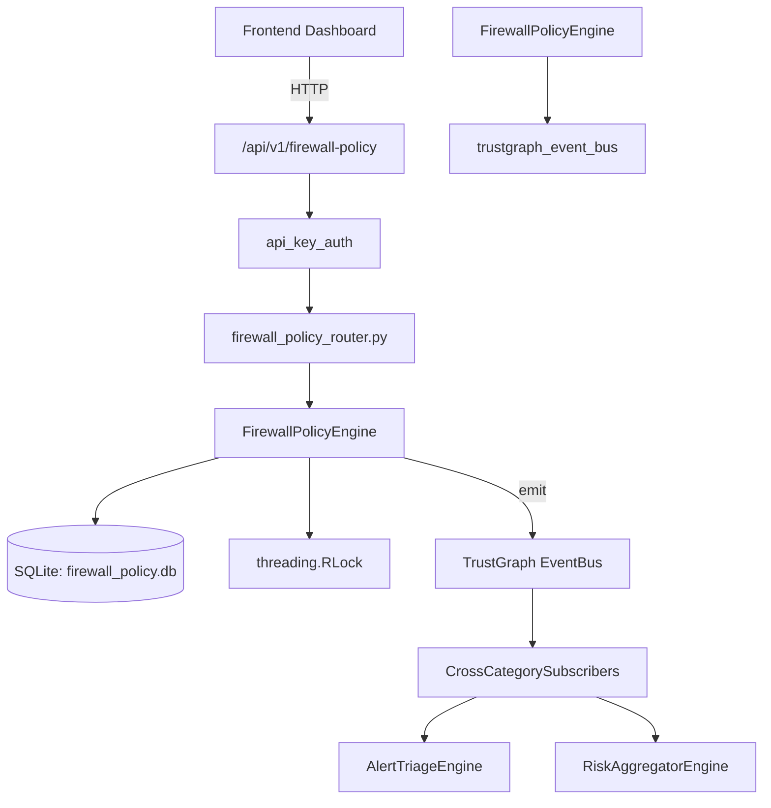

# US-0116: Firewall Policy

## Sub-Epic: Network
**Master Goal**: ALDECI — $35/mo enterprise security intelligence platform replacing $50K-500K/yr tools

## User Story
As a **James Wilson (Security Engineer)**, I need to manage firewall rules and policies
so that the platform delivers enterprise-grade network capabilities at 1/1000th the cost of legacy tools.

## Why This Matters
Firewall Policy replaces functionality found in enterprise tools like CrowdStrike, Wiz, Snyk, and Rapid7.
By building this into ALDECI's $35/mo stack, customers save $50K+/yr on standalone Network tooling.

## Architecture

## Current State: 95% Complete
- ✅ `register_firewall()` — Register a new firewall device. (line 128)
- ✅ `list_firewalls()` — List all firewalls for the org. (line 166)
- ✅ `add_rule()` — Add a firewall rule. (line 179)
- ✅ `list_rules()` — List rules for a firewall, optionally filtered by action. (line 245)
- ✅ `find_conflicting_rules()` — Detect rules that shadow or conflict with earlier rules. (line 267)
- ✅ `find_unused_rules()` — Return enabled rules with hit_count=0. (line 324)
- ❌ TrustGraph event emission — not yet verified

## Key Functions (from `suite-core/core/firewall_policy_engine.py` — 461 lines)
- `FirewallPolicyEngine.register_firewall()` — Register a new firewall device. (line 128)
- `FirewallPolicyEngine.list_firewalls()` — List all firewalls for the org. (line 166)
- `FirewallPolicyEngine.add_rule()` — Add a firewall rule. (line 179)
- `FirewallPolicyEngine.list_rules()` — List rules for a firewall, optionally filtered by action. (line 245)
- `FirewallPolicyEngine.find_conflicting_rules()` — Detect rules that shadow or conflict with earlier rules. (line 267)
- `FirewallPolicyEngine.find_unused_rules()` — Return enabled rules with hit_count=0. (line 324)
- `FirewallPolicyEngine.analyze_coverage_gaps()` — Identify coverage gaps and risky configurations. (line 356)
- `FirewallPolicyEngine.get_firewall_stats()` — Return aggregated stats for all firewalls in the org. (line 426)

## Dependencies
- **Depends on**: trustgraph_event_bus
- **Depended by**: Routers, TrustGraph EventBus, CrossCategorySubscribers
- **TrustGraph**: Event emission wired via ResponseInterceptorMiddleware
- **Source file**: `suite-core/core/firewall_policy_engine.py` (461 lines)
- **Router file**: `suite-api/apps/api/firewall_policy_router.py`

## API Endpoints
| Method | Path | Description |
|--------|------|-------------|
| POST | `/api/v1/firewall-policy/firewalls` | register firewall |
| GET | `/api/v1/firewall-policy/firewalls` | list firewalls |
| POST | `/api/v1/firewall-policy/firewalls/{firewall_id}/rules` | add rule |
| GET | `/api/v1/firewall-policy/firewalls/{firewall_id}/rules` | list rules |
| GET | `/api/v1/firewall-policy/firewalls/{firewall_id}/conflicts` | find conflicting rules |
| GET | `/api/v1/firewall-policy/firewalls/{firewall_id}/unused` | find unused rules |
| GET | `/api/v1/firewall-policy/firewalls/{firewall_id}/gaps` | analyze coverage gaps |
| GET | `/api/v1/firewall-policy/stats` | get firewall stats |

## Tasks Remaining
1. Verify TrustGraph event emission works end-to-end (2h)
2. Add integration test with real persona workflow (2h)
3. Wire CrossCategorySubscriber consumer chain (1h)
4. Validate with 30-persona walkthrough (1h)
5. Optimize query performance for large datasets (2h)
6. Expand test coverage to edge cases (2h)

## Definition of Done
- [ ] James Wilson (Security Engineer) can access /api/v1/firewall-policy and get meaningful data
- [ ] All CRUD operations return correct HTTP status codes
- [ ] TrustGraph receives events from this engine
- [ ] 31+ tests passing in `tests/test_firewall_policy_engine.py`
- [ ] 30-persona walkthrough includes this endpoint at 100%
- [ ] No hardcoded org_id — all queries are org-scoped

## Sprint: Wave 45 (est. April 21-23, 2026)

## Test Coverage
- **Test file**: `tests/test_firewall_policy_engine.py`
- **Tests**: 31 tests
- **Status**: Passing
