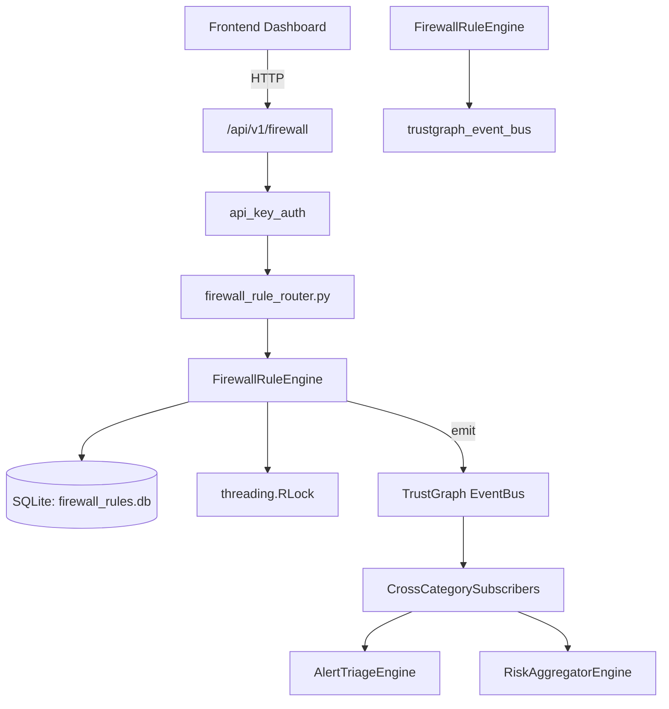

# US-0117: Firewall Rule

## Sub-Epic: Network
**Master Goal**: ALDECI — $35/mo enterprise security intelligence platform replacing $50K-500K/yr tools

## User Story
As a **James Wilson (Security Engineer)**, I need to manage firewall rules and policies
so that the platform delivers enterprise-grade network capabilities at 1/1000th the cost of legacy tools.

## Why This Matters
Firewall Rule replaces functionality found in enterprise tools like CrowdStrike, Wiz, Snyk, and Rapid7.
By building this into ALDECI's $35/mo stack, customers save $50K+/yr on standalone Network tooling.

## Architecture

## Current State: 95% Complete
- ✅ `add_firewall()` — Add a firewall to inventory and return the record. (line 174)
- ✅ `list_firewalls()` — Return all firewalls for an org. (line 225)
- ✅ `get_firewall()` — Fetch a single firewall scoped to org. (line 239)
- ✅ `add_rule()` — Add a firewall rule and return the record. (line 256)
- ✅ `list_rules()` — Return rules for an org, optionally filtered by firewall. (line 316)
- ✅ `analyze_rules()` — Analyze all rules for a firewall and return findings. (line 347)
- ❌ TrustGraph event emission — not yet verified

## Key Functions (from `suite-core/core/firewall_rule_engine.py` — 661 lines)
- `FirewallRuleEngine.add_firewall()` — Add a firewall to inventory and return the record. (line 174)
- `FirewallRuleEngine.list_firewalls()` — Return all firewalls for an org. (line 225)
- `FirewallRuleEngine.get_firewall()` — Fetch a single firewall scoped to org. (line 239)
- `FirewallRuleEngine.add_rule()` — Add a firewall rule and return the record. (line 256)
- `FirewallRuleEngine.list_rules()` — Return rules for an org, optionally filtered by firewall. (line 316)
- `FirewallRuleEngine.analyze_rules()` — Analyze all rules for a firewall and return findings. (line 347)
- `FirewallRuleEngine.create_finding()` — Manually create a finding and return the record. (line 516)
- `FirewallRuleEngine.list_findings()` — Return findings for an org with optional filters. (line 564)

## Dependencies
- **Depends on**: trustgraph_event_bus
- **Depended by**: Routers, TrustGraph EventBus, CrossCategorySubscribers
- **TrustGraph**: Event emission wired via ResponseInterceptorMiddleware
- **Source file**: `suite-core/core/firewall_rule_engine.py` (661 lines)
- **Router file**: `suite-api/apps/api/firewall_rule_router.py`

## API Endpoints
| Method | Path | Description |
|--------|------|-------------|
| POST | `/api/v1/firewall/firewalls` | add firewall |
| GET | `/api/v1/firewall/firewalls` | list firewalls |
| GET | `/api/v1/firewall/firewalls/{firewall_id}` | get firewall |
| POST | `/api/v1/firewall/firewalls/{firewall_id}/analyze` | analyze rules |
| GET | `/api/v1/firewall/rules` | list rules |
| POST | `/api/v1/firewall/rules` | add rule |
| GET | `/api/v1/firewall/findings` | list findings |
| POST | `/api/v1/firewall/findings` | create finding |
| POST | `/api/v1/firewall/findings/{finding_id}/resolve` | resolve finding |
| GET | `/api/v1/firewall/stats` | get firewall stats |

## Tasks Remaining
1. Verify TrustGraph event emission works end-to-end (2h)
2. Add integration test with real persona workflow (2h)
3. Wire CrossCategorySubscriber consumer chain (1h)
4. Validate with 30-persona walkthrough (1h)
5. Optimize query performance for large datasets (2h)
6. Expand test coverage to edge cases (2h)

## Definition of Done
- [ ] James Wilson (Security Engineer) can access /api/v1/firewall and get meaningful data
- [ ] All CRUD operations return correct HTTP status codes
- [ ] TrustGraph receives events from this engine
- [ ] 36+ tests passing in `tests/test_firewall_rule_engine.py`
- [ ] 30-persona walkthrough includes this endpoint at 100%
- [ ] No hardcoded org_id — all queries are org-scoped

## Sprint: Wave 45 (est. April 21-23, 2026)

## Test Coverage
- **Test file**: `tests/test_firewall_rule_engine.py`
- **Tests**: 36 tests
- **Status**: Passing
