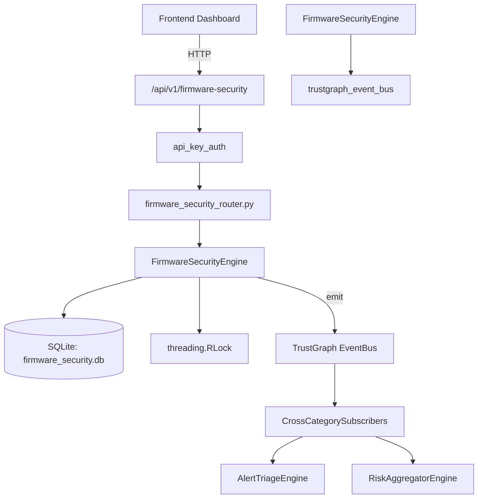

# US-0118: Firmware Security

## Sub-Epic: Advanced
**Master Goal**: ALDECI — $35/mo enterprise security intelligence platform replacing $50K-500K/yr tools

## User Story
As a **James Wilson (Security Engineer)**, I need to scan firmware for vulnerabilities
so that the platform delivers enterprise-grade advanced capabilities at 1/1000th the cost of legacy tools.

## Why This Matters
Firmware Security replaces functionality found in enterprise tools like CrowdStrike, Wiz, Snyk, and Rapid7.
By building this into ALDECI's $35/mo stack, customers save $50K+/yr on standalone Advanced tooling.

## Architecture

## Current State: 95% Complete
- ✅ `register_device()` — Register a new firmware device. Returns the created record. (line 153)
- ✅ `list_devices()` — List devices for an org, with optional filters. (line 211)
- ✅ `get_device()` — Get a single device by ID with org isolation. (line 231)
- ✅ `record_vulnerability()` — Record a firmware vulnerability. Returns the created record. (line 244)
- ✅ `list_vulnerabilities()` — List vulnerabilities for an org, with optional filters. (line 296)
- ✅ `create_scan()` — Create a firmware scan job. Returns the created record. (line 324)
- ❌ TrustGraph event emission — not yet verified

## Key Functions (from `suite-core/core/firmware_security_engine.py` — 476 lines)
- `FirmwareSecurityEngine.register_device()` — Register a new firmware device. Returns the created record. (line 153)
- `FirmwareSecurityEngine.list_devices()` — List devices for an org, with optional filters. (line 211)
- `FirmwareSecurityEngine.get_device()` — Get a single device by ID with org isolation. (line 231)
- `FirmwareSecurityEngine.record_vulnerability()` — Record a firmware vulnerability. Returns the created record. (line 244)
- `FirmwareSecurityEngine.list_vulnerabilities()` — List vulnerabilities for an org, with optional filters. (line 296)
- `FirmwareSecurityEngine.create_scan()` — Create a firmware scan job. Returns the created record. (line 324)
- `FirmwareSecurityEngine.complete_scan()` — Mark scan completed and update device.last_scanned. Returns updated scan or None (line 359)
- `FirmwareSecurityEngine.list_scans()` — List scans for an org, with optional filters. (line 399)

## Dependencies
- **Depends on**: trustgraph_event_bus
- **Depended by**: Routers, TrustGraph EventBus, CrossCategorySubscribers
- **TrustGraph**: Event emission wired via ResponseInterceptorMiddleware
- **Source file**: `suite-core/core/firmware_security_engine.py` (476 lines)
- **Router file**: `suite-api/apps/api/firmware_security_router.py`

## API Endpoints
| Method | Path | Description |
|--------|------|-------------|
| POST | `/api/v1/firmware-security/devices` | register device |
| GET | `/api/v1/firmware-security/devices` | list devices |
| GET | `/api/v1/firmware-security/devices/{device_id}` | get device |
| POST | `/api/v1/firmware-security/vulnerabilities` | record vulnerability |
| GET | `/api/v1/firmware-security/vulnerabilities` | list vulnerabilities |
| POST | `/api/v1/firmware-security/scans` | create scan |
| PUT | `/api/v1/firmware-security/scans/{scan_id}/complete` | complete scan |
| GET | `/api/v1/firmware-security/scans` | list scans |
| GET | `/api/v1/firmware-security/stats` | get firmware stats |

## Tasks Remaining
1. Verify TrustGraph event emission works end-to-end (2h)
2. Add integration test with real persona workflow (2h)
3. Wire CrossCategorySubscriber consumer chain (1h)
4. Validate with 30-persona walkthrough (1h)
5. Optimize query performance for large datasets (2h)
6. Expand test coverage to edge cases (2h)

## Definition of Done
- [ ] James Wilson (Security Engineer) can access /api/v1/firmware-security and get meaningful data
- [ ] All CRUD operations return correct HTTP status codes
- [ ] TrustGraph receives events from this engine
- [ ] 43+ tests passing in `tests/test_firmware_security_engine.py`
- [ ] 30-persona walkthrough includes this endpoint at 100%
- [ ] No hardcoded org_id — all queries are org-scoped

## Sprint: Wave 45 (est. April 21-23, 2026)

## Test Coverage
- **Test file**: `tests/test_firmware_security_engine.py`
- **Tests**: 43 tests
- **Status**: Passing
