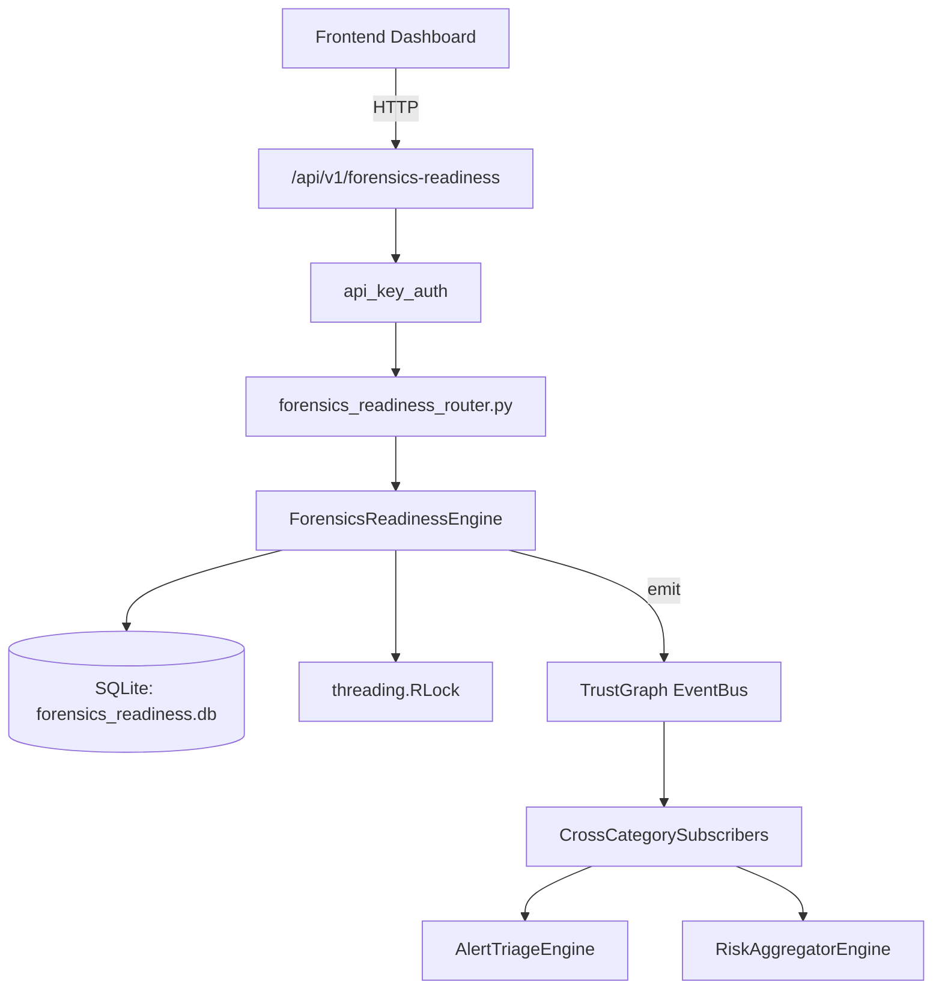

# US-0119: Forensics Readiness

## Sub-Epic: Advanced
**Master Goal**: ALDECI — $35/mo enterprise security intelligence platform replacing $50K-500K/yr tools

## User Story
As a **Karen Taylor (IR Lead)**, I need to maintain forensic readiness
so that the platform delivers enterprise-grade advanced capabilities at 1/1000th the cost of legacy tools.

## Why This Matters
Forensics Readiness replaces functionality found in enterprise tools like CrowdStrike, Wiz, Snyk, and Rapid7.
By building this into ALDECI's $35/mo stack, customers save $50K+/yr on standalone Advanced tooling.

## Architecture

## Current State: 95% Complete
- ✅ `register_evidence_source()` — Register an evidence source. (line 124)
- ✅ `list_evidence_sources()` — Return evidence sources for the org, optionally filtered by source_type. (line 178)
- ✅ `assess_readiness()` — Assess the forensic readiness of an evidence source. (line 197)
- ✅ `create_collection_plan()` — Create a forensic collection plan. (line 244)
- ✅ `execute_collection_plan()` — Mark a collection plan as executing. (line 304)
- ✅ `complete_collection_plan()` — Mark a collection plan as completed. (line 332)
- ❌ TrustGraph event emission — not yet verified

## Key Functions (from `suite-core/core/forensics_readiness_engine.py` — 436 lines)
- `ForensicsReadinessEngine.register_evidence_source()` — Register an evidence source. (line 124)
- `ForensicsReadinessEngine.list_evidence_sources()` — Return evidence sources for the org, optionally filtered by source_type. (line 178)
- `ForensicsReadinessEngine.assess_readiness()` — Assess the forensic readiness of an evidence source. (line 197)
- `ForensicsReadinessEngine.create_collection_plan()` — Create a forensic collection plan. (line 244)
- `ForensicsReadinessEngine.execute_collection_plan()` — Mark a collection plan as executing. (line 304)
- `ForensicsReadinessEngine.complete_collection_plan()` — Mark a collection plan as completed. (line 332)
- `ForensicsReadinessEngine.get_readiness_stats()` — Return aggregate forensics readiness statistics for the org. (line 374)

## Dependencies
- **Depends on**: standalone
- **Depended by**: Routers, TrustGraph EventBus, CrossCategorySubscribers
- **TrustGraph**: Event emission wired via ResponseInterceptorMiddleware
- **Source file**: `suite-core/core/forensics_readiness_engine.py` (436 lines)
- **Router file**: `suite-api/apps/api/forensics_readiness_router.py`

## API Endpoints
| Method | Path | Description |
|--------|------|-------------|
| POST | `/api/v1/forensics-readiness/sources` | register evidence source |
| GET | `/api/v1/forensics-readiness/sources` | list evidence sources |
| POST | `/api/v1/forensics-readiness/sources/{source_id}/assess` | assess readiness |
| POST | `/api/v1/forensics-readiness/plans` | create collection plan |
| PUT | `/api/v1/forensics-readiness/plans/{plan_id}/execute` | execute collection plan |
| PUT | `/api/v1/forensics-readiness/plans/{plan_id}/complete` | complete collection plan |
| GET | `/api/v1/forensics-readiness/stats` | get readiness stats |

## Tasks Remaining
1. Verify TrustGraph event emission works end-to-end (2h)
2. Add integration test with real persona workflow (2h)
3. Wire CrossCategorySubscriber consumer chain (1h)
4. Validate with 30-persona walkthrough (1h)
5. Optimize query performance for large datasets (2h)
6. Expand test coverage to edge cases (2h)

## Definition of Done
- [ ] Karen Taylor (IR Lead) can access /api/v1/forensics-readiness and get meaningful data
- [ ] All CRUD operations return correct HTTP status codes
- [ ] TrustGraph receives events from this engine
- [ ] 57+ tests passing in `tests/test_forensics_readiness_engine.py`
- [ ] 30-persona walkthrough includes this endpoint at 100%
- [ ] No hardcoded org_id — all queries are org-scoped

## Sprint: Wave 45 (est. April 21-23, 2026)

## Test Coverage
- **Test file**: `tests/test_forensics_readiness_engine.py`
- **Tests**: 57 tests
- **Status**: Passing
