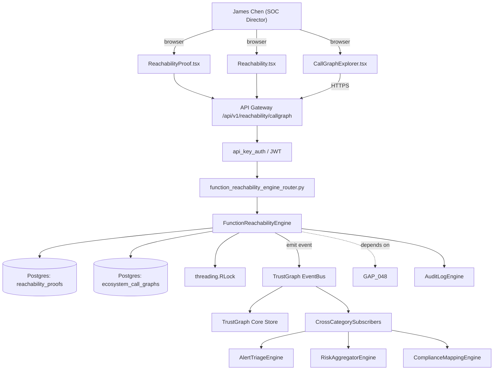

# US-0010: Add function-level reachability via pre-computed call graphs joined with transitive dependencies

## Sub-Epic: Graph/Reachability
**Master Goal**: ALDECI — tiered $199-$1,499/mo enterprise security intelligence platform replacing $50K-$500K/yr tools

## User Story
As a **James Chen (SOC Director)**, I need to add function-level reachability via pre-computed call graphs joined with transitive dependencies so that reachability-driven prioritization cuts false-positive noise and wins AppSec POCs.

## Why This Matters
Per competitor-emerging.md §2, Endor's 97% noise-reduction claim rests on pre-computed static call graphs for OSS packages joined to app call graphs at scan time. Start with Java, then JavaScript/TypeScript, then Python. Extend `security_dependency_mapping` with per-function reachability edges.

This work is called out as a P1 gap in `competitor-emerging.md`. Shipping it is load-bearing for ALDECI's tiered $199-$1,499/mo positioning against $50K-$500K/yr incumbents: every delayed gap becomes a displacement deal we lose.

## Architecture

## Current State: 0% — MISSING (new engine)
- [ ] Engine module `suite-core/core/function_reachability_engine.py` does not exist yet
- [ ] Router `suite-api/apps/api/function_reachability_engine_router.py` does not exist yet
- [ ] DB tables listed under Data Model do not exist yet
- [ ] Frontend screens listed under Key Functions do not exist yet
- [ ] No TrustGraph events emitted yet

## Key Functions
**Backend (engine methods):**
- `create_callgraph()` — backs `POST /api/v1/reachability/callgraph`
- `get_proof()` — backs `GET /api/v1/reachability/{finding_id}/proof`
- `create_sync()` — backs `POST /api/v1/reachability/ecosystem-graph/sync`

**Frontend screens:**
- `CallGraphExplorer.tsx` — operator-facing UI surface for this gap
- `ReachabilityProof.tsx` — operator-facing UI surface for this gap
- `Reachability.tsx` — operator-facing UI surface for this gap
- `FindingExplorer.tsx` — operator-facing UI surface for this gap

## API Endpoints
| Method | Path | Auth | Purpose |
|--------|------|------|---------|
| POST | `/api/v1/reachability/callgraph` | api_key_auth | reachability callgraph |
| GET | `/api/v1/reachability/{finding_id}/proof` | api_key_auth | {finding id} proof |
| POST | `/api/v1/reachability/ecosystem-graph/sync` | api_key_auth | ecosystem graph sync |

## Data Model
- add reachability_proofs table: finding_id, reachable (bool|null), proof_type, chain (JSONB), evaluated_at
- add ecosystem_call_graphs table: purl, version, graph (binary blob), language, ingested_at

## Dependencies
**Depends on**: GAP-048
**Depended by**: Router layer, TrustGraph EventBus, CrossCategorySubscribers, CrossCategoryEvidenceBuilder, AuditLogEngine
**New engine module**: `suite-core/core/function_reachability_engine.py`
**New router module**: `suite-api/apps/api/function_reachability_engine_router.py`
**Master gap id**: `GAP-010` (priority P1, effort XL)

## Tasks Remaining
1. Schema migration: add reachability_proofs table (4h)
2. Schema migration: add ecosystem_call_graphs table (4h)
3. Implement endpoint POST /api/v1/reachability/callgraph (6h)
4. Implement endpoint GET /api/v1/reachability/{finding_id}/proof (6h)
5. Implement endpoint POST /api/v1/reachability/ecosystem-graph/sync (6h)
6. Wire frontend screen CallGraphExplorer.tsx (5h)
7. Wire frontend screen ReachabilityProof.tsx (5h)
8. Wire frontend screen Reachability.tsx (5h)
9. Wire frontend screen FindingExplorer.tsx (5h)
10. Write 6 pytest cases: test_java_reachable_path_found, test_java_unreachable_absence_proof… (6h)
11. Wire TrustGraph event emission + CrossCategorySubscriber consumers (4h)
12. Persona walkthrough + integration test (3h)
13. Docs + API reference update (2h)

## Definition of Done
- [ ] Given a Java app with a transitive dep containing CVE-2024-X in function `vulnFn`, When scanner runs, Then the finding has `reachable=true` only if there is a static call path from the app's entrypoints to `vulnFn`.
- [ ] Given the same app, When `vulnFn` has no callers, Then the finding has `reachable=false` with chain_of_evidence explaining 'no static call path'.
- [ ] Given CallGraphExplorer.tsx, When a reachable finding is selected, Then the UI shows the call chain (entrypoint -> ... -> vulnFn) and a link to the source line.
- [ ] Given a JavaScript app, When scanner runs and reachability cannot be resolved (dynamic `require`), Then the finding is marked `reachable=unknown` with reason='dynamic_resolution'.
- [ ] Given ReachabilityProof.tsx, When reachable=true, Then exactly one call-path proof is returned; when reachable=false the absence-proof is returned.
- [ ] Given the ecosystem corpus is offline (in air-gap), When scanner runs, Then reachability still resolves using the bundled corpus.
- [ ] Given benchmark: on a test Java repo with 500 transitive deps and 40 CVEs, reachability must reduce actionable findings by >=90%.
- [ ] Given call graph join, p95 scan latency must not exceed 4x the baseline scan time on a mid-size Java app.
- [ ] All endpoints are org-scoped (no hardcoded org_id) and gated by `api_key_auth`.
- [ ] TrustGraph emits at least one event type for this engine and a CrossCategorySubscriber consumes it.
- [ ] `James Chen (SOC Director)` can execute the full workflow in the 30-persona walkthrough.

## Tests Required
- `test_java_reachable_path_found`
- `test_java_unreachable_absence_proof`
- `test_js_dynamic_require_returns_unknown`
- `test_reachability_reduces_noise_90pct_on_benchmark`
- `test_ecosystem_corpus_offline_use`
- `test_scan_latency_budget`

## Sprint: Wave 46 (est. May 13-May 19, 2026)

## Citation
Source research: `competitor-emerging.md` (gap `GAP-010`, priority `P1`, effort `XL`)
