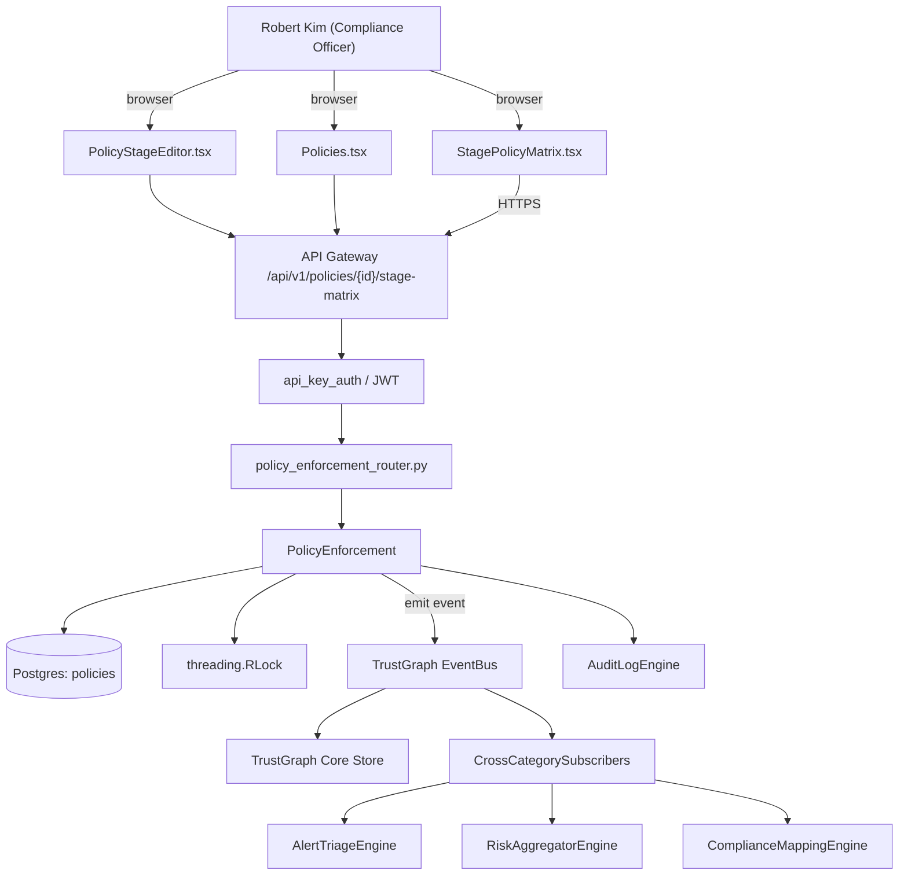

# US-0004: Add per-stage policy verdicts (Develop/Build/Stage/Release/Operate) with Warn-vs-Fail per stage

## Sub-Epic: Compliance
**Master Goal**: ALDECI — tiered $199-$1,499/mo enterprise security intelligence platform replacing $50K-$500K/yr tools

## User Story
As a **Robert Kim (Compliance Officer)**, I need to add per-stage policy verdicts (Develop/Build/Stage/Release/Operate) with Warn-vs-Fail per stage so that Fixops satisfies SOC2, NIST SP 800-53, FedRAMP, and FIPS-140 controls customers ask for in procurement.

## Why This Matters
Per competitor-sonatype.md §5, a single policy must emit different actions per stage — Warn in Develop, Fail in Release. Fixops's `policy_engine` + `policy_enforcement` + `pr_gate_router` + `ci_cd_gate_router` cover per-context gates but the inventory shows no per-stage verdict matrix model. Extend policy engine so every evaluation returns a `{stage: verdict}` map and every gate enforces the correct entry.

This work is called out as a P0 gap in `competitor-sonatype.md`. Shipping it is load-bearing for ALDECI's tiered $199-$1,499/mo positioning against $50K-$500K/yr incumbents: every delayed gap becomes a displacement deal we lose.

## Architecture

## Current State: 40% — PARTIAL (gap in existing engine)
- [x] Base `policy_enforcement` engine + router exist (see existing v2 PRD `policy_enforcement.md`)
- [ ] Gap `GAP-004` features below are missing / partial
- [ ] Acceptance criteria in this PRD are not met by current code
- [ ] Data model additions listed below have not been migrated
- [ ] Tests listed under Tests Required do not exist yet

## Key Functions
**Backend (engine methods):**
- `create_stage_matrix()` — backs `POST /api/v1/policies/{id}/stage-matrix`
- `get_stage_matrix()` — backs `GET /api/v1/policies/{id}/stage-matrix`
- `create_evaluate()` — backs `POST /api/v1/evaluate?stage={stage}`

**Frontend screens:**
- `StagePolicyMatrix.tsx` — operator-facing UI surface for this gap
- `PolicyStageEditor.tsx` — operator-facing UI surface for this gap
- `Policies.tsx` — operator-facing UI surface for this gap

## API Endpoints
| Method | Path | Auth | Purpose |
|--------|------|------|---------|
| POST | `/api/v1/policies/{id}/stage-matrix` | api_key_auth | {id} stage matrix |
| GET | `/api/v1/policies/{id}/stage-matrix` | api_key_auth | {id} stage matrix |
| POST | `/api/v1/evaluate?stage={stage}` | api_key_auth | v1 evaluate?stage={stage} |

## Data Model
- add policies.stage_matrix JSONB column storing {Develop|Build|Stage|Release|Operate: Warn|Fail|Disabled}

## Dependencies
**Depends on**: none explicit
**Depended by**: Router layer, TrustGraph EventBus, CrossCategorySubscribers, CrossCategoryEvidenceBuilder, AuditLogEngine
**Existing engine module (to extend)**: `suite-core/core/policy_enforcement.py`
**Master gap id**: `GAP-004` (priority P0, effort M)

## Tasks Remaining
1. Schema migration: add policies.stage_matrix JSONB column storing {Develop|Build|Stage|Release|Oper (3h)
2. Implement endpoint POST /api/v1/policies/{id}/stage-matrix (5h)
3. Implement endpoint GET /api/v1/policies/{id}/stage-matrix (5h)
4. Implement endpoint POST /api/v1/evaluate?stage={stage} (5h)
5. Wire frontend screen StagePolicyMatrix.tsx (4h)
6. Wire frontend screen PolicyStageEditor.tsx (4h)
7. Wire frontend screen Policies.tsx (4h)
8. Write 5 pytest cases: test_policy_stage_matrix_verdict_routing, test_stage_build_warn_does_not_fail_pr… (5h)
9. Wire TrustGraph event emission + CrossCategorySubscriber consumers (3h)
10. Persona walkthrough + integration test (3h)
11. Docs + API reference update (2h)

## Definition of Done
- [ ] Given a policy configured with {Develop:Warn, Build:Warn, Stage:Fail, Release:Fail, Operate:Warn}, When the policy engine evaluates a violation at `stage=Build`, Then it returns verdict=Warn and the PR gate does not fail the build.
- [ ] Given the same policy, When evaluated at `stage=Release`, Then it returns verdict=Fail and `/api/v1/evaluate?stage=Release` returns HTTP 422 with violation details.
- [ ] Given StagePolicyMatrix.tsx, When a policy owner opens a policy, Then they see a 5-column matrix (Develop/Build/Stage/Release/Operate) and can set each to Warn / Fail / Disabled.
- [ ] Given a policy update, When saved, Then an audit log entry captures actor, policy_id, before/after matrix.
- [ ] Given a PR scan call without a stage, When the API processes it, Then it defaults to stage=Build and logs a deprecation warning.
- [ ] Given a stage matrix with all five stages set, When an evaluation is requested for an unknown stage, Then the API returns HTTP 400 error_code=UNKNOWN_STAGE.
- [ ] All endpoints are org-scoped (no hardcoded org_id) and gated by `api_key_auth`.
- [ ] TrustGraph emits at least one event type for this engine and a CrossCategorySubscriber consumes it.
- [ ] `Robert Kim (Compliance Officer)` can execute the full workflow in the 30-persona walkthrough.

## Tests Required
- `test_policy_stage_matrix_verdict_routing`
- `test_stage_build_warn_does_not_fail_pr`
- `test_stage_release_fail_returns_422`
- `test_stage_matrix_audit_log_captures_diff`
- `test_unknown_stage_returns_400`

## Sprint: Wave 43 (est. Apr 22-Apr 28, 2026)

## Citation
Source research: `competitor-sonatype.md` (gap `GAP-004`, priority `P0`, effort `M`)
