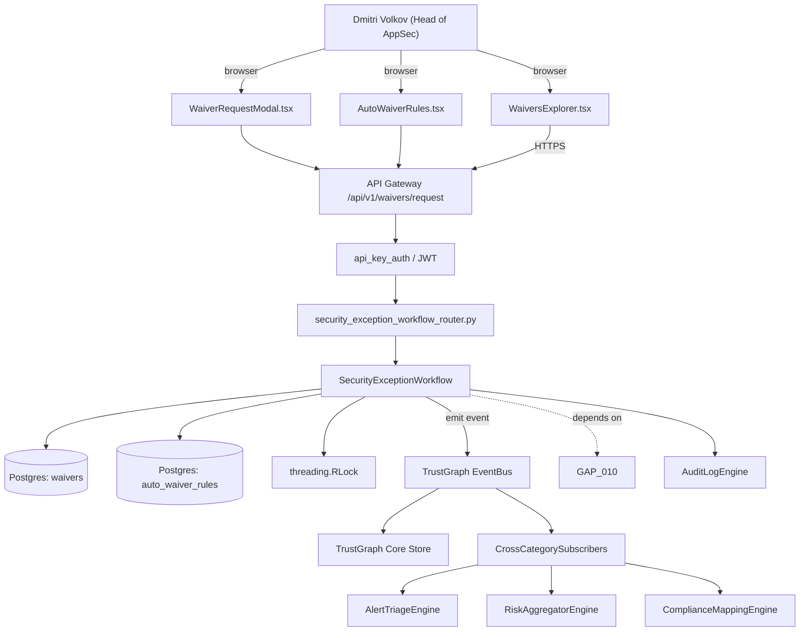

# US-0006: Build auto-waiver engine tied to reachability + upgrade-path analysis with time-bound expiry

## Sub-Epic: SCA/Supply-chain
**Master Goal**: ALDECI — tiered $199-$1,499/mo enterprise security intelligence platform replacing $50K-$500K/yr tools

## User Story
As a **Dmitri Volkov (Head of AppSec)**, I need to build auto-waiver engine tied to reachability + upgrade-path analysis with time-bound expiry so that Fixops delivers Sonatype-class supply-chain coverage while keeping the ALDECI price point.

## Why This Matters
Per competitor-sonatype.md §8, Sonatype auto-waives violations that are (a) low-threat with no upgrade path, or (b) not reachable. Waivers roll off the moment an upgrade path appears. Extend existing `vuln_exception` + `security_exception_workflow` + `risk_acceptance` with auto-waiver rules that consume reachability and upgrade-path signals.

This work is called out as a P0 gap in `competitor-sonatype.md`. Shipping it is load-bearing for ALDECI's tiered $199-$1,499/mo positioning against $50K-$500K/yr incumbents: every delayed gap becomes a displacement deal we lose.

## Architecture

## Current State: 40% — PARTIAL (gap in existing engine)
- [x] Base `security_exception_workflow` engine + router exist (see existing v2 PRD `security_exception_workflow.md`)
- [ ] Gap `GAP-006` features below are missing / partial
- [ ] Acceptance criteria in this PRD are not met by current code
- [ ] Data model additions listed below have not been migrated
- [ ] Tests listed under Tests Required do not exist yet

## Key Functions
**Backend (engine methods):**
- `create_request()` — backs `POST /api/v1/waivers/request`
- `patch_approve()` — backs `PATCH /api/v1/waivers/{id}/approve`
- `get_waivers()` — backs `GET /api/v1/waivers?auto=true`
- `create_auto_waiver_rules()` — backs `POST /api/v1/auto-waiver-rules`
- `delete_id()` — backs `DELETE /api/v1/waivers/{id}`

**Frontend screens:**
- `WaiversExplorer.tsx` — operator-facing UI surface for this gap
- `WaiverRequestModal.tsx` — operator-facing UI surface for this gap
- `AutoWaiverRules.tsx` — operator-facing UI surface for this gap

## API Endpoints
| Method | Path | Auth | Purpose |
|--------|------|------|---------|
| POST | `/api/v1/waivers/request` | api_key_auth | waivers request |
| PATCH | `/api/v1/waivers/{id}/approve` | api_key_auth | {id} approve |
| GET | `/api/v1/waivers?auto=true` | api_key_auth | v1 waivers?auto=true |
| POST | `/api/v1/auto-waiver-rules` | api_key_auth | v1 auto waiver rules |
| DELETE | `/api/v1/waivers/{id}` | api_key_auth | waivers {id} |

## Data Model
- add waivers.auto (bool), waivers.source, waivers.expires_at, waivers.rule_id columns
- add auto_waiver_rules table: id, org_id, match (JSONB), max_severity, expiry_days, active

## Dependencies
**Depends on**: GAP-010
**Depended by**: Router layer, TrustGraph EventBus, CrossCategorySubscribers, CrossCategoryEvidenceBuilder, AuditLogEngine
**Existing engine module (to extend)**: `suite-core/core/security_exception_workflow.py`
**Master gap id**: `GAP-006` (priority P0, effort M)

## Tasks Remaining
1. Schema migration: add waivers.auto (bool), waivers.source, waivers.expires_at, waivers.rule_id col (3h)
2. Schema migration: add auto_waiver_rules table (3h)
3. Implement endpoint POST /api/v1/waivers/request (4h)
4. Implement endpoint PATCH /api/v1/waivers/{id}/approve (4h)
5. Implement endpoint GET /api/v1/waivers?auto=true (4h)
6. Implement endpoint POST /api/v1/auto-waiver-rules (4h)
7. Implement endpoint DELETE /api/v1/waivers/{id} (4h)
8. Wire frontend screen WaiversExplorer.tsx (3h)
9. Wire frontend screen WaiverRequestModal.tsx (3h)
10. Wire frontend screen AutoWaiverRules.tsx (3h)
11. Write 5 pytest cases: test_auto_waiver_on_not_reachable, test_auto_waiver_revoked_when_reachability_flips… (4h)
12. Wire TrustGraph event emission + CrossCategorySubscriber consumers (3h)
13. Persona walkthrough + integration test (2h)
14. Docs + API reference update (1h)

## Definition of Done
- [ ] Given a finding with `reachable=false` and an AutoWaiverRule `rule=auto_waive_if_not_reachable max_severity=high`, When the pipeline runs, Then the finding is waived with source=auto_waiver and a 90-day expiry.
- [ ] Given a previously auto-waived finding, When the daily re-check detects `reachable=true` or `upgrade_path_available=true`, Then the waiver is revoked, an audit entry logs the reason, and the finding returns to open state.
- [ ] Given AutoWaiverRules.tsx, When an admin views the page, Then they see each rule with match criteria, scope (org/app), last-applied count, and toggle on/off.
- [ ] Given a waiver request via POST /api/v1/waivers/request, When the policy owner approves via PATCH /api/v1/waivers/{id}/approve, Then the waiver becomes active with the approver recorded.
- [ ] Given WaiversExplorer.tsx, When a user filters by `auto=true`, Then only auto-waivers are shown; bulk revoke is available.
- [ ] Given an auto-waiver with a 90-day expiry, When the clock passes expiry, Then the waiver is marked expired and the finding is re-evaluated in the next pipeline run.
- [ ] All endpoints are org-scoped (no hardcoded org_id) and gated by `api_key_auth`.
- [ ] TrustGraph emits at least one event type for this engine and a CrossCategorySubscriber consumes it.
- [ ] `Dmitri Volkov (Head of AppSec)` can execute the full workflow in the 30-persona walkthrough.

## Tests Required
- `test_auto_waiver_on_not_reachable`
- `test_auto_waiver_revoked_when_reachability_flips`
- `test_auto_waiver_revoked_when_upgrade_path_appears`
- `test_waiver_request_approval_flow`
- `test_expired_waiver_re_evaluates_finding`

## Sprint: Wave 45 (est. May 06-May 12, 2026)

## Citation
Source research: `competitor-sonatype.md` (gap `GAP-006`, priority `P0`, effort `M`)
