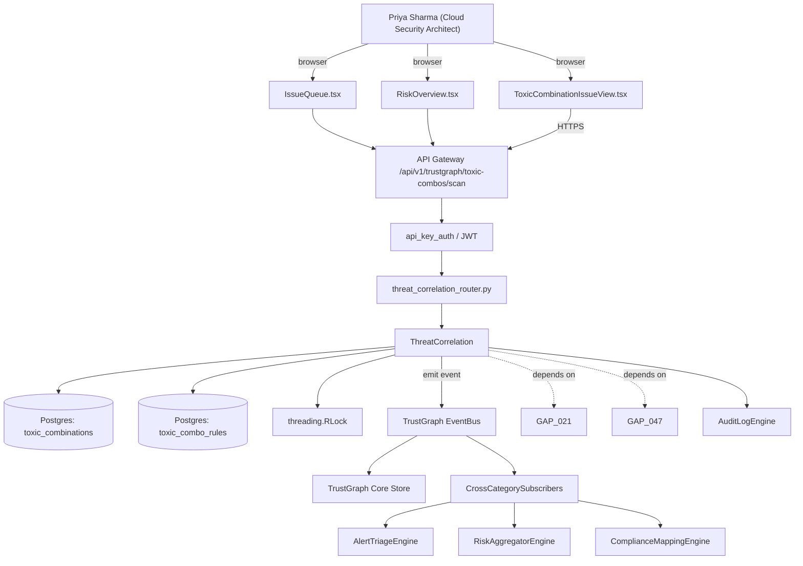

# US-0021: Implement toxic-combination correlation: produce single Issue per internet+CVE+perm+data chain

## Sub-Epic: CSPM/Graph
**Master Goal**: ALDECI — tiered $199-$1,499/mo enterprise security intelligence platform replacing $50K-$500K/yr tools

## User Story
As a **Priya Sharma (Cloud Security Architect)**, I need to implement toxic-combination correlation: produce single Issue per internet+CVE+perm+data chain so that toxic-combination noise drops and SOC teams act on real exposure instead of CVE lists.

## Why This Matters
Per competitor-cspm.md §1–3, the canonical Wiz Issue is 'internet-exposed VM with critical CVE, overly-permissive role, reaches sensitive data.' Fixops has `threat_correlation`, `attack_chain`, `exposure_case_router`, and TrustGraph primitives but no documented toxic-combination traversal rules or unified Issue UI.

This work is called out as a P0 gap in `competitor-cspm.md`. Shipping it is load-bearing for ALDECI's tiered $199-$1,499/mo positioning against $50K-$500K/yr incumbents: every delayed gap becomes a displacement deal we lose.

## Architecture

## Current State: 40% — PARTIAL (gap in existing engine)
- [x] Base `threat_correlation` engine + router exist (see existing v2 PRD `threat_correlation.md`)
- [ ] Gap `GAP-021` features below are missing / partial
- [ ] Acceptance criteria in this PRD are not met by current code
- [ ] Data model additions listed below have not been migrated
- [ ] Tests listed under Tests Required do not exist yet

## Key Functions
**Backend (engine methods):**
- `create_scan()` — backs `POST /api/v1/trustgraph/toxic-combos/scan`
- `get_toxic()` — backs `GET /api/v1/issues/toxic`
- `create_toxic_combo_rules()` — backs `POST /api/v1/toxic-combo-rules`

**Frontend screens:**
- `ToxicCombinationIssueView.tsx` — operator-facing UI surface for this gap
- `IssueQueue.tsx` — operator-facing UI surface for this gap
- `RiskOverview.tsx` — operator-facing UI surface for this gap

## API Endpoints
| Method | Path | Auth | Purpose |
|--------|------|------|---------|
| POST | `/api/v1/trustgraph/toxic-combos/scan` | api_key_auth | toxic combos scan |
| GET | `/api/v1/issues/toxic` | api_key_auth | issues toxic |
| POST | `/api/v1/toxic-combo-rules` | api_key_auth | v1 toxic combo rules |

## Data Model
- add toxic_combinations table: id, org_id, rule_id, chain_nodes (JSONB), blast_radius_score, status, resolution_reason, created_at, closed_at
- add toxic_combo_rules table: id, org_id, name, rule_dsl, active

## Dependencies
**Depends on**: GAP-021, GAP-047
**Depended by**: Router layer, TrustGraph EventBus, CrossCategorySubscribers, CrossCategoryEvidenceBuilder, AuditLogEngine
**Existing engine module (to extend)**: `suite-core/core/threat_correlation.py`
**Master gap id**: `GAP-021` (priority P0, effort L)

## Tasks Remaining
1. Schema migration: add toxic_combinations table (4h)
2. Schema migration: add toxic_combo_rules table (4h)
3. Implement endpoint POST /api/v1/trustgraph/toxic-combos/scan (6h)
4. Implement endpoint GET /api/v1/issues/toxic (6h)
5. Implement endpoint POST /api/v1/toxic-combo-rules (6h)
6. Wire frontend screen ToxicCombinationIssueView.tsx (5h)
7. Wire frontend screen IssueQueue.tsx (5h)
8. Wire frontend screen RiskOverview.tsx (5h)
9. Write 5 pytest cases: test_canonical_four_node_chain_produces_issue, test_issue_auto_close_on_chain_break… (6h)
10. Wire TrustGraph event emission + CrossCategorySubscriber consumers (4h)
11. Persona walkthrough + integration test (3h)
12. Docs + API reference update (2h)

## Definition of Done
- [ ] Given a graph with nodes (internet-exposed VM, HIGH CVE on VM, over-permissive IAM role assumable by VM, S3 bucket with PII readable by role), When the engine runs, Then exactly one ToxicCombination Issue is created linking all four nodes.
- [ ] Given the Issue, When a user opens ToxicCombinationIssueView.tsx, Then the traversal path and each contributing factor (with fix recommendation) is shown.
- [ ] Given any contributing factor is remediated (e.g., CVE patched), When the graph is re-evaluated, Then the Issue is auto-closed with resolution_reason='chain_broken_<factor>'.
- [ ] Given an org with 10 such chains, When GET /api/v1/issues/toxic is called, Then the results are de-duped (one Issue per unique chain), ranked by blast-radius score.
- [ ] Given a rule-authoring UI, When an admin defines a new toxic-combination rule (e.g., 'public S3 + audit-disabled'), Then the rule is applied on the next graph evaluation.
- [ ] Given 100k graph nodes, When the correlation runs, Then p95 completes within 10 minutes and memory stays under 4GB.
- [ ] All endpoints are org-scoped (no hardcoded org_id) and gated by `api_key_auth`.
- [ ] TrustGraph emits at least one event type for this engine and a CrossCategorySubscriber consumes it.
- [ ] `Priya Sharma (Cloud Security Architect)` can execute the full workflow in the 30-persona walkthrough.

## Tests Required
- `test_canonical_four_node_chain_produces_issue`
- `test_issue_auto_close_on_chain_break`
- `test_issue_dedup_across_identical_chains`
- `test_custom_rule_applied`
- `test_correlation_scale_100k_nodes`

## Sprint: Wave 44 (est. Apr 29-May 05, 2026)

## Citation
Source research: `competitor-cspm.md` (gap `GAP-021`, priority `P0`, effort `L`)
