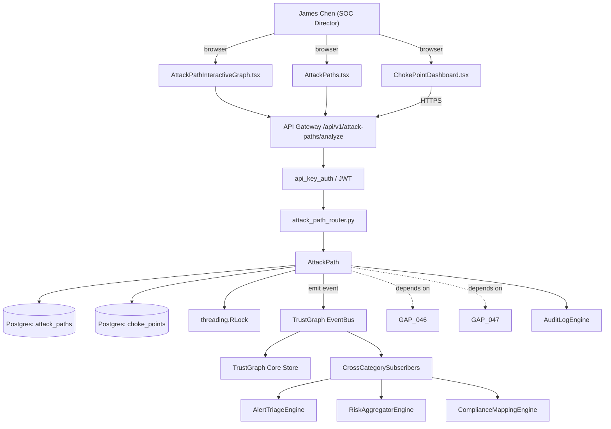

# US-0026: Attack-path visualization with choke-point highlighting; 10k+ node graphs render <2s interactively

## Sub-Epic: CTEM/Graph
**Master Goal**: ALDECI — tiered $199-$1,499/mo enterprise security intelligence platform replacing $50K-$500K/yr tools

## User Story
As a **James Chen (SOC Director)**, I need the ability to attack-path visualization with choke-point highlighting; 10k+ node graphs render <2s interactively so that Fixops renders 10k+ node attack-path graphs on par with BloodHound Enterprise.

## Why This Matters
Per competitor-ctem.md §2, XM Cyber's moat is ranking nodes whose remediation kills the most attack paths. Fixops has `attack_path`, `attack_chain`, `attack_surface` engines but no choke-point analyzer. Extend with choke-point scoring and an interactive dashboard.

This work is called out as a P0 gap in `competitor-ctem.md`. Shipping it is load-bearing for ALDECI's tiered $199-$1,499/mo positioning against $50K-$500K/yr incumbents: every delayed gap becomes a displacement deal we lose.

## Architecture

## Current State: 40% — PARTIAL (gap in existing engine)
- [x] Base `attack_path` engine + router exist (see existing v2 PRD `attack_path.md`)
- [ ] Gap `GAP-026` features below are missing / partial
- [ ] Acceptance criteria in this PRD are not met by current code
- [ ] Data model additions listed below have not been migrated
- [ ] Tests listed under Tests Required do not exist yet

## Key Functions
**Backend (engine methods):**
- `create_analyze()` — backs `POST /api/v1/attack-paths/analyze`
- `get_choke_points()` — backs `GET /api/v1/attack-paths/choke-points`
- `get_graph()` — backs `GET /api/v1/attack-paths/{id}/graph`

**Frontend screens:**
- `ChokePointDashboard.tsx` — operator-facing UI surface for this gap
- `AttackPathInteractiveGraph.tsx` — operator-facing UI surface for this gap
- `AttackPaths.tsx` — operator-facing UI surface for this gap

## API Endpoints
| Method | Path | Auth | Purpose |
|--------|------|------|---------|
| POST | `/api/v1/attack-paths/analyze` | api_key_auth | attack paths analyze |
| GET | `/api/v1/attack-paths/choke-points` | api_key_auth | attack paths choke points |
| GET | `/api/v1/attack-paths/{id}/graph` | api_key_auth | {id} graph |

## Data Model
- add attack_paths table: id, org_id, scope_id, path_nodes (JSONB), choke_point_node_id, critical_assets_at_risk, blast_radius_score, computed_at
- add choke_points table: id, node_id, paths_killed_count, projected_risk_delta

## Dependencies
**Depends on**: GAP-046, GAP-047
**Depended by**: Router layer, TrustGraph EventBus, CrossCategorySubscribers, CrossCategoryEvidenceBuilder, AuditLogEngine
**Existing engine module (to extend)**: `suite-core/core/attack_path.py`
**Master gap id**: `GAP-026` (priority P0, effort L)

## Tasks Remaining
1. Schema migration: add attack_paths table (4h)
2. Schema migration: add choke_points table (4h)
3. Implement endpoint POST /api/v1/attack-paths/analyze (6h)
4. Implement endpoint GET /api/v1/attack-paths/choke-points (6h)
5. Implement endpoint GET /api/v1/attack-paths/{id}/graph (6h)
6. Wire frontend screen ChokePointDashboard.tsx (5h)
7. Wire frontend screen AttackPathInteractiveGraph.tsx (5h)
8. Wire frontend screen AttackPaths.tsx (5h)
9. Write 4 pytest cases: test_choke_point_ranking_correct_on_synthetic_graph, test_interactive_render_under_2s_10k_nodes… (6h)
10. Wire TrustGraph event emission + CrossCategorySubscriber consumers (4h)
11. Persona walkthrough + integration test (3h)
12. Docs + API reference update (2h)

## Definition of Done
- [ ] Given a TrustGraph with 10k nodes and 100k edges, When the choke-point analyzer runs, Then it returns the top-N nodes ranked by % of critical assets whose paths include this node.
- [ ] Given ChokePointDashboard.tsx, When a user opens it, Then the top-20 choke points are shown with blast-radius (paths killed if fixed) and projected risk-score delta.
- [ ] Given the interactive graph, When a user clicks a choke point, Then the paths through it are highlighted and can be filtered to show only paths to crown-jewel assets.
- [ ] Given a graph with 10k nodes, When first painted, Then initial render completes in <2s on a laptop-class machine with hardware acceleration.
- [ ] Given a choke point is remediated (node marked fixed), When graph is recomputed, Then the dashboard shows the resulting drop in total-paths-to-crown-jewels and the updated top-20.
- [ ] Given POST /api/v1/attack-paths/analyze, When called with a scope (e.g., production + PII assets), Then it returns the path set and choke-point ranking scoped appropriately.
- [ ] All endpoints are org-scoped (no hardcoded org_id) and gated by `api_key_auth`.
- [ ] TrustGraph emits at least one event type for this engine and a CrossCategorySubscriber consumes it.
- [ ] `James Chen (SOC Director)` can execute the full workflow in the 30-persona walkthrough.

## Tests Required
- `test_choke_point_ranking_correct_on_synthetic_graph`
- `test_interactive_render_under_2s_10k_nodes`
- `test_choke_point_remediation_recomputes_ranking`
- `test_scoped_analysis_pii_only`

## Sprint: Wave 43 (est. Apr 22-Apr 28, 2026)

## Citation
Source research: `competitor-ctem.md` (gap `GAP-026`, priority `P0`, effort `L`)
