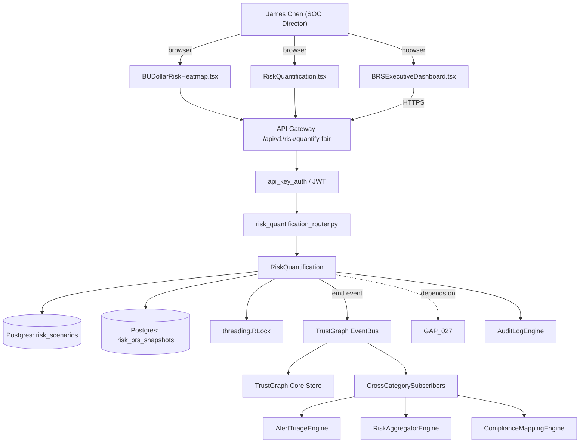

# US-0028: Dollarized risk quantification (FAIR + PGM) with per-BU and per-asset BRS

## Sub-Epic: CTEM
**Master Goal**: ALDECI — tiered $199-$1,499/mo enterprise security intelligence platform replacing $50K-$500K/yr tools

## User Story
As a **James Chen (SOC Director)**, I need the ability to dollarized risk quantification (FAIR + PGM) with per-BU and per-asset BRS so that Fixops matches XM Cyber / Tenable CTEM exposure-management depth.

## Why This Matters
Per competitor-ctem.md §3, Balbix's BRS is the CFO pitch. Fixops has `risk_quantification` + v2 engine; extend to FAIR-aligned PGM with Loss Event Frequency × Loss Magnitude output per asset and per BU. Pair with exec dashboard.

This work is called out as a P1 gap in `competitor-ctem.md`. Shipping it is load-bearing for ALDECI's tiered $199-$1,499/mo positioning against $50K-$500K/yr incumbents: every delayed gap becomes a displacement deal we lose.

## Architecture

## Current State: 40% — PARTIAL (gap in existing engine)
- [x] Base `risk_quantification` engine + router exist (see existing v2 PRD `risk_quantification.md`)
- [ ] Gap `GAP-028` features below are missing / partial
- [ ] Acceptance criteria in this PRD are not met by current code
- [ ] Data model additions listed below have not been migrated
- [ ] Tests listed under Tests Required do not exist yet

## Key Functions
**Backend (engine methods):**
- `create_quantify_fair()` — backs `POST /api/v1/risk/quantify-fair`
- `get_asset_id()` — backs `GET /api/v1/risk/brs/{asset_id}`
- `get_bu_id()` — backs `GET /api/v1/risk/brs/bu/{bu_id}`
- `create_scenarios()` — backs `POST /api/v1/risk/scenarios`

**Frontend screens:**
- `BRSExecutiveDashboard.tsx` — operator-facing UI surface for this gap
- `BUDollarRiskHeatmap.tsx` — operator-facing UI surface for this gap
- `RiskQuantification.tsx` — operator-facing UI surface for this gap

## API Endpoints
| Method | Path | Auth | Purpose |
|--------|------|------|---------|
| POST | `/api/v1/risk/quantify-fair` | api_key_auth | risk quantify fair |
| GET | `/api/v1/risk/brs/{asset_id}` | api_key_auth | brs {asset id} |
| GET | `/api/v1/risk/brs/bu/{bu_id}` | api_key_auth | bu {bu id} |
| POST | `/api/v1/risk/scenarios` | api_key_auth | risk scenarios |

## Data Model
- add risk_scenarios table: id, org_id, name, threat_event_freq, vulnerability, primary_loss, secondary_loss
- add risk_brs_snapshots table: scope_id, lef, lm, p10, p50, p90, computed_at

## Dependencies
**Depends on**: GAP-027
**Depended by**: Router layer, TrustGraph EventBus, CrossCategorySubscribers, CrossCategoryEvidenceBuilder, AuditLogEngine
**Existing engine module (to extend)**: `suite-core/core/risk_quantification.py`
**Master gap id**: `GAP-028` (priority P1, effort L)

## Tasks Remaining
1. Schema migration: add risk_scenarios table (4h)
2. Schema migration: add risk_brs_snapshots table (4h)
3. Implement endpoint POST /api/v1/risk/quantify-fair (6h)
4. Implement endpoint GET /api/v1/risk/brs/{asset_id} (6h)
5. Implement endpoint GET /api/v1/risk/brs/bu/{bu_id} (6h)
6. Implement endpoint POST /api/v1/risk/scenarios (6h)
7. Wire frontend screen BRSExecutiveDashboard.tsx (5h)
8. Wire frontend screen BUDollarRiskHeatmap.tsx (5h)
9. Wire frontend screen RiskQuantification.tsx (5h)
10. Write 4 pytest cases: test_lef_lm_to_ale_p50_accuracy, test_remediation_projected_reduction_tracked… (6h)
11. Wire TrustGraph event emission + CrossCategorySubscriber consumers (4h)
12. Persona walkthrough + integration test (3h)
13. Docs + API reference update (2h)

## Definition of Done
- [ ] Given exposure data for an asset with LEF=0.3/yr and LM=$1.2M, When BRS is computed, Then the asset's annualized loss expectancy is reported in dollars with 10th/50th/90th percentile bands.
- [ ] Given BRSExecutiveDashboard.tsx, When opened, Then it shows top-10 BUs by $ at risk, trend over last 4 quarters, and ROI of top-10 remediation actions.
- [ ] Given a remediation marked completed, When BRS re-computes, Then the projected reduction in $ at risk is recorded and compared to actual post-fix telemetry.
- [ ] Given BUDollarRiskHeatmap.tsx, When hovered on a cell, Then the underlying scenarios are listed with their likelihood and impact contributions.
- [ ] Given FAIR scenario authoring, When an analyst defines a new loss scenario with threat event frequency + vulnerability + primary/secondary loss, Then the engine incorporates it in next BRS run.
- [ ] Given POST /api/v1/risk/quantify-fair, When called with asset_ids, Then the response includes LEF, LM, and $ bands.
- [ ] All endpoints are org-scoped (no hardcoded org_id) and gated by `api_key_auth`.
- [ ] TrustGraph emits at least one event type for this engine and a CrossCategorySubscriber consumes it.
- [ ] `James Chen (SOC Director)` can execute the full workflow in the 30-persona walkthrough.

## Tests Required
- `test_lef_lm_to_ale_p50_accuracy`
- `test_remediation_projected_reduction_tracked`
- `test_new_fair_scenario_changes_brs`
- `test_dashboard_top10_trend`

## Sprint: Wave 49 (est. Jun 03-Jun 09, 2026)

## Citation
Source research: `competitor-ctem.md` (gap `GAP-028`, priority `P1`, effort `L`)
