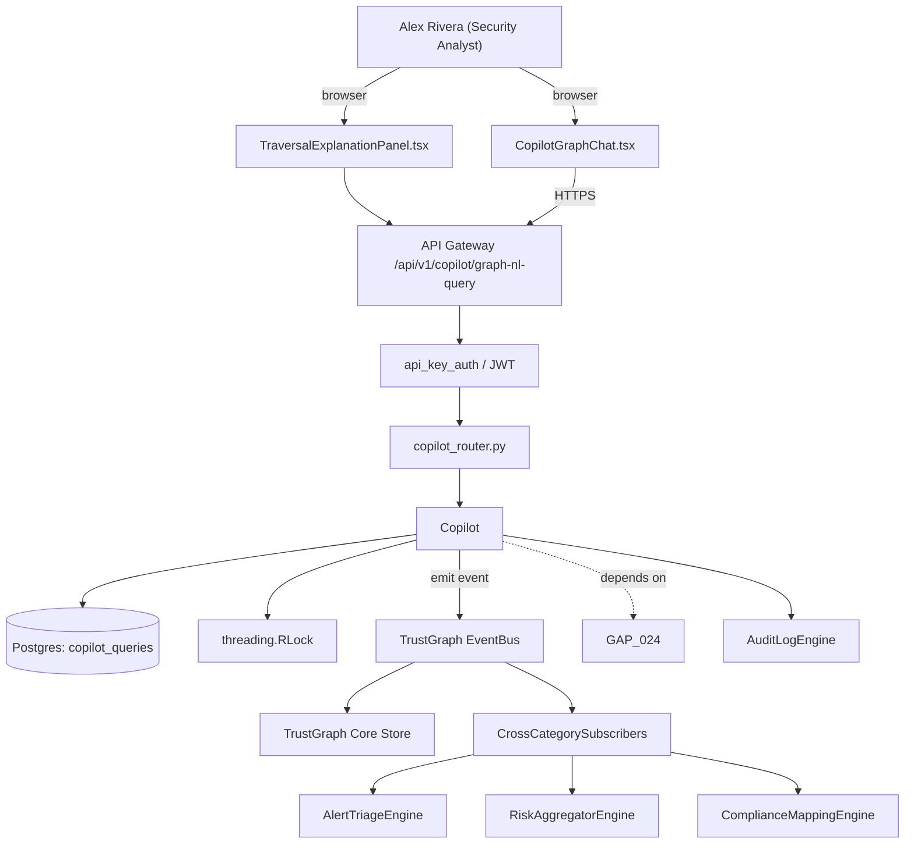

# US-0029: Add NL graph assistant with traversal-trace explanation

## Sub-Epic: AI/Copilot
**Master Goal**: ALDECI — tiered $199-$1,499/mo enterprise security intelligence platform replacing $50K-$500K/yr tools

## User Story
As a **Alex Rivera (Security Analyst)**, I need to add NL graph assistant with traversal-trace explanation so that ALDECI AI console differentiates vs point-tool AI copilots.

## Why This Matters
Per competitor-cspm.md §2 and §3 and competitor-ctem.md §1, NL queries are the UX frontier. Fixops `copilot_router` + `graphrag` exist. Extend to emit a traversal trace alongside answers so users can see the graph path the LLM followed.

This work is called out as a P1 gap in `competitor-cspm.md, competitor-ctem.md`. Shipping it is load-bearing for ALDECI's tiered $199-$1,499/mo positioning against $50K-$500K/yr incumbents: every delayed gap becomes a displacement deal we lose.

## Architecture

## Current State: 40% — PARTIAL (gap in existing engine)
- [x] Base `copilot` engine + router exist (see existing v2 PRD `copilot.md`)
- [ ] Gap `GAP-029` features below are missing / partial
- [ ] Acceptance criteria in this PRD are not met by current code
- [ ] Data model additions listed below have not been migrated
- [ ] Tests listed under Tests Required do not exist yet

## Key Functions
**Backend (engine methods):**
- `create_graph_nl_query()` — backs `POST /api/v1/copilot/graph-nl-query`
- `get_traversal_trace()` — backs `GET /api/v1/copilot/{q_id}/traversal-trace`

**Frontend screens:**
- `CopilotGraphChat.tsx` — operator-facing UI surface for this gap
- `TraversalExplanationPanel.tsx` — operator-facing UI surface for this gap

## API Endpoints
| Method | Path | Auth | Purpose |
|--------|------|------|---------|
| POST | `/api/v1/copilot/graph-nl-query` | api_key_auth | copilot graph nl query |
| GET | `/api/v1/copilot/{q_id}/traversal-trace` | api_key_auth | {q id} traversal trace |

## Data Model
- add copilot_queries table: id, user_id, query_text, generated_dsl, traversal_trace (JSONB), created_at

## Dependencies
**Depends on**: GAP-024
**Depended by**: Router layer, TrustGraph EventBus, CrossCategorySubscribers, CrossCategoryEvidenceBuilder, AuditLogEngine
**Existing engine module (to extend)**: `suite-core/core/copilot.py`
**Master gap id**: `GAP-029` (priority P1, effort M)

## Tasks Remaining
1. Schema migration: add copilot_queries table (4h)
2. Implement endpoint POST /api/v1/copilot/graph-nl-query (6h)
3. Implement endpoint GET /api/v1/copilot/{q_id}/traversal-trace (6h)
4. Wire frontend screen CopilotGraphChat.tsx (5h)
5. Wire frontend screen TraversalExplanationPanel.tsx (5h)
6. Write 5 pytest cases: test_nl_query_returns_trace, test_show_rql_round_trip… (6h)
7. Wire TrustGraph event emission + CrossCategorySubscriber consumers (4h)
8. Persona walkthrough + integration test (3h)
9. Docs + API reference update (2h)

## Definition of Done
- [ ] Given a user asks 'show me internet-facing S3 buckets in prod with PII', When CopilotGraphChat.tsx submits the query, Then the assistant returns a result list and a TraversalExplanationPanel.tsx showing the graph path (exposure -> bucket -> PII classification).
- [ ] Given the same query, When the user clicks 'show RQL', Then the generated RQL-style DSL is displayed and re-executable.
- [ ] Given an ambiguous query, When submitted, Then the assistant asks a clarifying question before returning results.
- [ ] Given an answer containing sensitive fields, When rendered, Then fields are redacted per the user's role.
- [ ] Given a query that returns 0 results, When the assistant responds, Then it explains why (e.g., 'no buckets tagged production in your estate').
- [ ] Given the assistant's LLM, When disabled or offline, Then the DSL fallback (GAP-024) is used and the UI indicates degraded mode.
- [ ] All endpoints are org-scoped (no hardcoded org_id) and gated by `api_key_auth`.
- [ ] TrustGraph emits at least one event type for this engine and a CrossCategorySubscriber consumes it.
- [ ] `Alex Rivera (Security Analyst)` can execute the full workflow in the 30-persona walkthrough.

## Tests Required
- `test_nl_query_returns_trace`
- `test_show_rql_round_trip`
- `test_ambiguous_query_asks_clarifier`
- `test_role_redaction_sensitive_fields`
- `test_offline_fallback_to_dsl`

## Sprint: Wave 46 (est. May 13-May 19, 2026)

## Citation
Source research: `competitor-cspm.md, competitor-ctem.md` (gap `GAP-029`, priority `P1`, effort `M`)
