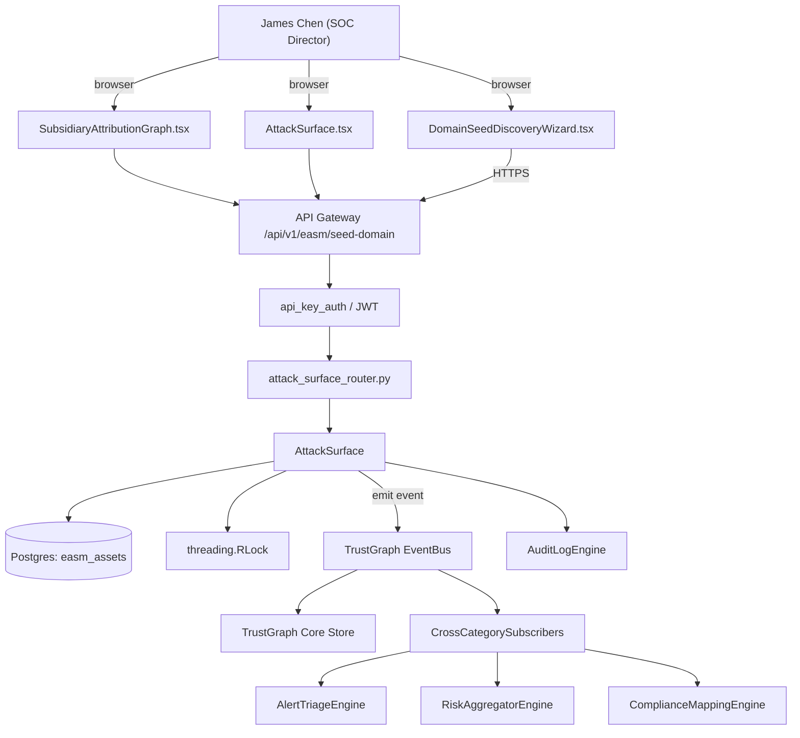

# US-0030: External attack-surface discovery from domain seed with subsidiary attribution

## Sub-Epic: CTEM
**Master Goal**: ALDECI — tiered $199-$1,499/mo enterprise security intelligence platform replacing $50K-$500K/yr tools

## User Story
As a **James Chen (SOC Director)**, I need the ability to external attack-surface discovery from domain seed with subsidiary attribution so that Fixops matches XM Cyber / Tenable CTEM exposure-management depth.

## Why This Matters
Per competitor-ctem.md §4, Falcon Surface seeds from a domain and maps subsidiaries + shadow IT. Fixops has `attack_surface`, `dark_web_monitoring`, `passive_dns`; extend with subsidiary attribution graph.

This work is called out as a P1 gap in `competitor-ctem.md`. Shipping it is load-bearing for ALDECI's tiered $199-$1,499/mo positioning against $50K-$500K/yr incumbents: every delayed gap becomes a displacement deal we lose.

## Architecture

## Current State: 40% — PARTIAL (gap in existing engine)
- [x] Base `attack_surface` engine + router exist (see existing v2 PRD `attack_surface.md`)
- [ ] Gap `GAP-030` features below are missing / partial
- [ ] Acceptance criteria in this PRD are not met by current code
- [ ] Data model additions listed below have not been migrated
- [ ] Tests listed under Tests Required do not exist yet

## Key Functions
**Backend (engine methods):**
- `create_seed_domain()` — backs `POST /api/v1/easm/seed-domain`
- `get_org()` — backs `GET /api/v1/easm/subsidiaries/{org}`
- `get_exposures()` — backs `GET /api/v1/easm/exposures?confidence=`

**Frontend screens:**
- `DomainSeedDiscoveryWizard.tsx` — operator-facing UI surface for this gap
- `SubsidiaryAttributionGraph.tsx` — operator-facing UI surface for this gap
- `AttackSurface.tsx` — operator-facing UI surface for this gap

## API Endpoints
| Method | Path | Auth | Purpose |
|--------|------|------|---------|
| POST | `/api/v1/easm/seed-domain` | api_key_auth | easm seed domain |
| GET | `/api/v1/easm/subsidiaries/{org}` | api_key_auth | subsidiaries {org} |
| GET | `/api/v1/easm/exposures?confidence=` | api_key_auth | easm exposures?confidence= |

## Data Model
- add easm_assets table: id, org_id, kind (domain|ip|cert|service), value, parent_org, attribution_confidence, first_seen, last_seen

## Dependencies
**Depends on**: none explicit
**Depended by**: Router layer, TrustGraph EventBus, CrossCategorySubscribers, CrossCategoryEvidenceBuilder, AuditLogEngine
**Existing engine module (to extend)**: `suite-core/core/attack_surface.py`
**Master gap id**: `GAP-030` (priority P1, effort L)

## Tasks Remaining
1. Schema migration: add easm_assets table (4h)
2. Implement endpoint POST /api/v1/easm/seed-domain (6h)
3. Implement endpoint GET /api/v1/easm/subsidiaries/{org} (6h)
4. Implement endpoint GET /api/v1/easm/exposures?confidence= (6h)
5. Wire frontend screen DomainSeedDiscoveryWizard.tsx (5h)
6. Wire frontend screen SubsidiaryAttributionGraph.tsx (5h)
7. Wire frontend screen AttackSurface.tsx (5h)
8. Write 4 pytest cases: test_seed_domain_discovers_subsidiaries, test_attribution_confidence_threshold… (6h)
9. Wire TrustGraph event emission + CrossCategorySubscriber consumers (4h)
10. Persona walkthrough + integration test (3h)
11. Docs + API reference update (2h)

## Definition of Done
- [ ] Given a seed domain corp.com, When the engine runs, Then subsidiaries, subdomains, IPs, certs, exposed services are enumerated and attributed to the parent org.
- [ ] Given DomainSeedDiscoveryWizard.tsx, When a user supplies a seed, Then the engine streams discovery progress with count-per-asset-type updating every 5s.
- [ ] Given SubsidiaryAttributionGraph.tsx, When opened, Then each discovered asset is visualized with its attribution path and confidence.
- [ ] Given an asset attributed with confidence<0.5, When listed, Then it is routed to a 'needs review' queue rather than auto-claimed.
- [ ] Given an asset that matches a known threat-intel campaign, When enriched, Then the exposure is boosted per adversary context (overlay of `threat_intel_enrichment`).
- [ ] Given a re-scan, When changes are detected (new subdomain, expiring cert), Then a webhook is emitted.
- [ ] All endpoints are org-scoped (no hardcoded org_id) and gated by `api_key_auth`.
- [ ] TrustGraph emits at least one event type for this engine and a CrossCategorySubscriber consumes it.
- [ ] `James Chen (SOC Director)` can execute the full workflow in the 30-persona walkthrough.

## Tests Required
- `test_seed_domain_discovers_subsidiaries`
- `test_attribution_confidence_threshold`
- `test_threat_intel_overlay_boosts_exposure`
- `test_webhook_on_change_detected`

## Sprint: Wave 47 (est. May 20-May 26, 2026)

## Citation
Source research: `competitor-ctem.md` (gap `GAP-030`, priority `P1`, effort `L`)
