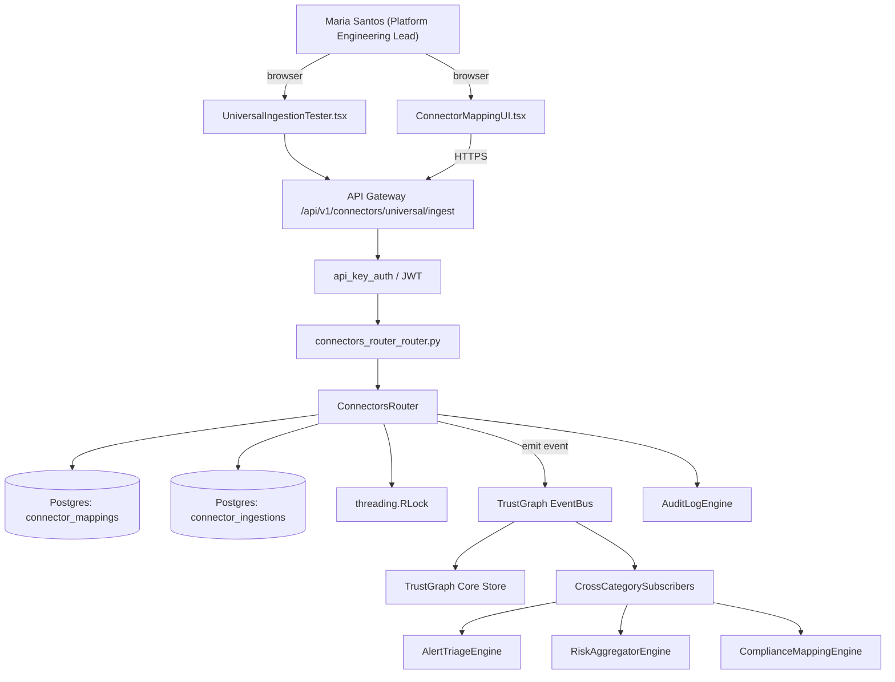

# US-0034: Build Universal Connector for third-party finding ingestion with field-mapping UI

## Sub-Epic: Integrations
**Master Goal**: ALDECI — tiered $199-$1,499/mo enterprise security intelligence platform replacing $50K-$500K/yr tools

## User Story
As a **Maria Santos (Platform Engineering Lead)**, I need to build Universal Connector for third-party finding ingestion with field-mapping UI so that platform teams onboard Fixops in hours, not weeks, and CI integrations are first-class.

## Why This Matters
Per competitor-aspm.md §3 (Veracode VRM Universal Connector) and competitor-emerging.md §3 (Cycode ConnectorX), a generic ingestion framework for any third-party finding format lets Fixops become the consolidation substrate. Extend `connectors_router` + `security_data_pipeline` with a mapping UI.

This work is called out as a P1 gap in `competitor-aspm.md, competitor-emerging.md`. Shipping it is load-bearing for ALDECI's tiered $199-$1,499/mo positioning against $50K-$500K/yr incumbents: every delayed gap becomes a displacement deal we lose.

## Architecture

## Current State: 40% — PARTIAL (gap in existing engine)
- [x] Base `connectors_router` engine + router exist (see existing v2 PRD `connectors_router.md`)
- [ ] Gap `GAP-034` features below are missing / partial
- [ ] Acceptance criteria in this PRD are not met by current code
- [ ] Data model additions listed below have not been migrated
- [ ] Tests listed under Tests Required do not exist yet

## Key Functions
**Backend (engine methods):**
- `create_ingest()` — backs `POST /api/v1/connectors/universal/ingest`
- `create_mapping()` — backs `POST /api/v1/connectors/mapping`
- `create_dry_run()` — backs `POST /api/v1/connectors/mapping/dry-run`

**Frontend screens:**
- `ConnectorMappingUI.tsx` — operator-facing UI surface for this gap
- `UniversalIngestionTester.tsx` — operator-facing UI surface for this gap

## API Endpoints
| Method | Path | Auth | Purpose |
|--------|------|------|---------|
| POST | `/api/v1/connectors/universal/ingest` | api_key_auth | universal ingest |
| POST | `/api/v1/connectors/mapping` | api_key_auth | connectors mapping |
| POST | `/api/v1/connectors/mapping/dry-run` | api_key_auth | mapping dry run |

## Data Model
- add connector_mappings table: id, org_id, name, source_tool, mapping_json, created_at
- add connector_ingestions table: id, mapping_id, file_hash, rows_total, rows_quarantined, completed_at

## Dependencies
**Depends on**: none explicit
**Depended by**: Router layer, TrustGraph EventBus, CrossCategorySubscribers, CrossCategoryEvidenceBuilder, AuditLogEngine
**Existing engine module (to extend)**: `suite-core/core/connectors_router.py`
**Master gap id**: `GAP-034` (priority P1, effort M)

## Tasks Remaining
1. Schema migration: add connector_mappings table (4h)
2. Schema migration: add connector_ingestions table (4h)
3. Implement endpoint POST /api/v1/connectors/universal/ingest (5h)
4. Implement endpoint POST /api/v1/connectors/mapping (5h)
5. Implement endpoint POST /api/v1/connectors/mapping/dry-run (5h)
6. Wire frontend screen ConnectorMappingUI.tsx (4h)
7. Wire frontend screen UniversalIngestionTester.tsx (4h)
8. Write 5 pytest cases: test_snyk_json_normalizes_to_unified_finding, test_mapping_template_reusable… (5h)
9. Wire TrustGraph event emission + CrossCategorySubscriber consumers (4h)
10. Persona walkthrough + integration test (3h)
11. Docs + API reference update (2h)

## Definition of Done
- [ ] Given a Snyk JSON export, When uploaded via POST /api/v1/connectors/universal/ingest, Then the mapping engine normalizes to UnifiedFinding and creates findings with source='snyk'.
- [ ] Given ConnectorMappingUI.tsx, When a user uploads a sample file for a new tool, Then fields are auto-detected and editable, and the mapping is saved as a reusable template.
- [ ] Given UniversalIngestionTester.tsx, When a dry-run is executed, Then a preview of normalized findings is shown without writes.
- [ ] Given a mapping template, When applied to a batch of 10k findings, Then ingestion completes in <5 min and reports row-level errors.
- [ ] Given a required field is missing in the source, When mapping runs, Then the row is quarantined with error=MAPPING_MISSING_REQUIRED and surfaced for review.
- [ ] All endpoints are org-scoped (no hardcoded org_id) and gated by `api_key_auth`.
- [ ] TrustGraph emits at least one event type for this engine and a CrossCategorySubscriber consumes it.
- [ ] `Maria Santos (Platform Engineering Lead)` can execute the full workflow in the 30-persona walkthrough.

## Tests Required
- `test_snyk_json_normalizes_to_unified_finding`
- `test_mapping_template_reusable`
- `test_dry_run_shows_preview_no_write`
- `test_10k_rows_under_5_min`
- `test_missing_required_field_quarantined`

## Sprint: Wave 48 (est. May 27-Jun 02, 2026)

## Citation
Source research: `competitor-aspm.md, competitor-emerging.md` (gap `GAP-034`, priority `P1`, effort `M`)
