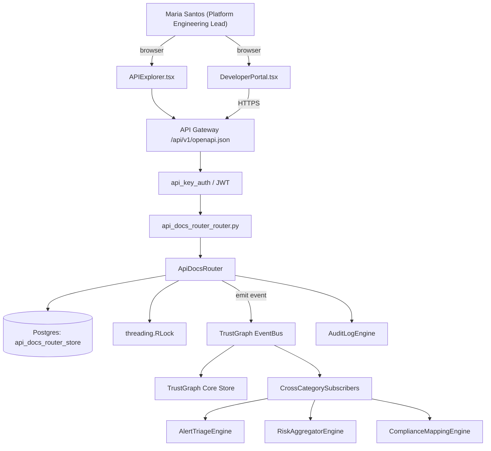

# US-0037: Publish OpenAPI spec + typed SDKs (Python, TypeScript, Go) and Developer Portal downloads

## Sub-Epic: Integrations
**Master Goal**: ALDECI — tiered $199-$1,499/mo enterprise security intelligence platform replacing $50K-$500K/yr tools

## User Story
As a **Maria Santos (Platform Engineering Lead)**, I need to publish OpenAPI spec + typed SDKs (Python, TypeScript, Go) and Developer Portal downloads so that platform teams onboard Fixops in hours, not weeks, and CI integrations are first-class.

## Why This Matters
Per competitor-aspm.md 'Absorb' §5, the competitor with the cleanest OpenAPI + typed SDKs wins automation spend. Fixops DeveloperPortal exists; formalize the OpenAPI publish + SDK build pipeline.

This work is called out as a P1 gap in `competitor-aspm.md`. Shipping it is load-bearing for ALDECI's tiered $199-$1,499/mo positioning against $50K-$500K/yr incumbents: every delayed gap becomes a displacement deal we lose.

## Architecture

## Current State: 40% — PARTIAL (gap in existing engine)
- [x] Base `api_docs_router` engine + router exist (see existing v2 PRD `api_docs_router.md`)
- [ ] Gap `GAP-037` features below are missing / partial
- [ ] Acceptance criteria in this PRD are not met by current code
- [ ] Data model additions listed below have not been migrated
- [ ] Tests listed under Tests Required do not exist yet

## Key Functions
**Backend (engine methods):**
- `get_openapi.json()` — backs `GET /api/v1/openapi.json`
- `get_latest()` — backs `GET /api/v1/sdk/{lang}/latest`

**Frontend screens:**
- `DeveloperPortal.tsx` — operator-facing UI surface for this gap
- `APIExplorer.tsx` — operator-facing UI surface for this gap

## API Endpoints
| Method | Path | Auth | Purpose |
|--------|------|------|---------|
| GET | `/api/v1/openapi.json` | api_key_auth | v1 openapi.json |
| GET | `/api/v1/sdk/{lang}/latest` | api_key_auth | {lang} latest |

## Data Model
- No schema changes (reuses existing tables).

## Dependencies
**Depends on**: none explicit
**Depended by**: Router layer, TrustGraph EventBus, CrossCategorySubscribers, CrossCategoryEvidenceBuilder, AuditLogEngine
**Existing engine module (to extend)**: `suite-core/core/api_docs_router.py`
**Master gap id**: `GAP-037` (priority P1, effort M)

## Tasks Remaining
1. Implement endpoint GET /api/v1/openapi.json (6h)
2. Implement endpoint GET /api/v1/sdk/{lang}/latest (6h)
3. Wire frontend screen DeveloperPortal.tsx (5h)
4. Wire frontend screen APIExplorer.tsx (5h)
5. Write 5 pytest cases: test_openapi_generated_on_main, test_breaking_change_blocks_merge… (6h)
6. Wire TrustGraph event emission + CrossCategorySubscriber consumers (4h)
7. Persona walkthrough + integration test (3h)
8. Docs + API reference update (2h)

## Definition of Done
- [ ] Given the API changes on main, When CI runs, Then an OpenAPI 3.1 spec is regenerated and diffed against the previous release; breaking changes block merge.
- [ ] Given a release tag, When the pipeline runs, Then Python + TypeScript + Go SDKs are built, versioned, published to PyPI / npm / Go module proxy, and uploaded to DeveloperPortal.tsx.
- [ ] Given GET /api/v1/openapi.json, When called, Then the current spec is served with ETag caching.
- [ ] Given a user downloads the Python SDK from DeveloperPortal.tsx, When they run the quickstart, Then a `hello findings` call succeeds against their tenant.
- [ ] Given a breaking API change, When CI runs, Then the diff report is posted to the PR with the specific endpoints affected.
- [ ] Given the portal page, When opened, Then it shows SDK versions, changelogs, and example snippets per language.
- [ ] All endpoints are org-scoped (no hardcoded org_id) and gated by `api_key_auth`.
- [ ] TrustGraph emits at least one event type for this engine and a CrossCategorySubscriber consumes it.
- [ ] `Maria Santos (Platform Engineering Lead)` can execute the full workflow in the 30-persona walkthrough.

## Tests Required
- `test_openapi_generated_on_main`
- `test_breaking_change_blocks_merge`
- `test_python_sdk_hello_findings`
- `test_typescript_sdk_hello_findings`
- `test_go_sdk_hello_findings`

## Sprint: Wave 49 (est. Jun 03-Jun 09, 2026)

## Citation
Source research: `competitor-aspm.md` (gap `GAP-037`, priority `P1`, effort `M`)
