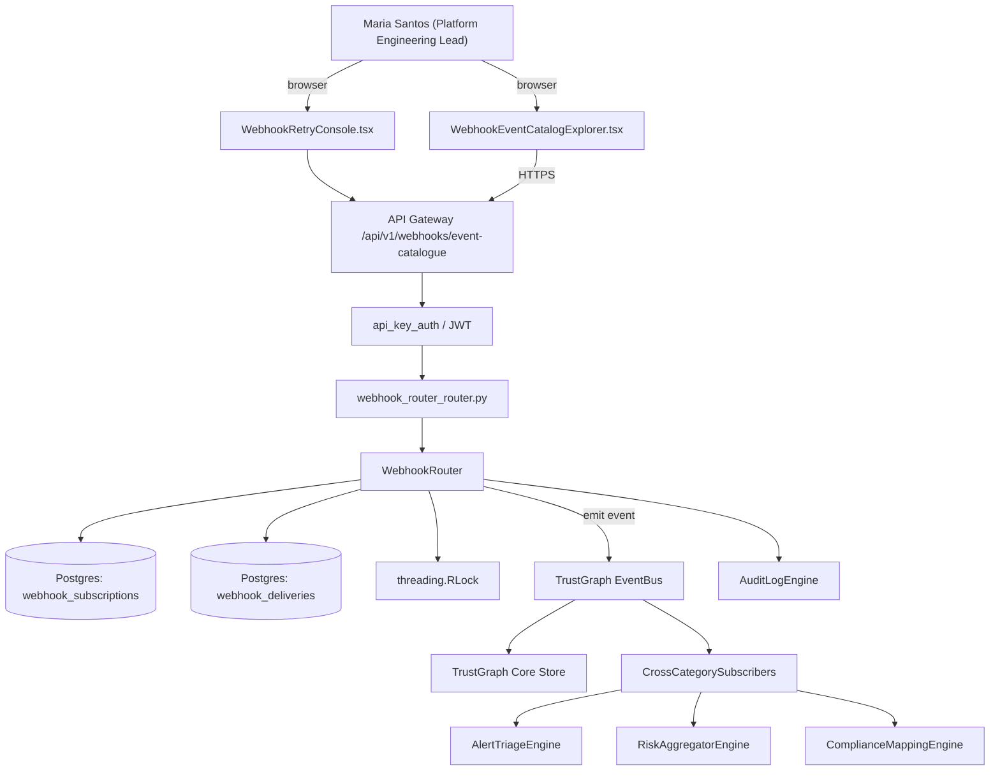

# US-0038: Graduate webhooks to GA with formal event catalog and retry semantics

## Sub-Epic: Integrations
**Master Goal**: ALDECI — tiered $199-$1,499/mo enterprise security intelligence platform replacing $50K-$500K/yr tools

## User Story
As a **Maria Santos (Platform Engineering Lead)**, I need to graduate webhooks to GA with formal event catalog and retry semantics so that platform teams onboard Fixops in hours, not weeks, and CI integrations are first-class.

## Why This Matters
Per competitor-aspm.md §5, Snyk is still in beta on webhooks; Fixops can win here. Publish a versioned event catalog (finding.*, scan.*, policy.*, pipeline.*, attack-path.*, compliance.*) with at-least-once delivery, exponential backoff retry, dead-letter queue, and signed payloads (HMAC-SHA256).

This work is called out as a P1 gap in `competitor-aspm.md`. Shipping it is load-bearing for ALDECI's tiered $199-$1,499/mo positioning against $50K-$500K/yr incumbents: every delayed gap becomes a displacement deal we lose.

## Architecture

## Current State: 40% — PARTIAL (gap in existing engine)
- [x] Base `webhook_router` engine + router exist (see existing v2 PRD `webhook_router.md`)
- [ ] Gap `GAP-038` features below are missing / partial
- [ ] Acceptance criteria in this PRD are not met by current code
- [ ] Data model additions listed below have not been migrated
- [ ] Tests listed under Tests Required do not exist yet

## Key Functions
**Backend (engine methods):**
- `get_event_catalogue()` — backs `GET /api/v1/webhooks/event-catalogue`
- `create_subscribe()` — backs `POST /api/v1/webhooks/subscribe`
- `get_dlq()` — backs `GET /api/v1/webhooks/{id}/dlq`
- `create_replay()` — backs `POST /api/v1/webhooks/{id}/replay`

**Frontend screens:**
- `WebhookEventCatalogExplorer.tsx` — operator-facing UI surface for this gap
- `WebhookRetryConsole.tsx` — operator-facing UI surface for this gap

## API Endpoints
| Method | Path | Auth | Purpose |
|--------|------|------|---------|
| GET | `/api/v1/webhooks/event-catalogue` | api_key_auth | webhooks event catalogue |
| POST | `/api/v1/webhooks/subscribe` | api_key_auth | webhooks subscribe |
| GET | `/api/v1/webhooks/{id}/dlq` | api_key_auth | {id} dlq |
| POST | `/api/v1/webhooks/{id}/replay` | api_key_auth | {id} replay |

## Data Model
- add webhook_subscriptions table: id, org_id, endpoint_url, events (JSONB), secret_fingerprint, created_at, active
- add webhook_deliveries table: id, subscription_id, event_name, event_version, payload_hash, status, attempt, next_retry_at

## Dependencies
**Depends on**: none explicit
**Depended by**: Router layer, TrustGraph EventBus, CrossCategorySubscribers, CrossCategoryEvidenceBuilder, AuditLogEngine
**Existing engine module (to extend)**: `suite-core/core/webhook_router.py`
**Master gap id**: `GAP-038` (priority P1, effort M)

## Tasks Remaining
1. Schema migration: add webhook_subscriptions table (3h)
2. Schema migration: add webhook_deliveries table (3h)
3. Implement endpoint GET /api/v1/webhooks/event-catalogue (5h)
4. Implement endpoint POST /api/v1/webhooks/subscribe (5h)
5. Implement endpoint GET /api/v1/webhooks/{id}/dlq (5h)
6. Implement endpoint POST /api/v1/webhooks/{id}/replay (5h)
7. Wire frontend screen WebhookEventCatalogExplorer.tsx (4h)
8. Wire frontend screen WebhookRetryConsole.tsx (4h)
9. Write 5 pytest cases: test_event_catalogue_endpoint, test_hmac_signature_verification… (5h)
10. Wire TrustGraph event emission + CrossCategorySubscriber consumers (3h)
11. Persona walkthrough + integration test (2h)
12. Docs + API reference update (2h)

## Definition of Done
- [ ] Given the event catalog, When GET /api/v1/webhooks/event-catalogue is called, Then every event (name, version, sample payload, schema ref) is listed.
- [ ] Given a subscription, When an event fires, Then the payload is signed with HMAC-SHA256 and delivered with retries (1m, 5m, 30m, 2h, 12h) on non-2xx responses.
- [ ] Given 5 failed retries, When a 6th attempt fails, Then the event goes to DLQ and is visible in WebhookRetryConsole.tsx with replay button.
- [ ] Given a consumer that verifies the signature, When a tampered payload is sent, Then verification fails.
- [ ] Given WebhookEventCatalogExplorer.tsx, When a user subscribes to finding.created and scan.completed, Then only those two events are delivered to the endpoint.
- [ ] Given an event schema version bump, When the webhook is delivered, Then both `X-Fixops-Event` and `X-Fixops-Event-Version` headers are set.
- [ ] All endpoints are org-scoped (no hardcoded org_id) and gated by `api_key_auth`.
- [ ] TrustGraph emits at least one event type for this engine and a CrossCategorySubscriber consumes it.
- [ ] `Maria Santos (Platform Engineering Lead)` can execute the full workflow in the 30-persona walkthrough.

## Tests Required
- `test_event_catalogue_endpoint`
- `test_hmac_signature_verification`
- `test_retry_backoff_schedule`
- `test_dlq_after_max_retries_and_replay`
- `test_subscription_event_filtering`

## Sprint: Wave 46 (est. May 13-May 19, 2026)

## Citation
Source research: `competitor-aspm.md` (gap `GAP-038`, priority `P1`, effort `M`)
