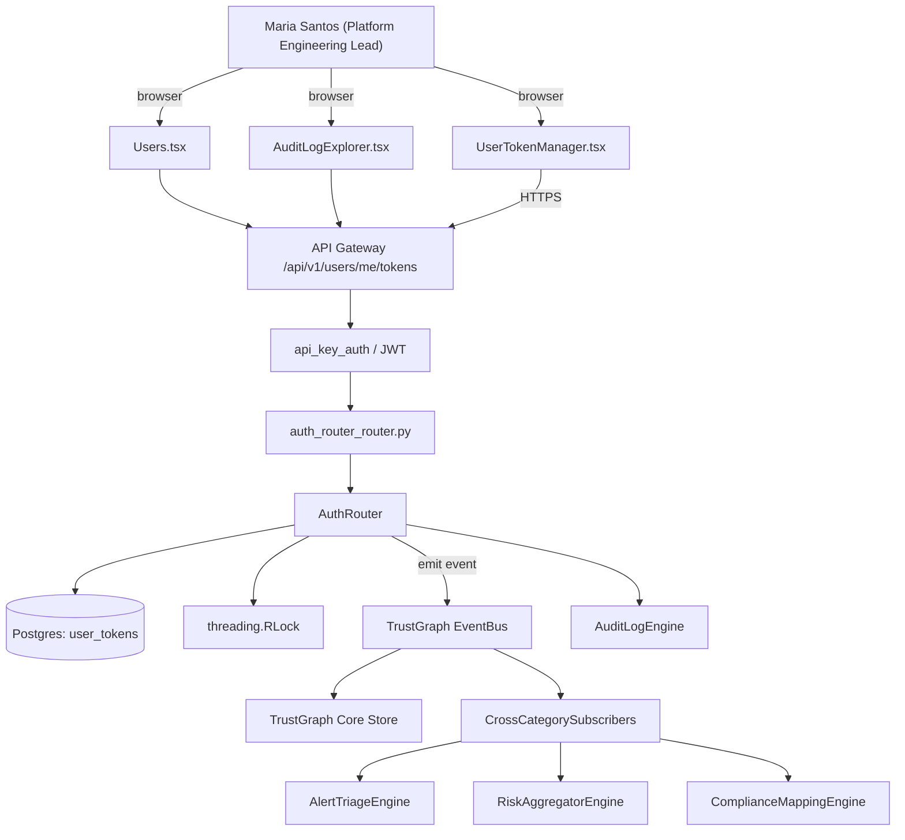

# US-0039: Add User Tokens — per-user disposable scoped machine credentials for CI

## Sub-Epic: Integrations
**Master Goal**: ALDECI — tiered $199-$1,499/mo enterprise security intelligence platform replacing $50K-$500K/yr tools

## User Story
As a **Maria Santos (Platform Engineering Lead)**, I need to add User Tokens — per-user disposable scoped machine credentials for CI so that platform teams onboard Fixops in hours, not weeks, and CI integrations are first-class.

## Why This Matters
Per competitor-sonatype.md §4, User Tokens are a federal-RFP checklist item: per-user, disposable, scoped to role. Fixops has API Key + JWT but no per-user disposable token. Ship alongside revocation UI and audit trail.

This work is called out as a P0 gap in `competitor-sonatype.md`. Shipping it is load-bearing for ALDECI's tiered $199-$1,499/mo positioning against $50K-$500K/yr incumbents: every delayed gap becomes a displacement deal we lose.

## Architecture

## Current State: 40% — PARTIAL (gap in existing engine)
- [x] Base `auth_router` engine + router exist (see existing v2 PRD `auth_router.md`)
- [ ] Gap `GAP-039` features below are missing / partial
- [ ] Acceptance criteria in this PRD are not met by current code
- [ ] Data model additions listed below have not been migrated
- [ ] Tests listed under Tests Required do not exist yet

## Key Functions
**Backend (engine methods):**
- `create_tokens()` — backs `POST /api/v1/users/me/tokens`
- `get_tokens()` — backs `GET /api/v1/users/me/tokens`
- `delete_id()` — backs `DELETE /api/v1/users/me/tokens/{id}`
- `get_tokens()` — backs `GET /api/v1/admin/tokens`

**Frontend screens:**
- `UserTokenManager.tsx` — operator-facing UI surface for this gap
- `Users.tsx` — operator-facing UI surface for this gap
- `AuditLogExplorer.tsx` — operator-facing UI surface for this gap

## API Endpoints
| Method | Path | Auth | Purpose |
|--------|------|------|---------|
| POST | `/api/v1/users/me/tokens` | api_key_auth | me tokens |
| GET | `/api/v1/users/me/tokens` | api_key_auth | me tokens |
| DELETE | `/api/v1/users/me/tokens/{id}` | api_key_auth | tokens {id} |
| GET | `/api/v1/admin/tokens` | api_key_auth | admin tokens |

## Data Model
- add user_tokens table: id, user_id, code_hash, passcode_hash, scopes (JSONB), created_at, last_used_at, revoked_at

## Dependencies
**Depends on**: none explicit
**Depended by**: Router layer, TrustGraph EventBus, CrossCategorySubscribers, CrossCategoryEvidenceBuilder, AuditLogEngine
**Existing engine module (to extend)**: `suite-core/core/auth_router.py`
**Master gap id**: `GAP-039` (priority P0, effort S)

## Tasks Remaining
1. Schema migration: add user_tokens table (2h)
2. Implement endpoint POST /api/v1/users/me/tokens (2h)
3. Implement endpoint GET /api/v1/users/me/tokens (2h)
4. Implement endpoint DELETE /api/v1/users/me/tokens/{id} (2h)
5. Implement endpoint GET /api/v1/admin/tokens (2h)
6. Wire frontend screen UserTokenManager.tsx (2h)
7. Wire frontend screen Users.tsx (2h)
8. Wire frontend screen AuditLogExplorer.tsx (2h)
9. Write 5 pytest cases: test_token_issued_shown_once, test_deactivated_owner_token_invalidated… (2h)
10. Wire TrustGraph event emission + CrossCategorySubscriber consumers (2h)
11. Persona walkthrough + integration test (1h)
12. Docs + API reference update (1h)

## Definition of Done
- [ ] Given an authenticated user visits UserTokenManager.tsx, When they click 'Create Token' with scope='scan:read+write', Then a token code+passcode pair is issued and shown once.
- [ ] Given a User Token is used in CI, When the token's owner is deactivated, Then the token is automatically invalidated on the next request.
- [ ] Given a User Token, When the user calls DELETE /api/v1/users/me/tokens/{id}, Then the token is revoked within 60s and subsequent calls return HTTP 401.
- [ ] Given an admin view, When listing all tokens for an org, Then token rows show owner, created_at, last_used_at, scope, and a revoke button (admin-only).
- [ ] Given audit log queries, When filtered by resource_type=user_token, Then create/use/revoke events are visible.
- [ ] Given token scopes, When a token with scope=scan:read calls a write endpoint, Then it returns HTTP 403 with error_code=SCOPE_INSUFFICIENT.
- [ ] All endpoints are org-scoped (no hardcoded org_id) and gated by `api_key_auth`.
- [ ] TrustGraph emits at least one event type for this engine and a CrossCategorySubscriber consumes it.
- [ ] `Maria Santos (Platform Engineering Lead)` can execute the full workflow in the 30-persona walkthrough.

## Tests Required
- `test_token_issued_shown_once`
- `test_deactivated_owner_token_invalidated`
- `test_token_revocation_within_60s`
- `test_scope_insufficient_returns_403`
- `test_token_events_in_audit_log`

## Sprint: Wave 44 (est. Apr 29-May 05, 2026)

## Citation
Source research: `competitor-sonatype.md` (gap `GAP-039`, priority `P0`, effort `S`)
