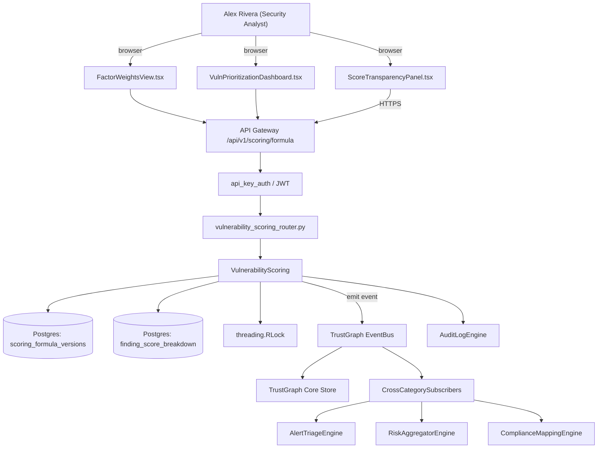

# US-0043: Expose explainable scoring: per-finding factor breakdown with weights

## Sub-Epic: AI/Copilot
**Master Goal**: ALDECI — tiered $199-$1,499/mo enterprise security intelligence platform replacing $50K-$500K/yr tools

## User Story
As a **Alex Rivera (Security Analyst)**, I need to expose explainable scoring: per-finding factor breakdown with weights so that ALDECI AI console differentiates vs point-tool AI copilots.

## Why This Matters
Per competitor-aspm.md 'Absorb' §2, opacity is a universal complaint. Publish the scoring formula and return per-finding contribution per factor (exploitability, reachability, exposure, business criticality, threat-intel adversary match).

This work is called out as a P1 gap in `competitor-aspm.md`. Shipping it is load-bearing for ALDECI's tiered $199-$1,499/mo positioning against $50K-$500K/yr incumbents: every delayed gap becomes a displacement deal we lose.

## Architecture

## Current State: 40% — PARTIAL (gap in existing engine)
- [x] Base `vulnerability_scoring` engine + router exist (see existing v2 PRD `vulnerability_scoring.md`)
- [ ] Gap `GAP-043` features below are missing / partial
- [ ] Acceptance criteria in this PRD are not met by current code
- [ ] Data model additions listed below have not been migrated
- [ ] Tests listed under Tests Required do not exist yet

## Key Functions
**Backend (engine methods):**
- `get_formula()` — backs `GET /api/v1/scoring/formula`
- `get_score_breakdown()` — backs `GET /api/v1/findings/{id}/score-breakdown`
- `update_formula()` — backs `PUT /api/v1/scoring/formula`

**Frontend screens:**
- `ScoreTransparencyPanel.tsx` — operator-facing UI surface for this gap
- `FactorWeightsView.tsx` — operator-facing UI surface for this gap
- `VulnPrioritizationDashboard.tsx` — operator-facing UI surface for this gap

## API Endpoints
| Method | Path | Auth | Purpose |
|--------|------|------|---------|
| GET | `/api/v1/scoring/formula` | api_key_auth | scoring formula |
| GET | `/api/v1/findings/{id}/score-breakdown` | api_key_auth | {id} score breakdown |
| PUT | `/api/v1/scoring/formula` | api_key_auth | scoring formula |

## Data Model
- add scoring_formula_versions table: id, version, formula_json, active, created_at, created_by
- add finding_score_breakdown table: finding_id, factor_name, factor_value, weight, contribution, evaluated_at

## Dependencies
**Depends on**: none explicit
**Depended by**: Router layer, TrustGraph EventBus, CrossCategorySubscribers, CrossCategoryEvidenceBuilder, AuditLogEngine
**Existing engine module (to extend)**: `suite-core/core/vulnerability_scoring.py`
**Master gap id**: `GAP-043` (priority P1, effort S)

## Tasks Remaining
1. Schema migration: add scoring_formula_versions table (2h)
2. Schema migration: add finding_score_breakdown table (2h)
3. Implement endpoint GET /api/v1/scoring/formula (2h)
4. Implement endpoint GET /api/v1/findings/{id}/score-breakdown (2h)
5. Implement endpoint PUT /api/v1/scoring/formula (2h)
6. Wire frontend screen ScoreTransparencyPanel.tsx (2h)
7. Wire frontend screen FactorWeightsView.tsx (2h)
8. Wire frontend screen VulnPrioritizationDashboard.tsx (2h)
9. Write 4 pytest cases: test_formula_endpoint_returns_current, test_breakdown_sums_to_score… (2h)
10. Wire TrustGraph event emission + CrossCategorySubscriber consumers (2h)
11. Persona walkthrough + integration test (1h)
12. Docs + API reference update (1h)

## Definition of Done
- [ ] Given GET /api/v1/scoring/formula, When called, Then the current formula (factors, weights, normalizations) is returned with version.
- [ ] Given a finding, When GET /api/v1/findings/{id}/score-breakdown is called, Then each factor's value, weight, and contribution to the final risk_score is returned.
- [ ] Given ScoreTransparencyPanel.tsx, When opened on a finding, Then a stacked-bar shows each factor's contribution and a change history if weights were updated.
- [ ] Given an admin updates factor weights, When changes are saved, Then an audit-log entry is created, affected findings are re-scored in background, and the new formula version is returned by the formula endpoint.
- [ ] Given a finding re-scored post-weight-change, When viewed, Then the delta from the prior score is shown with the driver (e.g., 'exploitability weight raised 15%').
- [ ] All endpoints are org-scoped (no hardcoded org_id) and gated by `api_key_auth`.
- [ ] TrustGraph emits at least one event type for this engine and a CrossCategorySubscriber consumes it.
- [ ] `Alex Rivera (Security Analyst)` can execute the full workflow in the 30-persona walkthrough.

## Tests Required
- `test_formula_endpoint_returns_current`
- `test_breakdown_sums_to_score`
- `test_weight_update_rescores_findings`
- `test_formula_change_audit_log`

## Sprint: Wave 49 (est. Jun 03-Jun 09, 2026)

## Citation
Source research: `competitor-aspm.md` (gap `GAP-043`, priority `P1`, effort `S`)
