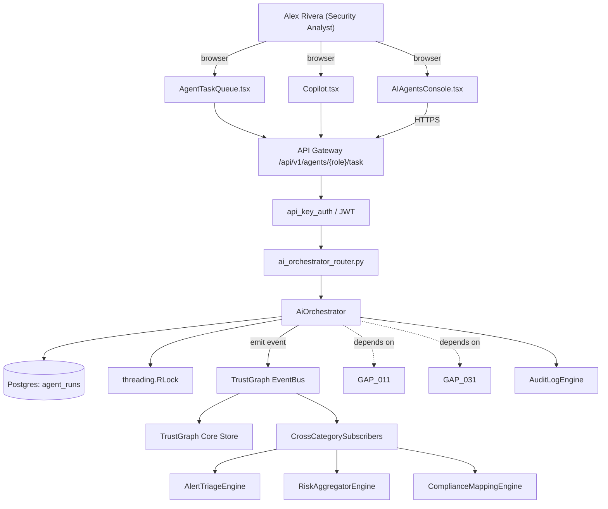

# US-0044: Ship AI Teammates console: Change-Impact, Exploitability, Fix-and-Remediation, Graph-Chat agents

## Sub-Epic: AI/Copilot
**Master Goal**: ALDECI — tiered $199-$1,499/mo enterprise security intelligence platform replacing $50K-$500K/yr tools

## User Story
As a **Alex Rivera (Security Analyst)**, I need to ship AI Teammates console: Change-Impact, Exploitability, Fix-and-Remediation, Graph-Chat agents so that ALDECI AI console differentiates vs point-tool AI copilots.

## Why This Matters
Per competitor-emerging.md §3, Cycode markets AI Teammates as distinct agents with defined roles. Fixops has `ai_orchestrator`, `copilot`, `ai_powered_soc`, `ai_security_advisor`, `autofix_engine`; expose them as named agents with task queues.

This work is called out as a P1 gap in `competitor-emerging.md`. Shipping it is load-bearing for ALDECI's tiered $199-$1,499/mo positioning against $50K-$500K/yr incumbents: every delayed gap becomes a displacement deal we lose.

## Architecture

## Current State: 40% — PARTIAL (gap in existing engine)
- [x] Base `ai_orchestrator` engine + router exist (see existing v2 PRD `ai_orchestrator.md`)
- [ ] Gap `GAP-044` features below are missing / partial
- [ ] Acceptance criteria in this PRD are not met by current code
- [ ] Data model additions listed below have not been migrated
- [ ] Tests listed under Tests Required do not exist yet

## Key Functions
**Backend (engine methods):**
- `create_task()` — backs `POST /api/v1/agents/{role}/task`
- `get_runs()` — backs `GET /api/v1/agents/runs`
- `create_retry()` — backs `POST /api/v1/agents/runs/{id}/retry`

**Frontend screens:**
- `AIAgentsConsole.tsx` — operator-facing UI surface for this gap
- `AgentTaskQueue.tsx` — operator-facing UI surface for this gap
- `Copilot.tsx` — operator-facing UI surface for this gap

## API Endpoints
| Method | Path | Auth | Purpose |
|--------|------|------|---------|
| POST | `/api/v1/agents/{role}/task` | api_key_auth | {role} task |
| GET | `/api/v1/agents/runs` | api_key_auth | agents runs |
| POST | `/api/v1/agents/runs/{id}/retry` | api_key_auth | {id} retry |

## Data Model
- add agent_runs table: id, role, input_context (JSONB), output (JSONB), status, started_at, ended_at, error

## Dependencies
**Depends on**: GAP-011, GAP-031
**Depended by**: Router layer, TrustGraph EventBus, CrossCategorySubscribers, CrossCategoryEvidenceBuilder, AuditLogEngine
**Existing engine module (to extend)**: `suite-core/core/ai_orchestrator.py`
**Master gap id**: `GAP-044` (priority P1, effort M)

## Tasks Remaining
1. Schema migration: add agent_runs table (3h)
2. Implement endpoint POST /api/v1/agents/{role}/task (5h)
3. Implement endpoint GET /api/v1/agents/runs (5h)
4. Implement endpoint POST /api/v1/agents/runs/{id}/retry (5h)
5. Wire frontend screen AIAgentsConsole.tsx (4h)
6. Wire frontend screen AgentTaskQueue.tsx (4h)
7. Wire frontend screen Copilot.tsx (4h)
8. Write 4 pytest cases: test_fix_and_remediation_produces_proposal, test_exploitability_agent_verdict_format… (5h)
9. Wire TrustGraph event emission + CrossCategorySubscriber consumers (3h)
10. Persona walkthrough + integration test (3h)
11. Docs + API reference update (2h)

## Definition of Done
- [ ] Given AIAgentsConsole.tsx, When opened, Then four agents (Change-Impact, Exploitability, Fix-and-Remediation, Graph-Chat) are shown with current task counts and last-activity time.
- [ ] Given a user assigns a finding to Fix-and-Remediation, When the agent runs, Then a fix proposal is produced and linked to an AutoFix run.
- [ ] Given the Exploitability agent receives a finding, When it runs, Then it consults reachability + threat-intel + MPTE and returns verdict={exploitable, not_exploitable, inconclusive} with rationale.
- [ ] Given a PR, When Change-Impact agent runs, Then it produces a material-change summary and posts a PR comment.
- [ ] Given an agent task fails, When viewed, Then the error, input context, and rerun option are visible.
- [ ] Given GET /api/v1/agents/runs?role=, When called, Then results are filterable by agent role, status, and date.
- [ ] All endpoints are org-scoped (no hardcoded org_id) and gated by `api_key_auth`.
- [ ] TrustGraph emits at least one event type for this engine and a CrossCategorySubscriber consumes it.
- [ ] `Alex Rivera (Security Analyst)` can execute the full workflow in the 30-persona walkthrough.

## Tests Required
- `test_fix_and_remediation_produces_proposal`
- `test_exploitability_agent_verdict_format`
- `test_change_impact_agent_pr_comment`
- `test_failed_task_retry`

## Sprint: Wave 46 (est. May 13-May 19, 2026)

## Citation
Source research: `competitor-emerging.md` (gap `GAP-044`, priority `P1`, effort `M`)
