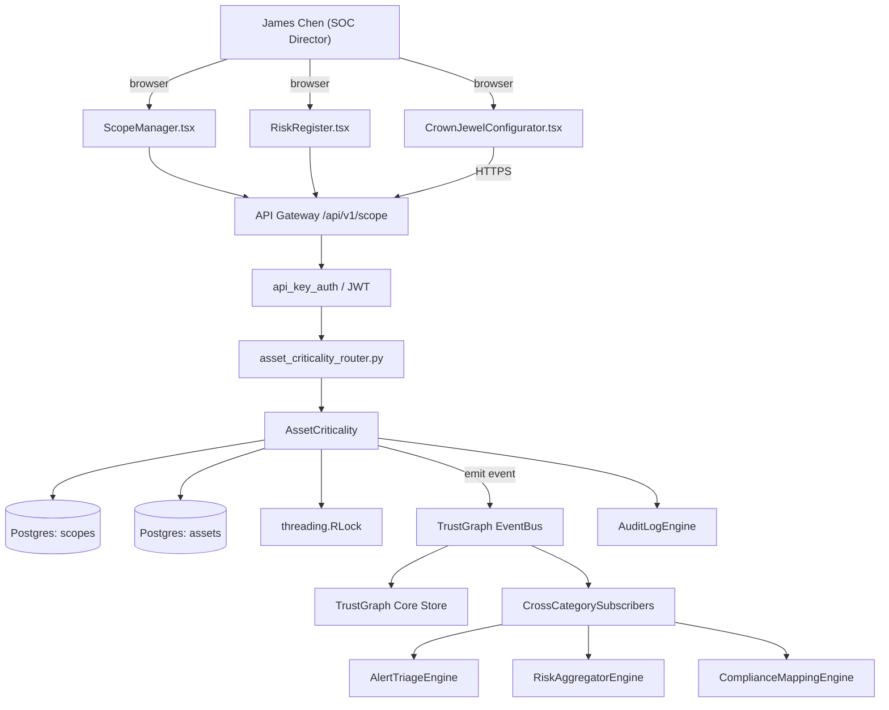

# US-0046: Add crown-jewel scoping + business-service tagging for CTEM

## Sub-Epic: Graph/Reachability
**Master Goal**: ALDECI — tiered $199-$1,499/mo enterprise security intelligence platform replacing $50K-$500K/yr tools

## User Story
As a **James Chen (SOC Director)**, I need to add crown-jewel scoping + business-service tagging for CTEM so that reachability-driven prioritization cuts false-positive noise and wins AppSec POCs.

## Why This Matters
Per competitor-ctem.md §0 (CTEM Scoping stage) and §1, critical-asset scoping is stage-1 of the CTEM loop. Fixops has `asset_criticality`, `asset_group`, `asset_tagging`, `risk_register`; build a first-class CrownJewelConfigurator + scope manager.

This work is called out as a P1 gap in `competitor-ctem.md`. Shipping it is load-bearing for ALDECI's tiered $199-$1,499/mo positioning against $50K-$500K/yr incumbents: every delayed gap becomes a displacement deal we lose.

## Architecture

## Current State: 40% — PARTIAL (gap in existing engine)
- [x] Base `asset_criticality` engine + router exist (see existing v2 PRD `asset_criticality.md`)
- [ ] Gap `GAP-046` features below are missing / partial
- [ ] Acceptance criteria in this PRD are not met by current code
- [ ] Data model additions listed below have not been migrated
- [ ] Tests listed under Tests Required do not exist yet

## Key Functions
**Backend (engine methods):**
- `create_scope()` — backs `POST /api/v1/scope`
- `create_crown_jewel_tag()` — backs `POST /api/v1/assets/{id}/crown-jewel-tag`
- `get_scopes()` — backs `GET /api/v1/scopes`
- `get_assets()` — backs `GET /api/v1/scopes/{id}/assets`

**Frontend screens:**
- `CrownJewelConfigurator.tsx` — operator-facing UI surface for this gap
- `ScopeManager.tsx` — operator-facing UI surface for this gap
- `RiskRegister.tsx` — operator-facing UI surface for this gap

## API Endpoints
| Method | Path | Auth | Purpose |
|--------|------|------|---------|
| POST | `/api/v1/scope` | api_key_auth | v1 scope |
| POST | `/api/v1/assets/{id}/crown-jewel-tag` | api_key_auth | {id} crown jewel tag |
| GET | `/api/v1/scopes` | api_key_auth | v1 scopes |
| GET | `/api/v1/scopes/{id}/assets` | api_key_auth | {id} assets |

## Data Model
- add scopes table: id, org_id, name, criteria (JSONB), created_at
- add asset_crown_jewel_flag column on assets table (bool + reason)

## Dependencies
**Depends on**: none explicit
**Depended by**: Router layer, TrustGraph EventBus, CrossCategorySubscribers, CrossCategoryEvidenceBuilder, AuditLogEngine
**Existing engine module (to extend)**: `suite-core/core/asset_criticality.py`
**Master gap id**: `GAP-046` (priority P1, effort M)

## Tasks Remaining
1. Schema migration: add scopes table (3h)
2. Schema migration: add asset_crown_jewel_flag column on assets table (bool + reason) (3h)
3. Implement endpoint POST /api/v1/scope (4h)
4. Implement endpoint POST /api/v1/assets/{id}/crown-jewel-tag (4h)
5. Implement endpoint GET /api/v1/scopes (4h)
6. Implement endpoint GET /api/v1/scopes/{id}/assets (4h)
7. Wire frontend screen CrownJewelConfigurator.tsx (4h)
8. Wire frontend screen ScopeManager.tsx (4h)
9. Wire frontend screen RiskRegister.tsx (4h)
10. Write 4 pytest cases: test_crown_jewel_inherits_from_service, test_scope_limits_ctem_evaluation… (4h)
11. Wire TrustGraph event emission + CrossCategorySubscriber consumers (3h)
12. Persona walkthrough + integration test (2h)
13. Docs + API reference update (1h)

## Definition of Done
- [ ] Given CrownJewelConfigurator.tsx, When a user marks a business service 'Payments', Then all underlying assets inherit the crown-jewel flag and appear in the Payments scope.
- [ ] Given a scope, When a CTEM workflow runs with that scope, Then only crown-jewel assets and their reachable paths are evaluated.
- [ ] Given POST /api/v1/scope, When called with criteria (tag=prod AND service=payments), Then the scope is saved and returns scope_id for reuse.
- [ ] Given a scope, When BRS is computed, Then the dollar-risk is aggregated for crown-jewels within the scope.
- [ ] Given a crown-jewel flag removal, When applied, Then dependent attack-path recomputes and audit-log records the change.
- [ ] All endpoints are org-scoped (no hardcoded org_id) and gated by `api_key_auth`.
- [ ] TrustGraph emits at least one event type for this engine and a CrossCategorySubscriber consumes it.
- [ ] `James Chen (SOC Director)` can execute the full workflow in the 30-persona walkthrough.

## Tests Required
- `test_crown_jewel_inherits_from_service`
- `test_scope_limits_ctem_evaluation`
- `test_brs_aggregates_within_scope`
- `test_crown_jewel_removal_audit_entry`

## Sprint: Wave 47 (est. May 20-May 26, 2026)

## Citation
Source research: `competitor-ctem.md` (gap `GAP-046`, priority `P1`, effort `M`)
