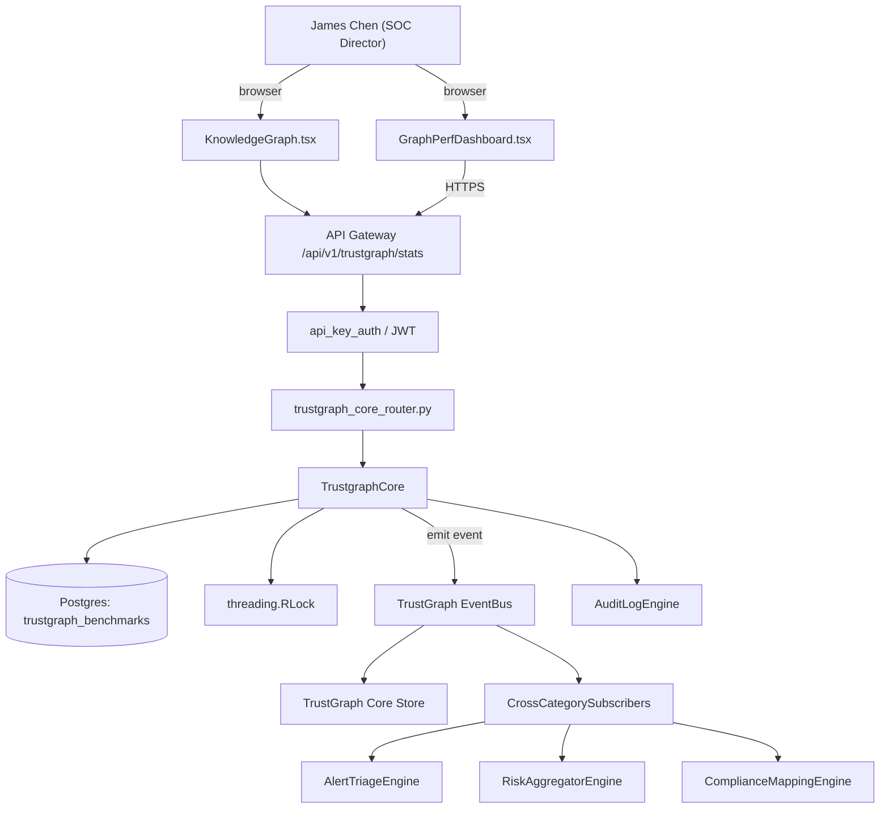

# US-0047: Scale TrustGraph to 10k+ nodes / 100k+ edges with incremental updates and <2s interactive queries

## Sub-Epic: Graph/Reachability
**Master Goal**: ALDECI — tiered $199-$1,499/mo enterprise security intelligence platform replacing $50K-$500K/yr tools

## User Story
As a **James Chen (SOC Director)**, I need to scale TrustGraph to 10k+ nodes / 100k+ edges with incremental updates and <2s interactive queries so that reachability-driven prioritization cuts false-positive noise and wins AppSec POCs.

## Why This Matters
Per competitor-emerging.md verdict, TrustGraph is currently ~1,941 nodes / 7,324 edges. Apiiro and XM Cyber graphs are orders of magnitude larger. Scale the graph substrate (consider indexing, partitioning, Neo4j or equivalent, incremental recompute) to 10k+ nodes and benchmark.

This work is called out as a P1 gap in `competitor-emerging.md`. Shipping it is load-bearing for ALDECI's tiered $199-$1,499/mo positioning against $50K-$500K/yr incumbents: every delayed gap becomes a displacement deal we lose.

## Architecture

## Current State: 40% — PARTIAL (gap in existing engine)
- [x] Base `trustgraph_core` engine + router exist (see existing v2 PRD `trustgraph_core.md`)
- [ ] Gap `GAP-047` features below are missing / partial
- [ ] Acceptance criteria in this PRD are not met by current code
- [ ] Data model additions listed below have not been migrated
- [ ] Tests listed under Tests Required do not exist yet

## Key Functions
**Backend (engine methods):**
- `get_stats()` — backs `GET /api/v1/trustgraph/stats`
- `create_compact()` — backs `POST /api/v1/trustgraph/compact`
- `get_quality_issues()` — backs `GET /api/v1/trustgraph/quality-issues`

**Frontend screens:**
- `GraphPerfDashboard.tsx` — operator-facing UI surface for this gap
- `KnowledgeGraph.tsx` — operator-facing UI surface for this gap

## API Endpoints
| Method | Path | Auth | Purpose |
|--------|------|------|---------|
| GET | `/api/v1/trustgraph/stats` | api_key_auth | trustgraph stats |
| POST | `/api/v1/trustgraph/compact` | api_key_auth | trustgraph compact |
| GET | `/api/v1/trustgraph/quality-issues` | api_key_auth | trustgraph quality issues |

## Data Model
- add trustgraph_benchmarks table: id, run_at, node_count, edge_count, p50_ms, p95_ms, workload

## Dependencies
**Depends on**: none explicit
**Depended by**: Router layer, TrustGraph EventBus, CrossCategorySubscribers, CrossCategoryEvidenceBuilder, AuditLogEngine
**Existing engine module (to extend)**: `suite-core/core/trustgraph_core.py`
**Master gap id**: `GAP-047` (priority P1, effort L)

## Tasks Remaining
1. Schema migration: add trustgraph_benchmarks table (4h)
2. Implement endpoint GET /api/v1/trustgraph/stats (6h)
3. Implement endpoint POST /api/v1/trustgraph/compact (6h)
4. Implement endpoint GET /api/v1/trustgraph/quality-issues (6h)
5. Wire frontend screen GraphPerfDashboard.tsx (5h)
6. Wire frontend screen KnowledgeGraph.tsx (5h)
7. Write 5 pytest cases: test_single_hop_p95_under_500ms, test_5_hop_toxic_combo_under_10s… (6h)
8. Wire TrustGraph event emission + CrossCategorySubscriber consumers (4h)
9. Persona walkthrough + integration test (3h)
10. Docs + API reference update (2h)

## Definition of Done
- [ ] Given a synthetic 10k-node / 100k-edge TrustGraph, When a single-hop query runs, Then p95 latency is <500ms.
- [ ] Given a 5-hop traversal for toxic-combo detection on the same graph, When run, Then p95 completes in <10s.
- [ ] Given an incremental update (add 100 nodes + 500 edges), When applied, Then dependent caches invalidate in <5s and downstream correlations are recomputed in <60s.
- [ ] Given GraphPerfDashboard.tsx, When opened, Then query-latency histograms, edge/node counts, and write-throughput are displayed.
- [ ] Given a maintenance window, When POST /api/v1/trustgraph/compact is invoked, Then orphan nodes are removed, indexes rebuilt, and reports show the compaction ratio.
- [ ] Given the quality monitor, When cycles, orphan chains, or stale nodes are detected, Then they appear in a quality issues queue.
- [ ] All endpoints are org-scoped (no hardcoded org_id) and gated by `api_key_auth`.
- [ ] TrustGraph emits at least one event type for this engine and a CrossCategorySubscriber consumes it.
- [ ] `James Chen (SOC Director)` can execute the full workflow in the 30-persona walkthrough.

## Tests Required
- `test_single_hop_p95_under_500ms`
- `test_5_hop_toxic_combo_under_10s`
- `test_incremental_cache_invalidation_under_5s`
- `test_compact_removes_orphans`
- `test_quality_monitor_detects_cycles`

## Sprint: Wave 48 (est. May 27-Jun 02, 2026)

## Citation
Source research: `competitor-emerging.md` (gap `GAP-047`, priority `P1`, effort `L`)
