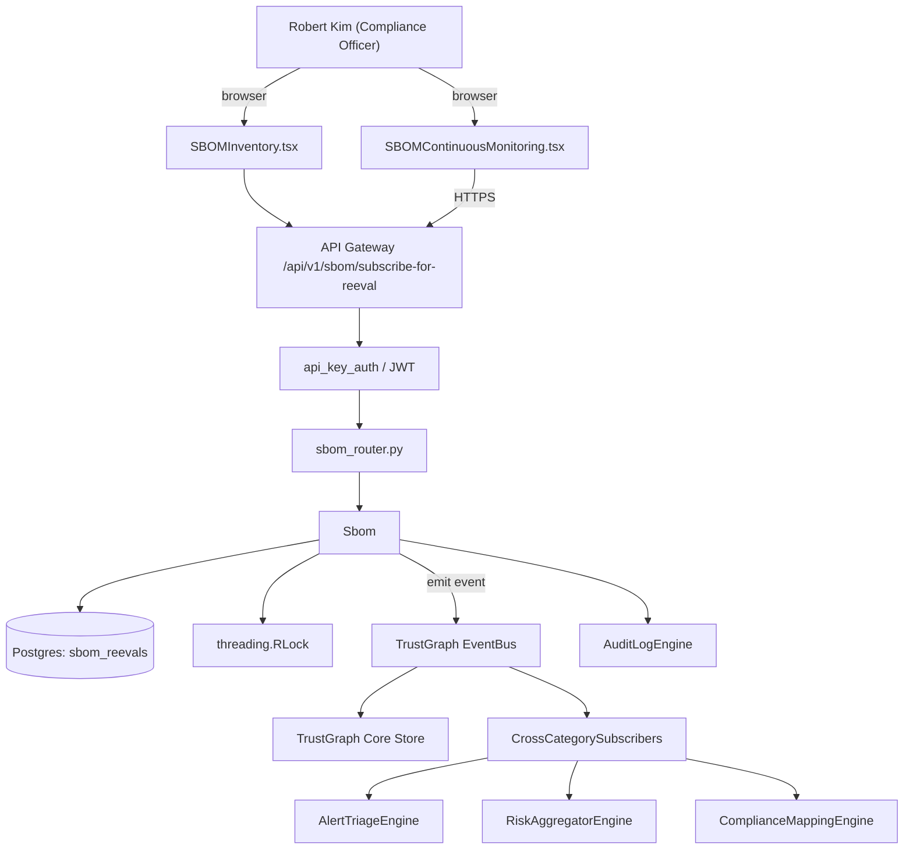

# US-0055: Continuous SBOM monitoring: re-evaluate ingested third-party SBOMs as new CVEs drop

## Sub-Epic: Compliance
**Master Goal**: ALDECI — tiered $199-$1,499/mo enterprise security intelligence platform replacing $50K-$500K/yr tools

## User Story
As a **Robert Kim (Compliance Officer)**, I need the ability to continuous SBOM monitoring: re-evaluate ingested third-party SBOMs as new CVEs drop so that Fixops satisfies SOC2, NIST SP 800-53, FedRAMP, and FIPS-140 controls customers ask for in procurement.

## Why This Matters
Per competitor-sonatype.md §1 (SBOM Manager), third-party SBOMs must be continuously re-evaluated when new intel lands. Fixops has `sbom` / `sbom_export` and SBOM screens; add the scheduler + delta notifications.

This work is called out as a P1 gap in `competitor-sonatype.md`. Shipping it is load-bearing for ALDECI's tiered $199-$1,499/mo positioning against $50K-$500K/yr incumbents: every delayed gap becomes a displacement deal we lose.

## Architecture

## Current State: 40% — PARTIAL (gap in existing engine)
- [x] Base `sbom` engine + router exist (see existing v2 PRD `sbom.md`)
- [ ] Gap `GAP-055` features below are missing / partial
- [ ] Acceptance criteria in this PRD are not met by current code
- [ ] Data model additions listed below have not been migrated
- [ ] Tests listed under Tests Required do not exist yet

## Key Functions
**Backend (engine methods):**
- `create_subscribe_for_reeval()` — backs `POST /api/v1/sbom/subscribe-for-reeval`
- `get_re_eval_history()` — backs `GET /api/v1/sbom/{id}/re-eval-history`

**Frontend screens:**
- `SBOMContinuousMonitoring.tsx` — operator-facing UI surface for this gap
- `SBOMInventory.tsx` — operator-facing UI surface for this gap

## API Endpoints
| Method | Path | Auth | Purpose |
|--------|------|------|---------|
| POST | `/api/v1/sbom/subscribe-for-reeval` | api_key_auth | sbom subscribe for reeval |
| GET | `/api/v1/sbom/{id}/re-eval-history` | api_key_auth | {id} re eval history |

## Data Model
- add sbom_reevals table: id, sbom_id, run_at, new_vuln_count, components_covered, notes

## Dependencies
**Depends on**: none explicit
**Depended by**: Router layer, TrustGraph EventBus, CrossCategorySubscribers, CrossCategoryEvidenceBuilder, AuditLogEngine
**Existing engine module (to extend)**: `suite-core/core/sbom.py`
**Master gap id**: `GAP-055` (priority P1, effort M)

## Tasks Remaining
1. Schema migration: add sbom_reevals table (4h)
2. Implement endpoint POST /api/v1/sbom/subscribe-for-reeval (6h)
3. Implement endpoint GET /api/v1/sbom/{id}/re-eval-history (6h)
4. Wire frontend screen SBOMContinuousMonitoring.tsx (5h)
5. Wire frontend screen SBOMInventory.tsx (5h)
6. Write 4 pytest cases: test_reeval_detects_new_cve_on_ingested_sbom, test_webhook_fires_on_new_vulns… (6h)
7. Wire TrustGraph event emission + CrossCategorySubscriber consumers (4h)
8. Persona walkthrough + integration test (3h)
9. Docs + API reference update (2h)

## Definition of Done
- [ ] Given an ingested CycloneDX SBOM, When a new CVE lands affecting one of its components, Then the SBOM is re-evaluated within 1h and a new finding is created.
- [ ] Given SBOMContinuousMonitoring.tsx, When opened, Then each monitored SBOM shows last_re_eval_at, new_vulns_since_ingest, and subscription status.
- [ ] Given POST /api/v1/sbom/subscribe-for-reeval with sbom_id, When saved, Then the SBOM is added to the monitoring rotation.
- [ ] Given a re-eval that finds new HIGH+ vulns, When emitted, Then webhook event sbom.vulns.new fires to subscribers.
- [ ] Given an SBOM whose components are no longer in the data feed, When re-evaluated, Then a coverage gap note is recorded.
- [ ] All endpoints are org-scoped (no hardcoded org_id) and gated by `api_key_auth`.
- [ ] TrustGraph emits at least one event type for this engine and a CrossCategorySubscriber consumes it.
- [ ] `Robert Kim (Compliance Officer)` can execute the full workflow in the 30-persona walkthrough.

## Tests Required
- `test_reeval_detects_new_cve_on_ingested_sbom`
- `test_webhook_fires_on_new_vulns`
- `test_subscription_add_and_remove`
- `test_coverage_gap_noted`

## Sprint: Wave 49 (est. Jun 03-Jun 09, 2026)

## Citation
Source research: `competitor-sonatype.md` (gap `GAP-055`, priority `P1`, effort `M`)
