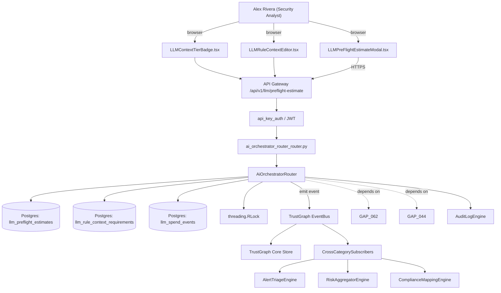

# US-0061: Tiered LLM context router + pre-flight cost-estimate modal (per-rule contextRequirement, user-approved spend)

## Sub-Epic: UX/AI
**Master Goal**: ALDECI — tiered $199-$1,499/mo enterprise security intelligence platform replacing $50K-$500K/yr tools

## User Story
As a **Alex Rivera (Security Analyst)**, I need the ability to tiered LLM context router + pre-flight cost-estimate modal so that ALDECI keeps parity with $50K-$500K/yr incumbents at $199-$1,499/mo.

## Why This Matters
Per /tmp/truecourse-analysis.md §8 (LLM layer) + §9 takeaway 1 and competitor-truecourse.md, TrueCourse attaches a contextRequirement (tier: metadata|targeted|full-file + fileFilter/functionFilter) to every LLM rule and computes a PreFlightEstimate (total tokens, tiered breakdown, dollar estimate) that the user must approve before any tokens spend. Fixops' LLM copilots today spend tokens opaquely. Extend ai_orchestrator_router + ai_governance with (a) a per-rule contextRequirement schema, (b) a context-router that selects metadata-only/targeted/full-file context batches with MAX_CHARS_PER_BATCH=100_000 caps and PROMPT_OVERHEAD_TOKENS=500 / TOKENS_PER_RULE=50 / TOKENS_PER_FILE_PATH=25 budgeting, (c) a pre-flight estimator, and (d) an approve-or-reject modal gating actual spend, surfaced both in the web UI and via CLI prompt.

This work is called out as a P1 gap in `competitor-truecourse.md`. Shipping it is load-bearing for ALDECI's tiered $199-$1,499/mo positioning against $50K-$500K/yr incumbents: every delayed gap becomes a displacement deal we lose.

## Architecture

## Current State: 40% — PARTIAL (gap in existing engine)
- [x] Base `ai_orchestrator_router` engine + router exist (see existing v2 PRD `ai_orchestrator_router.md`)
- [ ] Gap `GAP-061` features below are missing / partial
- [ ] Acceptance criteria in this PRD are not met by current code
- [ ] Data model additions listed below have not been migrated
- [ ] Tests listed under Tests Required do not exist yet

## Key Functions
**Backend (engine methods):**
- `create_preflight_estimate()` — backs `POST /api/v1/llm/preflight-estimate`
- `create_estimateId()` — backs `POST /api/v1/llm/approve-spend/{estimateId}`
- `get_context_requirement()` — backs `GET /api/v1/llm/rules/{key}/context-requirement`
- `get_history()` — backs `GET /api/v1/llm/spend/history`

**Frontend screens:**
- `LLMPreFlightEstimateModal.tsx` — operator-facing UI surface for this gap
- `LLMContextTierBadge.tsx` — operator-facing UI surface for this gap
- `LLMRuleContextEditor.tsx` — operator-facing UI surface for this gap
- `CopilotGraphChat.tsx` — operator-facing UI surface for this gap

## API Endpoints
| Method | Path | Auth | Purpose |
|--------|------|------|---------|
| POST | `/api/v1/llm/preflight-estimate` | api_key_auth | llm preflight estimate |
| POST | `/api/v1/llm/approve-spend/{estimateId}` | api_key_auth | approve spend {estimateId} |
| GET | `/api/v1/llm/rules/{key}/context-requirement` | api_key_auth | {key} context requirement |
| GET | `/api/v1/llm/spend/history` | api_key_auth | spend history |

## Data Model
- add llm_preflight_estimates table: id, org_id, created_at, estimated_input_tokens, estimated_output_tokens, estimated_cost_usd, per_tier_breakdown (JSONB), approved_at, approved_by, actual_cost_usd, status
- add llm_rule_context_requirements table: rule_key, tier (enum: metadata|targeted|full-file), file_filter (JSONB), function_filter (JSONB), updated_at
- add llm_spend_events table: id, estimate_id, rule_key, call_type, input_tokens, output_tokens, cache_read_tokens, cache_creation_tokens, cost_usd, timestamp

## Dependencies
**Depends on**: GAP-062, GAP-044
**Depended by**: Router layer, TrustGraph EventBus, CrossCategorySubscribers, CrossCategoryEvidenceBuilder, AuditLogEngine
**Existing engine module (to extend)**: `suite-core/core/ai_orchestrator_router.py`
**Master gap id**: `GAP-061` (priority P1, effort M)

## Tasks Remaining
1. Schema migration: add llm_preflight_estimates table (3h)
2. Schema migration: add llm_rule_context_requirements table (3h)
3. Schema migration: add llm_spend_events table (3h)
4. Implement endpoint POST /api/v1/llm/preflight-estimate (4h)
5. Implement endpoint POST /api/v1/llm/approve-spend/{estimateId} (4h)
6. Implement endpoint GET /api/v1/llm/rules/{key}/context-requirement (4h)
7. Implement endpoint GET /api/v1/llm/spend/history (4h)
8. Wire frontend screen LLMPreFlightEstimateModal.tsx (3h)
9. Wire frontend screen LLMContextTierBadge.tsx (3h)
10. Wire frontend screen LLMRuleContextEditor.tsx (3h)
11. Wire frontend screen CopilotGraphChat.tsx (3h)
12. Write 7 pytest cases: test_context_router_selects_targeted_files_only, test_preflight_estimate_returns_within_2s… (4h)
13. Wire TrustGraph event emission + CrossCategorySubscriber consumers (3h)
14. Persona walkthrough + integration test (2h)
15. Docs + API reference update (1h)

## Definition of Done
- [ ] Given an LLM rule declared with contextRequirement.tier='targeted' and fileFilter.hasRouteHandlers=true, When an analysis runs, Then only files containing route handlers are batched into the prompt and the metadata log records context_tier='targeted' and files_included=<N>.
- [ ] Given a planned LLM run across 50 rules and 2000 files, When POST /api/v1/llm/preflight-estimate is called, Then the response returns total_input_tokens, total_output_tokens, estimated_cost_usd, and a per-tier breakdown {metadata, targeted, full-file} within 2 seconds.
- [ ] Given the LLMPreFlightEstimateModal.tsx surface, When the estimate is shown, Then the user sees total cost, per-rule contribution table, and explicit Approve/Cancel buttons — no tokens are spent until Approve is clicked.
- [ ] Given an approved estimate, When the orchestrator runs, Then actual spend is recorded against the estimateId and a deviation > 20% from the estimate raises a warning event.
- [ ] Given a rule with contextRequirement.tier='full-file' over a repo >100k chars, When batching runs, Then batches are split to respect MAX_CHARS_PER_BATCH=100000 and each batch carries its own token budget line item.
- [ ] Given the CLI `fixops analyze --llm`, When invoked non-interactively, Then the CLI prints the pre-flight estimate and requires --approve-spend to proceed; absent --approve-spend the process exits 3 (not-approved).
- [ ] Given a rule without a contextRequirement declaration, When validation runs, Then the rule is rejected at publish time with error_code=LLM_RULE_MISSING_CONTEXT_TIER.
- [ ] Given a GET /api/v1/llm/rules/{key}/context-requirement call, When the rule is LLM-type, Then the response includes tier, fileFilter, and functionFilter fields as declared.
- [ ] All endpoints are org-scoped (no hardcoded org_id) and gated by `api_key_auth`.
- [ ] TrustGraph emits at least one event type for this engine and a CrossCategorySubscriber consumes it.
- [ ] `Alex Rivera (Security Analyst)` can execute the full workflow in the 30-persona walkthrough.

## Tests Required
- `test_context_router_selects_targeted_files_only`
- `test_preflight_estimate_returns_within_2s`
- `test_spend_blocked_until_user_approves`
- `test_cli_requires_approve_spend_flag`
- `test_batch_splitting_respects_max_chars`
- `test_deviation_over_20pct_raises_warning`
- `test_rule_without_context_tier_rejected_at_publish`

## Sprint: Wave 47 (est. May 20-May 26, 2026)

## Citation
Source research: `competitor-truecourse.md` (gap `GAP-061`, priority `P1`, effort `M`)
