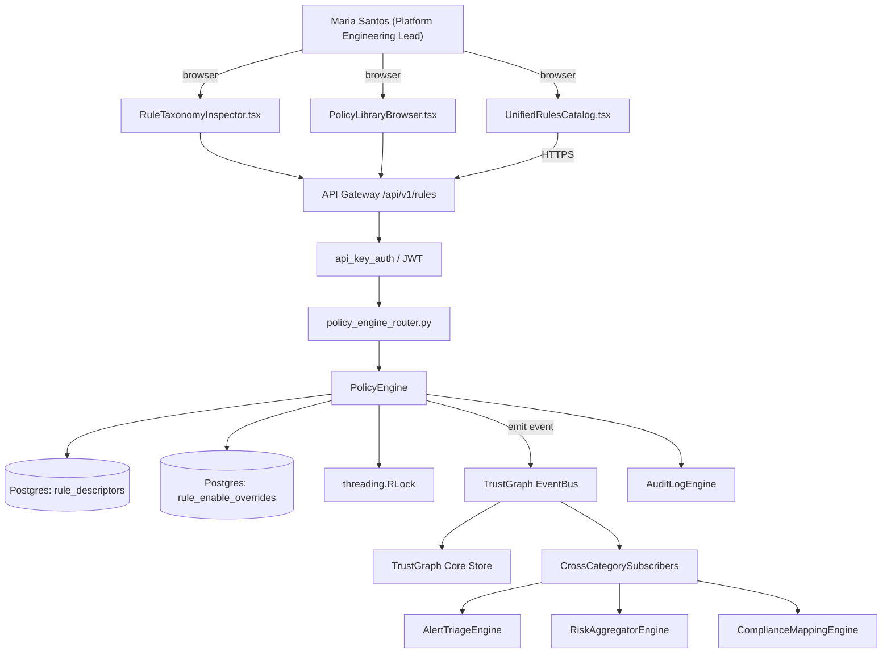

# US-0062: Unified deterministic + LLM rule taxonomy with shared shape across SAST/SCA/IaC/secret/LLM paths

## Sub-Epic: Platform
**Master Goal**: ALDECI — tiered $199-$1,499/mo enterprise security intelligence platform replacing $50K-$500K/yr tools

## User Story
As a **Maria Santos (Platform Engineering Lead)**, I need the ability to unified deterministic + LLM rule taxonomy with shared shape across SAST/SCA/IaC/secret/LLM paths so that ALDECI keeps parity with $50K-$500K/yr incumbents at $199-$1,499/mo.

## Why This Matters
Per /tmp/truecourse-analysis.md §3 (Rules Catalog taxonomy) + §9 takeaway 2 and competitor-truecourse.md, every TrueCourse rule — whether fast AST visitor or LLM prompt — shares the same {key, domain, category, severity, description, enabled, type: deterministic|llm} shape. Disable/enable, diff, and UI filtering all work uniformly. Fixops today fragments rule shapes across sast, iac_scanner, secret_scanner, policy_engine, real_opa_engine, and ai_security_advisor. Define a shared RuleDescriptor schema and refactor each path to publish rules against it. Enables unified /api/v1/rules, single Rules catalog UI, and consistent enable/disable + filtering semantics. Prerequisite for GAP-061 (context tiering on LLM rules) and GAP-069 (rule DSL).

This work is called out as a P1 gap in `competitor-truecourse.md`. Shipping it is load-bearing for ALDECI's tiered $199-$1,499/mo positioning against $50K-$500K/yr incumbents: every delayed gap becomes a displacement deal we lose.

## Architecture

## Current State: 40% — PARTIAL (gap in existing engine)
- [x] Base `policy_engine` engine + router exist (see existing v2 PRD `policy_engine.md`)
- [ ] Gap `GAP-062` features below are missing / partial
- [ ] Acceptance criteria in this PRD are not met by current code
- [ ] Data model additions listed below have not been migrated
- [ ] Tests listed under Tests Required do not exist yet

## Key Functions
**Backend (engine methods):**
- `get_rules()` — backs `GET /api/v1/rules`
- `get_key()` — backs `GET /api/v1/rules/{key}`
- `patch_enabled()` — backs `PATCH /api/v1/rules/{key}/enabled`
- `get_domains()` — backs `GET /api/v1/rules/domains`
- `get_categories()` — backs `GET /api/v1/rules/categories`

**Frontend screens:**
- `UnifiedRulesCatalog.tsx` — operator-facing UI surface for this gap
- `RuleTaxonomyInspector.tsx` — operator-facing UI surface for this gap
- `PolicyLibraryBrowser.tsx` — operator-facing UI surface for this gap

## API Endpoints
| Method | Path | Auth | Purpose |
|--------|------|------|---------|
| GET | `/api/v1/rules` | api_key_auth | v1 rules |
| GET | `/api/v1/rules/{key}` | api_key_auth | rules {key} |
| PATCH | `/api/v1/rules/{key}/enabled` | api_key_auth | {key} enabled |
| GET | `/api/v1/rules/domains` | api_key_auth | rules domains |
| GET | `/api/v1/rules/categories` | api_key_auth | rules categories |

## Data Model
- add rule_descriptors table: key (PK, format <domain>/<type>/<slug>), domain, category, severity, description, enabled (bool), type (deterministic|llm), source_engine, created_at, updated_at
- add rule_enable_overrides table: rule_key, org_id, app_id, enabled, updated_at, updated_by

## Dependencies
**Depends on**: none explicit
**Depended by**: Router layer, TrustGraph EventBus, CrossCategorySubscribers, CrossCategoryEvidenceBuilder, AuditLogEngine
**Existing engine module (to extend)**: `suite-core/core/policy_engine.py`
**Master gap id**: `GAP-062` (priority P1, effort M)

## Tasks Remaining
1. Schema migration: add rule_descriptors table (3h)
2. Schema migration: add rule_enable_overrides table (3h)
3. Implement endpoint GET /api/v1/rules (4h)
4. Implement endpoint GET /api/v1/rules/{key} (4h)
5. Implement endpoint PATCH /api/v1/rules/{key}/enabled (4h)
6. Implement endpoint GET /api/v1/rules/domains (4h)
7. Implement endpoint GET /api/v1/rules/categories (4h)
8. Wire frontend screen UnifiedRulesCatalog.tsx (3h)
9. Wire frontend screen RuleTaxonomyInspector.tsx (3h)
10. Wire frontend screen PolicyLibraryBrowser.tsx (3h)
11. Write 7 pytest cases: test_rule_descriptor_zod_validation, test_unified_get_rules_across_engines… (4h)
12. Wire TrustGraph event emission + CrossCategorySubscriber consumers (3h)
13. Persona walkthrough + integration test (2h)
14. Docs + API reference update (1h)

## Definition of Done
- [ ] Given the shared RuleDescriptor schema {key (domain/type/slug), domain (enum), category (enum), severity (info|low|medium|high|critical), description, enabled (bool), type (deterministic|llm)}, When any engine registers a rule, Then the rule passes Zod validation against the shared schema or is rejected with error_code=RULE_SCHEMA_INVALID.
- [ ] Given rules registered from sast, iac_scanner, secret_scanner, policy_engine, and ai_security_advisor, When GET /api/v1/rules is called, Then the response returns a unified list with stable keys and identical field shape across engines.
- [ ] Given the UnifiedRulesCatalog.tsx, When a user disables a rule via PATCH /api/v1/rules/{key}/enabled, Then the change propagates to the originating engine within 5s and subsequent scans skip that rule.
- [ ] Given a rule of type='llm', When GET /api/v1/rules/{key} is called, Then the response additionally carries a contextRequirement (wired via GAP-061).
- [ ] Given a filter query `domain=security&severity=critical&enabled=true`, When applied to GET /api/v1/rules, Then only matching rules are returned regardless of originating engine.
- [ ] Given two engines attempting to register the same rule key, When the second registration runs, Then it is rejected with error_code=DUPLICATE_RULE_KEY and the first registration stands.
- [ ] Given a rule-schema migration, When existing rules are backfilled, Then every pre-existing rule has a valid key, domain, category, and severity or the migration fails and is rolled back.
- [ ] All endpoints are org-scoped (no hardcoded org_id) and gated by `api_key_auth`.
- [ ] TrustGraph emits at least one event type for this engine and a CrossCategorySubscriber consumes it.
- [ ] `Maria Santos (Platform Engineering Lead)` can execute the full workflow in the 30-persona walkthrough.

## Tests Required
- `test_rule_descriptor_zod_validation`
- `test_unified_get_rules_across_engines`
- `test_disable_propagates_to_engine_within_5s`
- `test_duplicate_rule_key_rejected`
- `test_filter_by_domain_severity_enabled`
- `test_backfill_migration_reversible`
- `test_llm_rule_carries_context_requirement`

## Sprint: Wave 48 (est. May 27-Jun 02, 2026)

## Citation
Source research: `competitor-truecourse.md` (gap `GAP-062`, priority `P1`, effort `M`)
