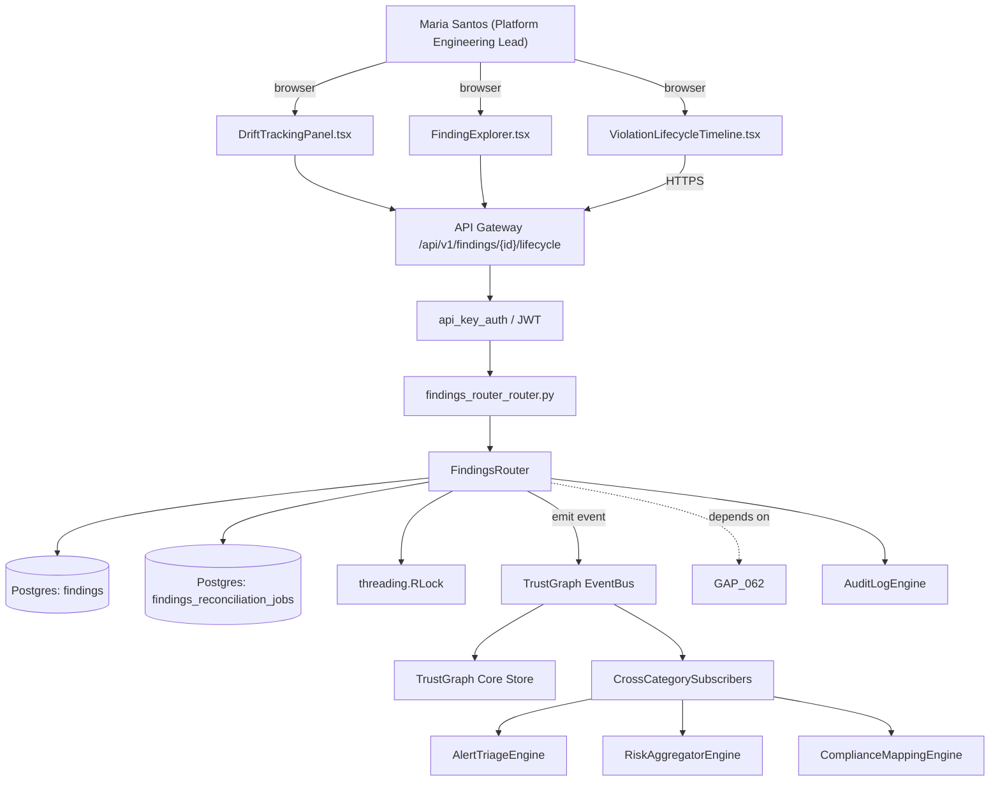

# US-0063: Violation lifecycle with stable identity (firstSeenAt / previousViolationId / resolvedAt) + LLM lifecycle prompt template

## Sub-Epic: Platform
**Master Goal**: ALDECI — tiered $199-$1,499/mo enterprise security intelligence platform replacing $50K-$500K/yr tools

## User Story
As a **Maria Santos (Platform Engineering Lead)**, I need the ability to violation lifecycle with stable identity (firstSeenAt / previousViolationId / resolvedAt) + LLM lifecycle prompt template so that ALDECI keeps parity with $50K-$500K/yr incumbents at $199-$1,499/mo.

## Why This Matters
Per /tmp/truecourse-analysis.md §4 (ViolationRecord) + §8 (Lifecycle / diff) + §9 takeaway 3 and competitor-truecourse.md, TrueCourse gives every violation a stable identity chain so 'was this fixed?' is answerable without heuristics. LLM analyses are explicitly prompted with previous violations and told to emit resolvedViolationIds / unchangedViolationIds / newViolations — real drift tracking. Fixops today lacks a stable previousViolationId chain; vuln_trend and vulnerability_age rely on duplicate/signature heuristics. Add firstSeenAt, previousViolationId, resolvedAt fields to findings; build a reconciliation step in the scan pipeline that links new findings to prior ones by (ruleKey + targetNode + location-fingerprint); update LLM prompts to receive prior violations and return lifecycle classifications. Prerequisite for GAP-066 (diff-mode UI).

This work is called out as a P1 gap in `competitor-truecourse.md`. Shipping it is load-bearing for ALDECI's tiered $199-$1,499/mo positioning against $50K-$500K/yr incumbents: every delayed gap becomes a displacement deal we lose.

## Architecture

## Current State: 40% — PARTIAL (gap in existing engine)
- [x] Base `findings_router` engine + router exist (see existing v2 PRD `findings_router.md`)
- [ ] Gap `GAP-063` features below are missing / partial
- [ ] Acceptance criteria in this PRD are not met by current code
- [ ] Data model additions listed below have not been migrated
- [ ] Tests listed under Tests Required do not exist yet

## Key Functions
**Backend (engine methods):**
- `get_lifecycle()` — backs `GET /api/v1/findings/{id}/lifecycle`
- `create_reconcile()` — backs `POST /api/v1/findings/reconcile`
- `get_drift()` — backs `GET /api/v1/findings/drift?since=`
- `get_findings()` — backs `GET /api/v1/findings?status=new|unchanged|resolved`

**Frontend screens:**
- `ViolationLifecycleTimeline.tsx` — operator-facing UI surface for this gap
- `DriftTrackingPanel.tsx` — operator-facing UI surface for this gap
- `FindingExplorer.tsx` — operator-facing UI surface for this gap

## API Endpoints
| Method | Path | Auth | Purpose |
|--------|------|------|---------|
| GET | `/api/v1/findings/{id}/lifecycle` | api_key_auth | {id} lifecycle |
| POST | `/api/v1/findings/reconcile` | api_key_auth | findings reconcile |
| GET | `/api/v1/findings/drift?since=` | api_key_auth | findings drift?since= |
| GET | `/api/v1/findings?status=new|unchanged|resolved` | api_key_auth | v1 findings?status=new|unchanged|resolved |

## Data Model
- alter findings table: add first_seen_at (timestamp), previous_violation_id (FK->findings.id, nullable), resolved_at (timestamp, nullable), lifecycle_status (enum: new|unchanged|resolved), location_fingerprint (text)
- add findings_reconciliation_jobs table: id, org_id, started_at, completed_at, scan_from_id, scan_to_id, new_count, unchanged_count, resolved_count, status
- add index on findings(rule_key, target_node_id, location_fingerprint) for fast reconciliation lookups

## Dependencies
**Depends on**: GAP-062
**Depended by**: Router layer, TrustGraph EventBus, CrossCategorySubscribers, CrossCategoryEvidenceBuilder, AuditLogEngine
**Existing engine module (to extend)**: `suite-core/core/findings_router.py`
**Master gap id**: `GAP-063` (priority P1, effort M)

## Tasks Remaining
1. Schema migration: alter findings table (3h)
2. Schema migration: add findings_reconciliation_jobs table (3h)
3. Schema migration: add index on findings(rule_key, target_node_id, location_fingerprint) for fast r (3h)
4. Implement endpoint GET /api/v1/findings/{id}/lifecycle (4h)
5. Implement endpoint POST /api/v1/findings/reconcile (4h)
6. Implement endpoint GET /api/v1/findings/drift?since= (4h)
7. Implement endpoint GET /api/v1/findings?status=new|unchanged|resolved (4h)
8. Wire frontend screen ViolationLifecycleTimeline.tsx (3h)
9. Wire frontend screen DriftTrackingPanel.tsx (3h)
10. Wire frontend screen FindingExplorer.tsx (3h)
11. Write 8 pytest cases: test_reconciliation_links_identical_finding, test_resolved_marked_when_absent_in_next_scan… (4h)
12. Wire TrustGraph event emission + CrossCategorySubscriber consumers (3h)
13. Persona walkthrough + integration test (2h)
14. Docs + API reference update (1h)

## Definition of Done
- [ ] Given two consecutive scans of the same repo, When a violation with identical ruleKey+targetNode+location-fingerprint appears in both, Then the second-scan record has previousViolationId pointing to the first-scan record, firstSeenAt equals the first scan timestamp, and status='unchanged'.
- [ ] Given a violation present in scan N but not scan N+1, When reconciliation runs, Then the record is marked status='resolved' with resolvedAt set to the scan N+1 timestamp.
- [ ] Given a new violation in scan N+1 with no prior match, When reconciliation runs, Then status='new', firstSeenAt=scan N+1 timestamp, previousViolationId=null.
- [ ] Given an LLM-type rule, When the orchestrator builds the prompt, Then it includes the list of prior violations for that rule+scope and instructs the model to return resolvedViolationIds, unchangedViolationIds, and newViolations arrays; responses are validated with Zod.
- [ ] Given the DriftTrackingPanel.tsx, When a user queries GET /api/v1/findings/drift?since=<iso>, Then the panel lists counts of new/resolved/unchanged per severity + top resolved rules.
- [ ] Given a code move that shifts a violation to a new line but same method, When fingerprinting uses (ruleKey + methodId + normalizedSnippet) instead of raw line number, Then the violation is still linked via previousViolationId.
- [ ] Given POST /api/v1/findings/reconcile, When invoked, Then a reconciliation job runs and returns a jobId that can be polled for completion.
- [ ] Given an LLM response marking a violation resolved without evidence, When validation runs, Then the orchestrator rejects the response and retries up to CLAUDE_CODE_MAX_RETRIES (default 2).
- [ ] All endpoints are org-scoped (no hardcoded org_id) and gated by `api_key_auth`.
- [ ] TrustGraph emits at least one event type for this engine and a CrossCategorySubscriber consumes it.
- [ ] `Maria Santos (Platform Engineering Lead)` can execute the full workflow in the 30-persona walkthrough.

## Tests Required
- `test_reconciliation_links_identical_finding`
- `test_resolved_marked_when_absent_in_next_scan`
- `test_new_finding_has_null_previous_id`
- `test_llm_prompt_includes_prior_violations`
- `test_llm_lifecycle_output_zod_validated`
- `test_line_shift_still_links_via_method_fingerprint`
- `test_drift_api_returns_severity_breakdown`
- `test_reconciliation_job_idempotent`

## Sprint: Wave 49 (est. Jun 03-Jun 09, 2026)

## Citation
Source research: `competitor-truecourse.md` (gap `GAP-063`, priority `P1`, effort `M`)
