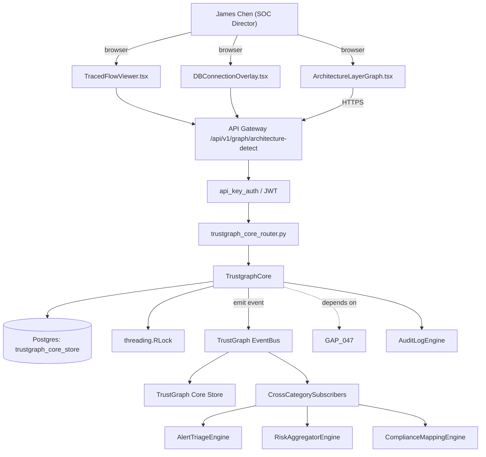

# US-0065: Architecture-aware graph: services->layers->modules->methods + DB connections + traced flows absorbed into TrustGraph

## Sub-Epic: Graph
**Master Goal**: ALDECI — tiered $199-$1,499/mo enterprise security intelligence platform replacing $50K-$500K/yr tools

## User Story
As a **James Chen (SOC Director)**, I need the ability to architecture-aware graph: services->layers->modules->methods + DB connections + traced flows absorbed into TrustGraph so that ALDECI keeps parity with $50K-$500K/yr incumbents at $199-$1,499/mo.

## Why This Matters
Per /tmp/truecourse-analysis.md §4 (Graph) + §9 takeaway 5 and competitor-truecourse.md, TrueCourse materializes services -> layers (data|api|service|external with 0-100 confidence + evidence[]) -> modules (class|interface|standalone) -> methods, plus databases (tables, FK relations, driver, connectedServices) and flows (trigger + entryMethod + steps[] with stepType call|http|db-read|db-write|event). Fixops' TrustGraph has the bus + indexer but lacks the layer classifier, flow tracer, and DB-connection overlay. Absorbing these lets Fixops correlate a SAST finding with architectural context ('SQLi in API-layer module of a public-facing service' vs 'SQLi in file X'). Prerequisite for GAP-066 diff-mode UI.

This work is called out as a P1 gap in `competitor-truecourse.md`. Shipping it is load-bearing for ALDECI's tiered $199-$1,499/mo positioning against $50K-$500K/yr incumbents: every delayed gap becomes a displacement deal we lose.

## Architecture

## Current State: 40% — PARTIAL (gap in existing engine)
- [x] Base `trustgraph_core` engine + router exist (see existing v2 PRD `trustgraph_core.md`)
- [ ] Gap `GAP-065` features below are missing / partial
- [ ] Acceptance criteria in this PRD are not met by current code
- [ ] Data model additions listed below have not been migrated
- [ ] Tests listed under Tests Required do not exist yet

## Key Functions
**Backend (engine methods):**
- `create_architecture_detect()` — backs `POST /api/v1/graph/architecture-detect`
- `get_serviceId()` — backs `GET /api/v1/graph/flows/{serviceId}`
- `get_moduleId()` — backs `GET /api/v1/graph/layers/{moduleId}`
- `get_repoId()` — backs `GET /api/v1/graph/databases/{repoId}`

**Frontend screens:**
- `ArchitectureLayerGraph.tsx` — operator-facing UI surface for this gap
- `TracedFlowViewer.tsx` — operator-facing UI surface for this gap
- `DBConnectionOverlay.tsx` — operator-facing UI surface for this gap
- `FindingExplorer.tsx` — operator-facing UI surface for this gap

## API Endpoints
| Method | Path | Auth | Purpose |
|--------|------|------|---------|
| POST | `/api/v1/graph/architecture-detect` | api_key_auth | graph architecture detect |
| GET | `/api/v1/graph/flows/{serviceId}` | api_key_auth | flows {serviceId} |
| GET | `/api/v1/graph/layers/{moduleId}` | api_key_auth | layers {moduleId} |
| GET | `/api/v1/graph/databases/{repoId}` | api_key_auth | databases {repoId} |

## Data Model
- extend trustgraph node schema: add layer node type with properties {kind: data|api|service|external, confidence (0-100), evidence (array of strings)}
- extend trustgraph node schema: add flow node type with properties {trigger: http|cron|startup|event, entry_method_id, steps (JSONB array of {stepType, targetId, metadata})}
- extend trustgraph node schema: add database node type with properties {driver, tables (JSONB), relations (JSONB), connected_service_ids (array)}
- add edges: service->layer (contains), layer->module (contains), module->method (contains), method->method (calls with callCount), service->database (connects-to)

## Dependencies
**Depends on**: GAP-047
**Depended by**: Router layer, TrustGraph EventBus, CrossCategorySubscribers, CrossCategoryEvidenceBuilder, AuditLogEngine
**Existing engine module (to extend)**: `suite-core/core/trustgraph_core.py`
**Master gap id**: `GAP-065` (priority P1, effort L)

## Tasks Remaining
1. Schema migration: extend trustgraph node schema (4h)
2. Schema migration: extend trustgraph node schema (4h)
3. Schema migration: extend trustgraph node schema (4h)
4. Schema migration: add edges (4h)
5. Implement endpoint POST /api/v1/graph/architecture-detect (6h)
6. Implement endpoint GET /api/v1/graph/flows/{serviceId} (6h)
7. Implement endpoint GET /api/v1/graph/layers/{moduleId} (6h)
8. Implement endpoint GET /api/v1/graph/databases/{repoId} (6h)
9. Wire frontend screen ArchitectureLayerGraph.tsx (5h)
10. Wire frontend screen TracedFlowViewer.tsx (5h)
11. Wire frontend screen DBConnectionOverlay.tsx (5h)
12. Wire frontend screen FindingExplorer.tsx (5h)
13. Write 7 pytest cases: test_layer_detector_emits_confidence_and_evidence, test_flow_tracer_http_trigger_detected… (6h)
14. Wire TrustGraph event emission + CrossCategorySubscriber consumers (4h)
15. Persona walkthrough + integration test (3h)
16. Docs + API reference update (2h)

## Definition of Done
- [ ] Given a TypeScript/Python repo, When POST /api/v1/graph/architecture-detect runs, Then TrustGraph is populated with service nodes, layer nodes (data|api|service|external) with layer.confidence in [0,100] and layer.evidence as an array of strings (e.g. 'file path matches /controllers/', 'imports express.Router').
- [ ] Given modules detected across services, When GET /api/v1/graph/layers/{moduleId} is called, Then the module's layer assignment is returned with confidence and evidence.
- [ ] Given a repo with HTTP route handlers and cron triggers, When POST /api/v1/graph/architecture-detect runs, Then flows[] is populated with trigger (http|cron|startup|event), entryMethod, and steps[] where each step has stepType in {call, http, db-read, db-write, event}.
- [ ] Given detected databases (postgres, mysql, mongodb, redis, sqlite), When GET /api/v1/graph/flows/{serviceId} is called, Then db-read and db-write steps carry target database id + table name when parseable.
- [ ] Given a SAST finding bound to a method, When the UI renders the finding, Then it shows: service name, layer (with confidence/evidence tooltip), module kind, method — not just file path.
- [ ] Given a layer detector with low confidence (<40), When rendering, Then the layer badge is grayed out and labeled 'uncertain' so downstream policies don't over-rely on it.
- [ ] Given an incremental re-analysis, When only a subset of files changed, Then only affected modules/methods/flows are re-computed within 5s (not full re-build).
- [ ] All endpoints are org-scoped (no hardcoded org_id) and gated by `api_key_auth`.
- [ ] TrustGraph emits at least one event type for this engine and a CrossCategorySubscriber consumes it.
- [ ] `James Chen (SOC Director)` can execute the full workflow in the 30-persona walkthrough.

## Tests Required
- `test_layer_detector_emits_confidence_and_evidence`
- `test_flow_tracer_http_trigger_detected`
- `test_flow_tracer_cron_trigger_detected`
- `test_db_steps_carry_table_name_when_parseable`
- `test_finding_enriched_with_service_layer_module_method`
- `test_low_confidence_layer_rendered_uncertain`
- `test_incremental_reanalysis_under_5s`

## Sprint: Wave 47 (est. May 20-May 26, 2026)

## Citation
Source research: `competitor-truecourse.md` (gap `GAP-065`, priority `P1`, effort `L`)
