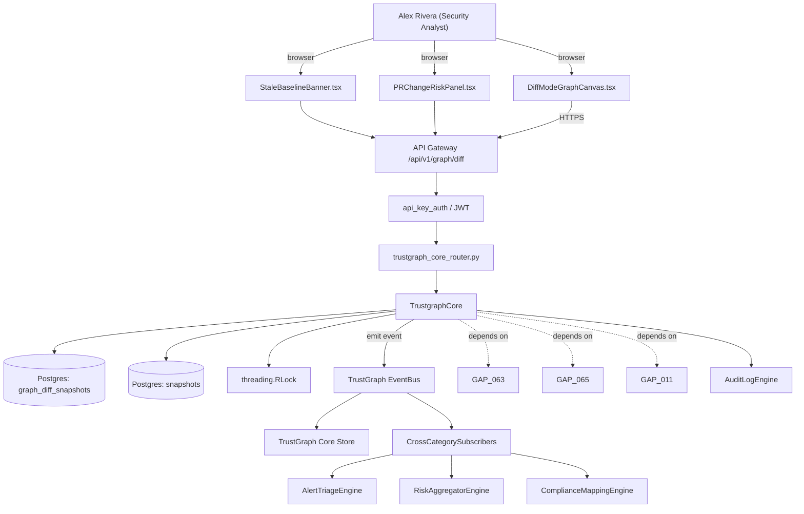

# US-0066: Diff-mode graph UI: dim unaffected nodes, badge affected with new/resolved counts, stale-baseline banners

## Sub-Epic: UX
**Master Goal**: ALDECI — tiered $199-$1,499/mo enterprise security intelligence platform replacing $50K-$500K/yr tools

## User Story
As a **Alex Rivera (Security Analyst)**, I need the ability to diff-mode graph UI: dim unaffected nodes, badge affected with new/resolved counts, stale-baseline banners so that ALDECI keeps parity with $50K-$500K/yr incumbents at $199-$1,499/mo.

## Why This Matters
Per /tmp/truecourse-analysis.md §1 (Graphs tab) + §8 (DiffSnapshot.affectedNodeIds) + §9 takeaway 10 and competitor-truecourse.md, TrueCourse renders a 'what changed in this PR' view by dimming unaffected nodes in the React Flow graph, badging affected nodes with new/resolved finding counts, and surfacing 'stale baseline' banners when the current analysis is older than the working tree. Fixops PR gate surfaces findings but not architectural-graph diff. Pairs with GAP-063 (stable violation identity) and GAP-011 (material change). Implement DiffSnapshot computation + UI overlay on TrustGraph.

This work is called out as a P1 gap in `competitor-truecourse.md`. Shipping it is load-bearing for ALDECI's tiered $199-$1,499/mo positioning against $50K-$500K/yr incumbents: every delayed gap becomes a displacement deal we lose.

## Architecture

## Current State: 40% — PARTIAL (gap in existing engine)
- [x] Base `trustgraph_core` engine + router exist (see existing v2 PRD `trustgraph_core.md`)
- [ ] Gap `GAP-066` features below are missing / partial
- [ ] Acceptance criteria in this PRD are not met by current code
- [ ] Data model additions listed below have not been migrated
- [ ] Tests listed under Tests Required do not exist yet

## Key Functions
**Backend (engine methods):**
- `get_diff()` — backs `GET /api/v1/graph/diff?prId=`
- `get_affected_nodes()` — backs `GET /api/v1/graph/affected-nodes?since=`
- `get_currentId()` — backs `GET /api/v1/graph/diff/{baselineId}/{currentId}`

**Frontend screens:**
- `DiffModeGraphCanvas.tsx` — operator-facing UI surface for this gap
- `StaleBaselineBanner.tsx` — operator-facing UI surface for this gap
- `PRChangeRiskPanel.tsx` — operator-facing UI surface for this gap
- `FindingExplorer.tsx` — operator-facing UI surface for this gap

## API Endpoints
| Method | Path | Auth | Purpose |
|--------|------|------|---------|
| GET | `/api/v1/graph/diff?prId=` | api_key_auth | graph diff?prId= |
| GET | `/api/v1/graph/affected-nodes?since=` | api_key_auth | graph affected nodes?since= |
| GET | `/api/v1/graph/diff/{baselineId}/{currentId}` | api_key_auth | {baselineId} {currentId} |

## Data Model
- add graph_diff_snapshots table: id, org_id, baseline_snapshot_id, current_snapshot_id, affected_node_ids (JSONB), new_counts_by_node (JSONB), resolved_counts_by_node (JSONB), computed_at
- extend snapshots table if needed: add snapshot_at timestamp (to compute 'stale' threshold)

## Dependencies
**Depends on**: GAP-063, GAP-065, GAP-011
**Depended by**: Router layer, TrustGraph EventBus, CrossCategorySubscribers, CrossCategoryEvidenceBuilder, AuditLogEngine
**Existing engine module (to extend)**: `suite-core/core/trustgraph_core.py`
**Master gap id**: `GAP-066` (priority P1, effort M)

## Tasks Remaining
1. Schema migration: add graph_diff_snapshots table (3h)
2. Schema migration: extend snapshots table if needed (3h)
3. Implement endpoint GET /api/v1/graph/diff?prId= (4h)
4. Implement endpoint GET /api/v1/graph/affected-nodes?since= (4h)
5. Implement endpoint GET /api/v1/graph/diff/{baselineId}/{currentId} (4h)
6. Wire frontend screen DiffModeGraphCanvas.tsx (4h)
7. Wire frontend screen StaleBaselineBanner.tsx (4h)
8. Wire frontend screen PRChangeRiskPanel.tsx (4h)
9. Wire frontend screen FindingExplorer.tsx (4h)
10. Write 6 pytest cases: test_diff_api_returns_affected_and_counts, test_ui_dims_unaffected_nodes… (4h)
11. Wire TrustGraph event emission + CrossCategorySubscriber consumers (3h)
12. Persona walkthrough + integration test (2h)
13. Docs + API reference update (1h)

## Definition of Done
- [ ] Given a PR with changes, When GET /api/v1/graph/diff?prId=<id> is called, Then the response returns affectedNodeIds[], newViolationCountByNode{}, resolvedViolationCountByNode{}, baselineSnapshotId, currentSnapshotId.
- [ ] Given DiffModeGraphCanvas.tsx rendering a PR diff, When diff mode is toggled on, Then unaffected nodes are dimmed to 30% opacity and affected nodes show new/resolved badges in top-right.
- [ ] Given a baseline snapshot older than 24h compared to the working tree, When the graph renders, Then StaleBaselineBanner.tsx appears with 'Baseline is N hours old — consider re-running analysis' and a Re-run button.
- [ ] Given GET /api/v1/graph/affected-nodes?since=<iso>, When called, Then returns a list of node ids whose findings or structure changed since the timestamp.
- [ ] Given a node with both new and resolved findings, When rendered, Then the badge shows '+2 / -1' format with color coding (red for new, green for resolved).
- [ ] Given diff mode is on and a user clicks an affected node, When the click is processed, Then the findings sidebar shows only new + resolved findings for that node (not unchanged).
- [ ] Given a PR with 10k+ affected nodes, When the diff graph renders, Then p95 first-paint is under 2s (matching GAP-026/GAP-047 scale targets).
- [ ] All endpoints are org-scoped (no hardcoded org_id) and gated by `api_key_auth`.
- [ ] TrustGraph emits at least one event type for this engine and a CrossCategorySubscriber consumes it.
- [ ] `Alex Rivera (Security Analyst)` can execute the full workflow in the 30-persona walkthrough.

## Tests Required
- `test_diff_api_returns_affected_and_counts`
- `test_ui_dims_unaffected_nodes`
- `test_stale_baseline_banner_shown_over_24h`
- `test_badge_format_new_minus_resolved`
- `test_click_filters_to_new_resolved_only`
- `test_10k_node_diff_renders_under_2s`

## Sprint: Wave 48 (est. May 27-Jun 02, 2026)

## Citation
Source research: `competitor-truecourse.md` (gap `GAP-066`, priority `P1`, effort `M`)
