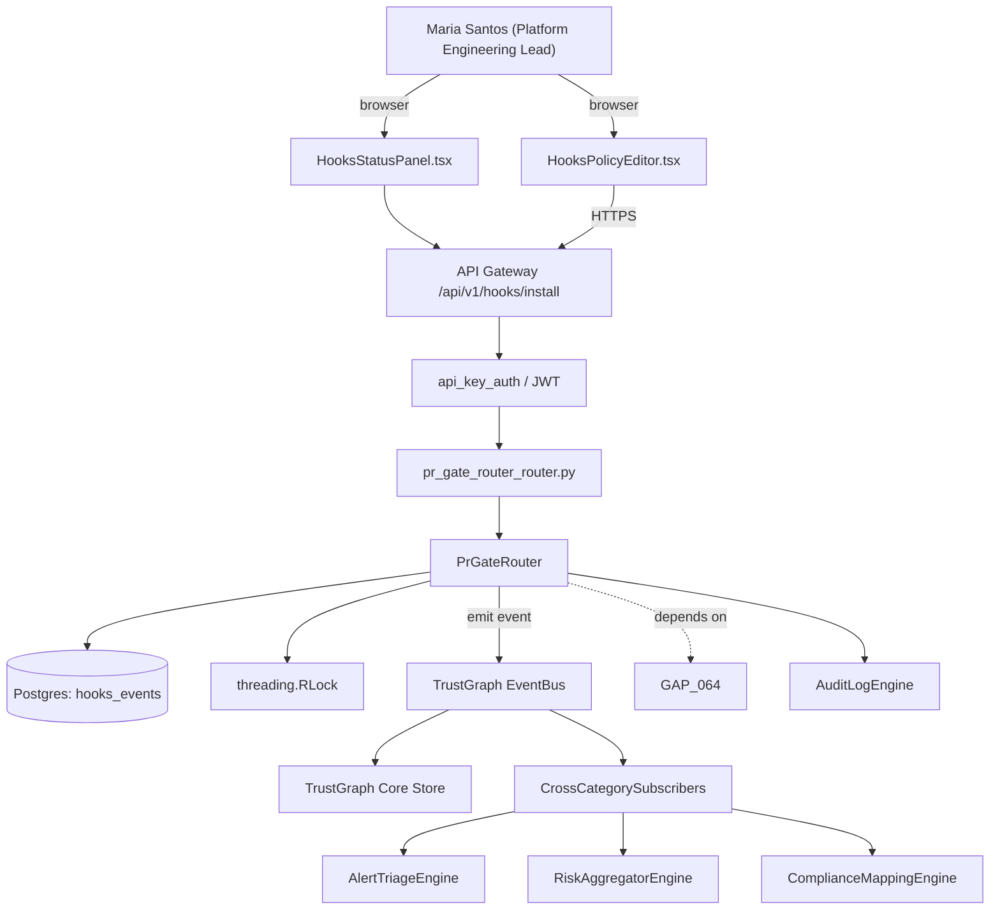

# US-0068: Committed YAML hook policy (.fixops/hooks.yaml) with no-hidden-defaults guardrail

## Sub-Epic: Integrations
**Master Goal**: ALDECI — tiered $199-$1,499/mo enterprise security intelligence platform replacing $50K-$500K/yr tools

## User Story
As a **Maria Santos (Platform Engineering Lead)**, I need the ability to committed YAML hook policy (.fixops/hooks.yaml) with no-hidden-defaults guardrail so that platform teams onboard Fixops in hours, not weeks, and CI integrations are first-class.

## Why This Matters
Per /tmp/truecourse-analysis.md §7 (Git integration) + §9 takeaway 8 and competitor-truecourse.md, TrueCourse's pre-commit hook is 100% driven by .truecourse/hooks.yaml with an explicit no-hidden-defaults guardrail (`pre-commit: { block-on: [critical, high], llm: false }`). Fixops pr_gate_router gates at PR time but has no local committable YAML hook policy for pre-commit. Add `fixops hooks install/uninstall/status/run` CLI verbs + a committed .fixops/hooks.yaml read at hook invocation. No implicit server-side state — the YAML file is the source of truth.

This work is called out as a P1 gap in `competitor-truecourse.md`. Shipping it is load-bearing for ALDECI's tiered $199-$1,499/mo positioning against $50K-$500K/yr incumbents: every delayed gap becomes a displacement deal we lose.

## Architecture

## Current State: 40% — PARTIAL (gap in existing engine)
- [x] Base `pr_gate_router` engine + router exist (see existing v2 PRD `pr_gate_router.md`)
- [ ] Gap `GAP-068` features below are missing / partial
- [ ] Acceptance criteria in this PRD are not met by current code
- [ ] Data model additions listed below have not been migrated
- [ ] Tests listed under Tests Required do not exist yet

## Key Functions
**Backend (engine methods):**
- `create_install()` — backs `POST /api/v1/hooks/install`
- `create_uninstall()` — backs `POST /api/v1/hooks/uninstall`
- `get_status()` — backs `GET /api/v1/hooks/status`
- `create_run()` — backs `POST /api/v1/hooks/run`

**Frontend screens:**
- `HooksPolicyEditor.tsx` — operator-facing UI surface for this gap
- `HooksStatusPanel.tsx` — operator-facing UI surface for this gap

## API Endpoints
| Method | Path | Auth | Purpose |
|--------|------|------|---------|
| POST | `/api/v1/hooks/install` | api_key_auth | hooks install |
| POST | `/api/v1/hooks/uninstall` | api_key_auth | hooks uninstall |
| GET | `/api/v1/hooks/status` | api_key_auth | hooks status |
| POST | `/api/v1/hooks/run` | api_key_auth | hooks run |

## Data Model
- no server-side schema changes required (policy lives in the repo); add hooks_events table server-side: id, org_id, repo_id, event (install|uninstall|run_blocked|run_passed), policy_hash, invoked_at

## Dependencies
**Depends on**: GAP-064
**Depended by**: Router layer, TrustGraph EventBus, CrossCategorySubscribers, CrossCategoryEvidenceBuilder, AuditLogEngine
**Existing engine module (to extend)**: `suite-core/core/pr_gate_router.py`
**Master gap id**: `GAP-068` (priority P1, effort S)

## Tasks Remaining
1. Schema migration: no server-side schema changes required (policy lives in the repo); add hooks_eve (2h)
2. Implement endpoint POST /api/v1/hooks/install (3h)
3. Implement endpoint POST /api/v1/hooks/uninstall (3h)
4. Implement endpoint GET /api/v1/hooks/status (3h)
5. Implement endpoint POST /api/v1/hooks/run (3h)
6. Wire frontend screen HooksPolicyEditor.tsx (2h)
7. Wire frontend screen HooksStatusPanel.tsx (2h)
8. Write 8 pytest cases: test_hooks_install_creates_yaml_and_hook, test_pre_commit_blocks_on_new_critical… (3h)
9. Wire TrustGraph event emission + CrossCategorySubscriber consumers (2h)
10. Persona walkthrough + integration test (1h)
11. Docs + API reference update (1h)

## Definition of Done
- [ ] Given `fixops hooks install`, When executed in a repo, Then .fixops/hooks.yaml is created (if absent) with a default block-on=[critical, high] + llm=false, and a git pre-commit hook is written that calls `fixops hooks run`.
- [ ] Given a commit with a new critical finding, When the pre-commit hook runs, Then it blocks the commit with a clear message listing the blocking finding(s) and exit code 1.
- [ ] Given a commit with no new critical/high findings, When the hook runs, Then the commit proceeds with exit 0.
- [ ] Given .fixops/hooks.yaml missing, When `fixops hooks run` is invoked, Then the command exits with error_code=HOOKS_POLICY_MISSING and prints 'No committed policy — refusing to apply implicit defaults' (no-hidden-defaults guardrail).
- [ ] Given a hook policy with llm=false, When the hook runs, Then only deterministic rules are evaluated and LLM rules are skipped.
- [ ] Given `fixops hooks uninstall`, When executed, Then the pre-commit hook is removed but .fixops/hooks.yaml remains (user may have committed it).
- [ ] Given `fixops hooks status`, When executed, Then it prints installed/not-installed, the current policy, and a warning if typical commit time exceeds 30s.
- [ ] Given an invalid hooks.yaml (unknown block-on value), When `fixops hooks run` reads it, Then it exits with error_code=HOOKS_POLICY_INVALID without partial application.
- [ ] All endpoints are org-scoped (no hardcoded org_id) and gated by `api_key_auth`.
- [ ] TrustGraph emits at least one event type for this engine and a CrossCategorySubscriber consumes it.
- [ ] `Maria Santos (Platform Engineering Lead)` can execute the full workflow in the 30-persona walkthrough.

## Tests Required
- `test_hooks_install_creates_yaml_and_hook`
- `test_pre_commit_blocks_on_new_critical`
- `test_pre_commit_passes_with_no_new_criticals`
- `test_missing_policy_refuses_with_no_hidden_defaults`
- `test_llm_false_skips_llm_rules`
- `test_uninstall_keeps_yaml_removes_hook`
- `test_status_warns_on_long_commit_time`
- `test_invalid_yaml_rejected_atomically`

## Sprint: Wave 46 (est. May 13-May 19, 2026)

## Citation
Source research: `competitor-truecourse.md` (gap `GAP-068`, priority `P1`, effort `S`)
