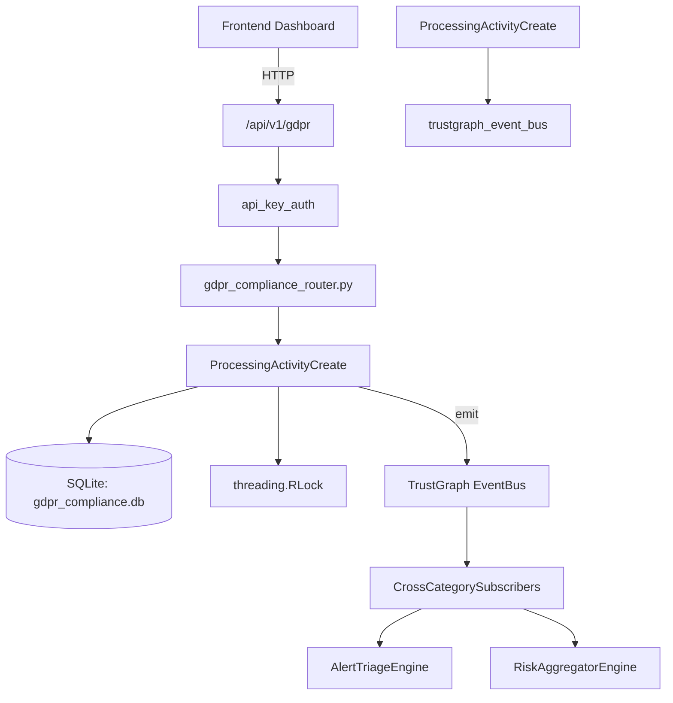

# US-0120: Gdpr Compliance

## Sub-Epic: GRC
**Master Goal**: ALDECI — $35/mo enterprise security intelligence platform replacing $50K-500K/yr tools

## User Story
As a **Robert Kim (Compliance Officer)**, I need to ensure GDPR compliance
so that the platform delivers enterprise-grade grc capabilities at 1/1000th the cost of legacy tools.

## Why This Matters
Gdpr Compliance replaces functionality found in enterprise tools like CrowdStrike, Wiz, Snyk, and Rapid7.
By building this into ALDECI's $35/mo stack, customers save $50K+/yr on standalone GRC tooling.

## Architecture

## Current State: 95% Complete
- ✅ `record_processing_activity()` — Register a processing activity. Validates name, lawful_basis, and purpose. (line 135)
- ✅ `list_processing_activities()` — List processing activities for org, optionally filtered by lawful_basis or statu (line 171)
- ✅ `record_consent()` — Record a consent entry for subject_id + purpose. (line 215)
- ✅ `list_consents()` — List consents for org, optionally filtered by subject_id. (line 237)
- ✅ `withdraw_consent()` — Withdraw a consent record. Sets consented=False and withdrawn_at=now. (line 253)
- ✅ `run_gdpr_assessment()` — Run GDPR compliance assessment for org_id. (line 290)
- ❌ TrustGraph event emission — not yet verified

## Key Functions (from `suite-core/core/gdpr_compliance_engine.py` — 348 lines)
- `GDPRComplianceEngine.record_processing_activity()` — Register a processing activity. Validates name, lawful_basis, and purpose. (line 135)
- `GDPRComplianceEngine.list_processing_activities()` — List processing activities for org, optionally filtered by lawful_basis or statu (line 171)
- `GDPRComplianceEngine.record_consent()` — Record a consent entry for subject_id + purpose. (line 215)
- `GDPRComplianceEngine.list_consents()` — List consents for org, optionally filtered by subject_id. (line 237)
- `GDPRComplianceEngine.withdraw_consent()` — Withdraw a consent record. Sets consented=False and withdrawn_at=now. (line 253)
- `GDPRComplianceEngine.run_gdpr_assessment()` — Run GDPR compliance assessment for org_id. (line 290)

## Dependencies
- **Depends on**: trustgraph_event_bus
- **Depended by**: Routers, TrustGraph EventBus, CrossCategorySubscribers
- **TrustGraph**: Event emission wired via ResponseInterceptorMiddleware
- **Source file**: `suite-core/core/gdpr_compliance_engine.py` (348 lines)
- **Router file**: `suite-api/apps/api/gdpr_compliance_router.py`

## API Endpoints
| Method | Path | Description |
|--------|------|-------------|
| POST | `/api/v1/gdpr/activities` | record processing activity |
| GET | `/api/v1/gdpr/activities` | list processing activities |
| POST | `/api/v1/gdpr/consents` | record consent |
| GET | `/api/v1/gdpr/consents` | list consents |
| PUT | `/api/v1/gdpr/consents/{consent_id}/withdraw` | withdraw consent |
| GET | `/api/v1/gdpr/assessment` | run gdpr assessment |

## Tasks Remaining
1. Verify TrustGraph event emission works end-to-end (2h)
2. Add integration test with real persona workflow (2h)
3. Wire CrossCategorySubscriber consumer chain (1h)
4. Validate with 30-persona walkthrough (1h)
5. Optimize query performance for large datasets (2h)
6. Expand test coverage to edge cases (2h)

## Definition of Done
- [ ] Robert Kim (Compliance Officer) can access /api/v1/gdpr and get meaningful data
- [ ] All CRUD operations return correct HTTP status codes
- [ ] TrustGraph receives events from this engine
- [ ] 29+ tests passing in `tests/test_gdpr_compliance_engine.py`
- [ ] 30-persona walkthrough includes this endpoint at 100%
- [ ] No hardcoded org_id — all queries are org-scoped

## Sprint: Wave 46 (est. April 22-24, 2026)

## Test Coverage
- **Test file**: `tests/test_gdpr_compliance_engine.py`
- **Tests**: 29 tests
- **Status**: Passing
