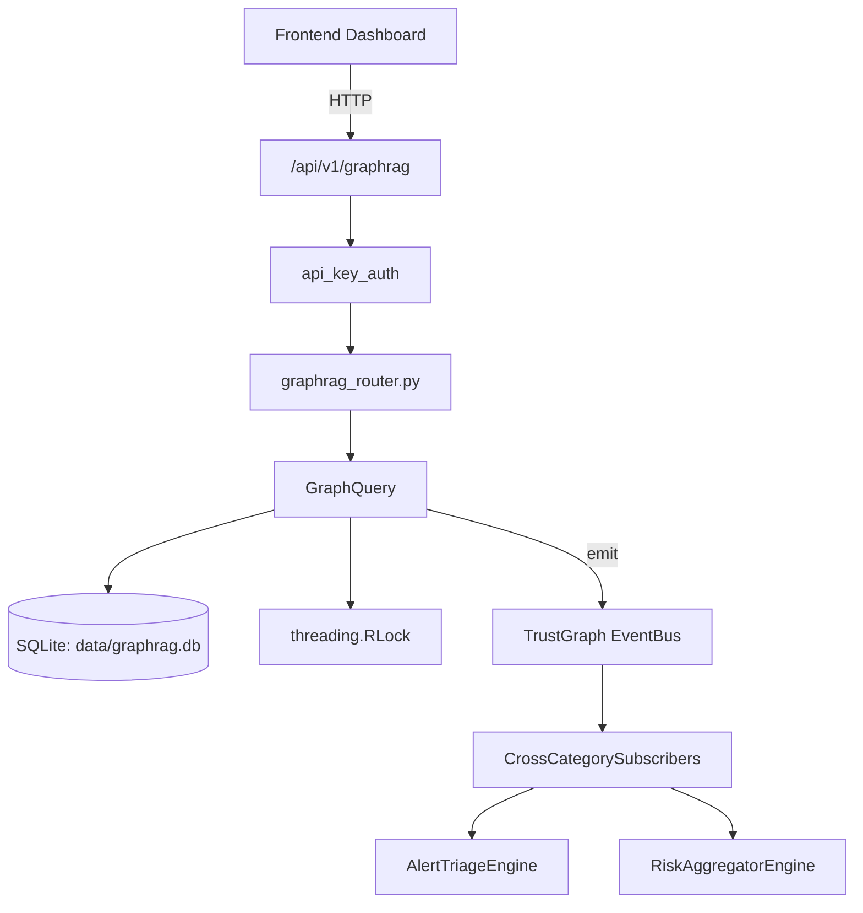

# US-0121: Graphrag

## Sub-Epic: Advanced
**Master Goal**: ALDECI — $35/mo enterprise security intelligence platform replacing $50K-500K/yr tools

## User Story
As a **Richard Adams (Security Architect)**, I need to query security knowledge graph
so that the platform delivers enterprise-grade advanced capabilities at 1/1000th the cost of legacy tools.

## Why This Matters
Graphrag replaces functionality found in enterprise tools like CrowdStrike, Wiz, Snyk, and Rapid7.
By building this into ALDECI's $35/mo stack, customers save $50K+/yr on standalone Advanced tooling.

## Architecture

## Current State: 70% Complete
- ✅ `to_dict()` — Convert to dictionary. (line 113)
- ✅ `query()` — Execute a natural language query over TrustGraph. (line 140)
- ✅ `clear_cache()` — Clear query cache. (line 398)
- ✅ `from_core()` — Set target Knowledge Core. (line 430)
- ✅ `where()` — Add a filter condition. (line 444)
- ✅ `related_to()` — Filter to related entities of a specific type. (line 458)
- ❌ No dedicated router — endpoint may be in gap_router.py
- ❌ No test file found — needs test coverage
- ❌ TrustGraph event emission — not yet verified

## Key Functions (from `suite-core/core/graphrag_engine.py` — 535 lines)
- `GraphRAGResult.to_dict()` — Convert to dictionary. (line 113)
- `GraphRAGEngine.query()` — Execute a natural language query over TrustGraph. (line 140)
- `GraphRAGEngine.clear_cache()` — Clear query cache. (line 398)
- `TrustGraphQueryBuilder.from_core()` — Set target Knowledge Core. (line 430)
- `TrustGraphQueryBuilder.where()` — Add a filter condition. (line 444)
- `TrustGraphQueryBuilder.related_to()` — Filter to related entities of a specific type. (line 458)
- `TrustGraphQueryBuilder.limit()` — Set result limit. (line 470)
- `TrustGraphQueryBuilder.execute()` — Execute the query and return results. (line 482)

## Dependencies
- **Depends on**: standalone
- **Depended by**: Routers, TrustGraph EventBus, CrossCategorySubscribers
- **TrustGraph**: Event emission wired via ResponseInterceptorMiddleware
- **Source file**: `suite-core/core/graphrag_engine.py` (535 lines)
- **Router file**: `suite-api/apps/api/N/A`

## API Endpoints
| Method | Path | Description |
|--------|------|-------------|
| GET | `/api/v1/graphrag` | List resources |

## Tasks Remaining
1. Verify TrustGraph event emission works end-to-end (2h)
2. Add integration test with real persona workflow (2h)
3. Wire CrossCategorySubscriber consumer chain (1h)
4. Validate with 30-persona walkthrough (1h)
5. Create dedicated router (needs wiring in app.py) (3h)
6. Write unit tests (4h)

## Definition of Done
- [ ] Richard Adams (Security Architect) can access /api/v1/graphrag and get meaningful data
- [ ] All CRUD operations return correct HTTP status codes
- [ ] TrustGraph receives events from this engine
- [ ] 20+ tests passing in `tests/test_graphrag_engine.py`
- [ ] 30-persona walkthrough includes this endpoint at 100%
- [ ] No hardcoded org_id — all queries are org-scoped

## Sprint: Wave 46 (est. April 22-24, 2026)

## Test Coverage
- **Test file**: `tests/test_graphrag_engine.py`
- **Tests**: 0 tests
- **Status**: Needs coverage
