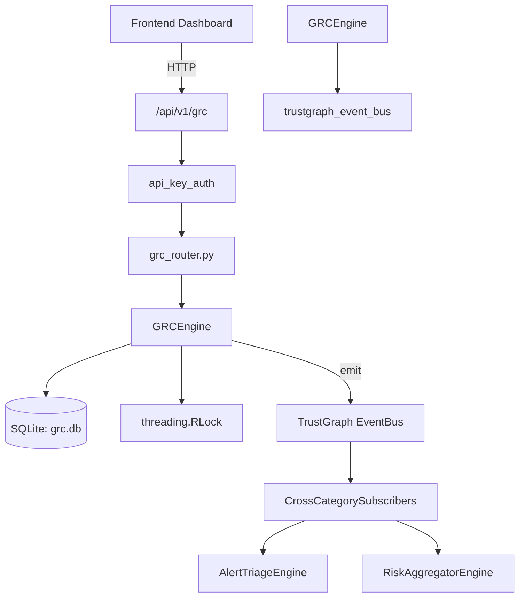

# US-0122: Grc

## Sub-Epic: GRC
**Master Goal**: ALDECI — $35/mo enterprise security intelligence platform replacing $50K-500K/yr tools

## User Story
As a **Robert Kim (Compliance Officer)**, I need to manage governance, risk, and compliance
so that the platform delivers enterprise-grade grc capabilities at 1/1000th the cost of legacy tools.

## Why This Matters
Grc replaces functionality found in enterprise tools like CrowdStrike, Wiz, Snyk, and Rapid7.
By building this into ALDECI's $35/mo stack, customers save $50K+/yr on standalone GRC tooling.

## Architecture

## Current State: 95% Complete
- ✅ `add_framework()` — Create a new GRC framework entry. (line 194)
- ✅ `list_frameworks()` — List all frameworks for an org. (line 239)
- ✅ `add_control()` — Add a control to a framework. (line 252)
- ✅ `list_controls()` — List controls, optionally filtered by framework and/or status. (line 301)
- ✅ `update_control_status()` — Update a control's status and optionally append an evidence note. (line 328)
- ✅ `add_risk()` — Add a risk to the register. (line 375)
- ❌ TrustGraph event emission — not yet verified

## Key Functions (from `suite-core/core/grc_engine.py` — 614 lines)
- `GRCEngine.add_framework()` — Create a new GRC framework entry. (line 194)
- `GRCEngine.list_frameworks()` — List all frameworks for an org. (line 239)
- `GRCEngine.add_control()` — Add a control to a framework. (line 252)
- `GRCEngine.list_controls()` — List controls, optionally filtered by framework and/or status. (line 301)
- `GRCEngine.update_control_status()` — Update a control's status and optionally append an evidence note. (line 328)
- `GRCEngine.add_risk()` — Add a risk to the register. (line 375)
- `GRCEngine.list_risks()` — List risks, optionally filtered by status and/or category. (line 428)
- `GRCEngine.update_risk()` — Partially update a risk record. (line 449)

## Dependencies
- **Depends on**: trustgraph_event_bus
- **Depended by**: Routers, TrustGraph EventBus, CrossCategorySubscribers
- **TrustGraph**: Event emission wired via ResponseInterceptorMiddleware
- **Source file**: `suite-core/core/grc_engine.py` (614 lines)
- **Router file**: `suite-api/apps/api/grc_router.py`

## API Endpoints
| Method | Path | Description |
|--------|------|-------------|
| GET | `/api/v1/grc/frameworks` | list frameworks |
| POST | `/api/v1/grc/frameworks` | add framework |
| GET | `/api/v1/grc/controls` | list controls |
| POST | `/api/v1/grc/controls` | add control |
| PATCH | `/api/v1/grc/controls/{control_id}/status` | update control status |
| GET | `/api/v1/grc/risks` | list risks |
| POST | `/api/v1/grc/risks` | add risk |
| PATCH | `/api/v1/grc/risks/{risk_id}` | update risk |
| GET | `/api/v1/grc/assessments` | list assessments |
| POST | `/api/v1/grc/assessments` | create assessment |
| GET | `/api/v1/grc/stats` | get grc stats |

## Tasks Remaining
1. Verify TrustGraph event emission works end-to-end (2h)
2. Add integration test with real persona workflow (2h)
3. Wire CrossCategorySubscriber consumer chain (1h)
4. Validate with 30-persona walkthrough (1h)
5. Optimize query performance for large datasets (2h)
6. Expand test coverage to edge cases (2h)

## Definition of Done
- [ ] Robert Kim (Compliance Officer) can access /api/v1/grc and get meaningful data
- [ ] All CRUD operations return correct HTTP status codes
- [ ] TrustGraph receives events from this engine
- [ ] 28+ tests passing in `tests/test_grc_engine.py`
- [ ] 30-persona walkthrough includes this endpoint at 100%
- [ ] No hardcoded org_id — all queries are org-scoped

## Sprint: Wave 46 (est. April 22-24, 2026)

## Test Coverage
- **Test file**: `tests/test_grc_engine.py`
- **Tests**: 28 tests
- **Status**: Passing
