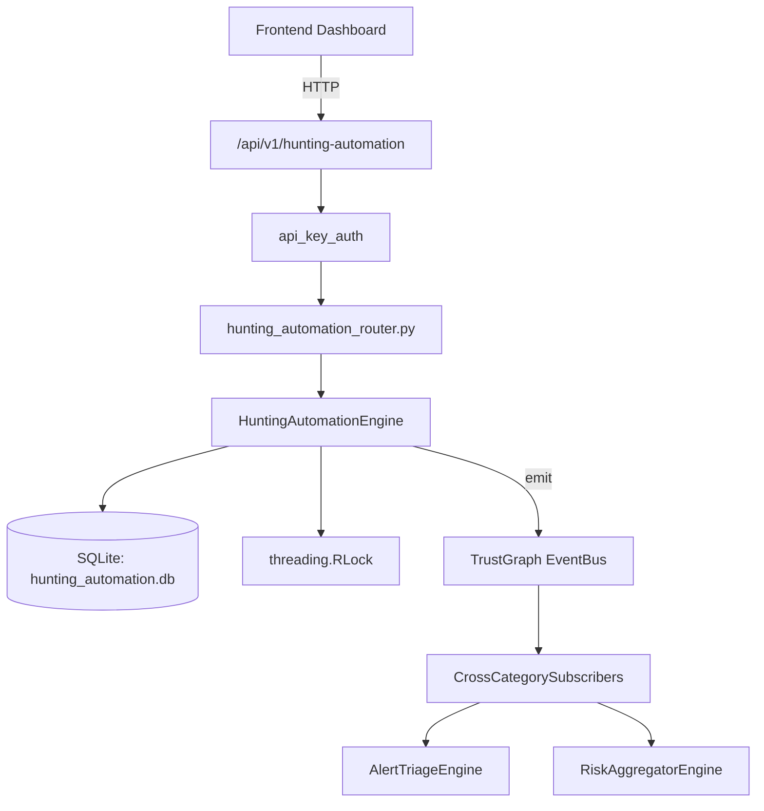

# US-0123: Hunting Automation

## Sub-Epic: Advanced
**Master Goal**: ALDECI — $35/mo enterprise security intelligence platform replacing $50K-500K/yr tools

## User Story
As a **Priya Sharma (SOC T2 Analyst)**, I need to automate threat hunting workflows
so that the platform delivers enterprise-grade advanced capabilities at 1/1000th the cost of legacy tools.

## Why This Matters
Hunting Automation replaces functionality found in enterprise tools like CrowdStrike, Wiz, Snyk, and Rapid7.
By building this into ALDECI's $35/mo stack, customers save $50K+/yr on standalone Advanced tooling.

## Architecture

## Current State: 95% Complete
- ✅ `create_hypothesis()` — Create a new hunt hypothesis. data_sources stored as JSON list. (line 139)
- ✅ `validate_hypothesis()` — Update validation status of a hypothesis. (line 188)
- ✅ `get_hypothesis()` — Fetch a single hypothesis scoped to org_id. (line 215)
- ✅ `list_hypotheses()` — List all hypotheses for the org. (line 230)
- ✅ `add_query()` — Add a hunt query to a hypothesis. (line 248)
- ✅ `get_query()` — Fetch a single query scoped to org_id. (line 293)
- ❌ TrustGraph event emission — not yet verified

## Key Functions (from `suite-core/core/hunting_automation_engine.py` — 508 lines)
- `HuntingAutomationEngine.create_hypothesis()` — Create a new hunt hypothesis. data_sources stored as JSON list. (line 139)
- `HuntingAutomationEngine.validate_hypothesis()` — Update validation status of a hypothesis. (line 188)
- `HuntingAutomationEngine.get_hypothesis()` — Fetch a single hypothesis scoped to org_id. (line 215)
- `HuntingAutomationEngine.list_hypotheses()` — List all hypotheses for the org. (line 230)
- `HuntingAutomationEngine.add_query()` — Add a hunt query to a hypothesis. (line 248)
- `HuntingAutomationEngine.get_query()` — Fetch a single query scoped to org_id. (line 293)
- `HuntingAutomationEngine.execute_query()` — Record a successful query execution. (line 306)
- `HuntingAutomationEngine.fail_execution()` — Record a failed execution. Does NOT update query stats. (line 369)

## Dependencies
- **Depends on**: standalone
- **Depended by**: Routers, TrustGraph EventBus, CrossCategorySubscribers
- **TrustGraph**: Event emission wired via ResponseInterceptorMiddleware
- **Source file**: `suite-core/core/hunting_automation_engine.py` (508 lines)
- **Router file**: `suite-api/apps/api/hunting_automation_router.py`

## API Endpoints
| Method | Path | Description |
|--------|------|-------------|
| POST | `/api/v1/hunting-automation/hypotheses` | create hypothesis |
| PUT | `/api/v1/hunting-automation/hypotheses/{hypothesis_id}/validate` | validate hypothesis |
| POST | `/api/v1/hunting-automation/hypotheses/{hypothesis_id}/queries` | add query |
| POST | `/api/v1/hunting-automation/queries/{query_id}/execute` | execute query |
| POST | `/api/v1/hunting-automation/queries/{query_id}/fail` | fail execution |
| GET | `/api/v1/hunting-automation/summary` | get hunt summary |
| GET | `/api/v1/hunting-automation/hypotheses/{hypothesis_id}` | get hypothesis detail |
| GET | `/api/v1/hunting-automation/executions` | get recent executions |
| GET | `/api/v1/hunting-automation/high-yield` | get high yield queries |

## Tasks Remaining
1. Verify TrustGraph event emission works end-to-end (2h)
2. Add integration test with real persona workflow (2h)
3. Wire CrossCategorySubscriber consumer chain (1h)
4. Validate with 30-persona walkthrough (1h)
5. Optimize query performance for large datasets (2h)
6. Expand test coverage to edge cases (2h)

## Definition of Done
- [ ] Priya Sharma (SOC T2 Analyst) can access /api/v1/hunting-automation and get meaningful data
- [ ] All CRUD operations return correct HTTP status codes
- [ ] TrustGraph receives events from this engine
- [ ] 44+ tests passing in `tests/test_hunting_automation_engine.py`
- [ ] 30-persona walkthrough includes this endpoint at 100%
- [ ] No hardcoded org_id — all queries are org-scoped

## Sprint: Wave 46 (est. April 22-24, 2026)

## Test Coverage
- **Test file**: `tests/test_hunting_automation_engine.py`
- **Tests**: 44 tests
- **Status**: Passing
