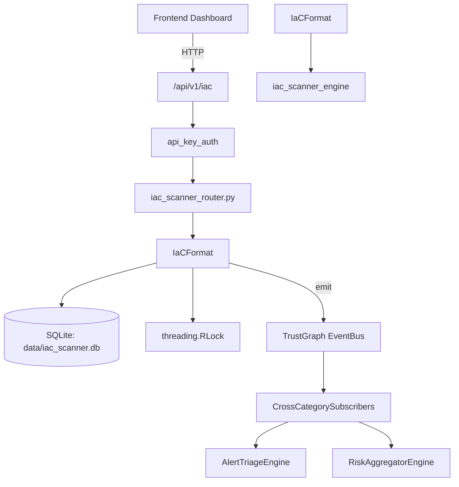

# US-0124: Iac Scanner

## Sub-Epic: ASPM
**Master Goal**: ALDECI — $35/mo enterprise security intelligence platform replacing $50K-500K/yr tools

## User Story
As a **Emma Davis (DevSecOps Engineer)**, I need to scan infrastructure-as-code templates
so that the platform delivers enterprise-grade aspm capabilities at 1/1000th the cost of legacy tools.

## Why This Matters
Iac Scanner replaces functionality found in enterprise tools like CrowdStrike, Wiz, Snyk, and Rapid7.
By building this into ALDECI's $35/mo stack, customers save $50K+/yr on standalone ASPM tooling.

## Architecture

## Current State: 95% Complete
- ✅ `parse()` — implemented (line 289)
- ✅ `parse()` — implemented (line 348)
- ✅ `parse()` — implemented (line 413)
- ✅ `parse()` — implemented (line 465)
- ✅ `parse()` — implemented (line 492)
- ✅ `check_s3_public_access()` — implemented (line 1050)
- ❌ TrustGraph event emission — not yet verified

## Key Functions (from `suite-core/core/iac_scanner_engine.py` — 1890 lines)
- `TerraformParser.parse()` — Handle parse (line 289)
- `CloudFormationParser.parse()` — Handle parse (line 348)
- `KubernetesParser.parse()` — Handle parse (line 413)
- `DockerfileParser.parse()` — Handle parse (line 465)
- `AnsibleParser.parse()` — Handle parse (line 492)
- `IaCRuleEngine.check_s3_public_access()` — Handle check s3 public access (line 1050)
- `IaCRuleEngine.check_s3_versioning()` — Handle check s3 versioning (line 1066)
- `IaCRuleEngine.check_s3_logging()` — Handle check s3 logging (line 1078)

## Dependencies
- **Depends on**: iac_scanner_engine
- **Depended by**: Routers, TrustGraph EventBus, CrossCategorySubscribers
- **TrustGraph**: Event emission wired via ResponseInterceptorMiddleware
- **Source file**: `suite-core/core/iac_scanner_engine.py` (1890 lines)
- **Router file**: `suite-api/apps/api/iac_scanner_router.py`

## API Endpoints
| Method | Path | Description |
|--------|------|-------------|
| POST | `/api/v1/iac/scan` | scan iac |
| GET | `/api/v1/iac/findings` | get findings |
| GET | `/api/v1/iac/rules` | list rules |
| POST | `/api/v1/iac/rules/custom` | add custom rule |
| GET | `/api/v1/iac/drift` | get drift |
| POST | `/api/v1/iac/drift/check` | check drift |
| GET | `/api/v1/iac/summary` | get summary |

## Tasks Remaining
1. Verify TrustGraph event emission works end-to-end (2h)
2. Add integration test with real persona workflow (2h)
3. Wire CrossCategorySubscriber consumer chain (1h)
4. Validate with 30-persona walkthrough (1h)
5. Optimize query performance for large datasets (2h)
6. Expand test coverage to edge cases (2h)

## Definition of Done
- [ ] Emma Davis (DevSecOps Engineer) can access /api/v1/iac and get meaningful data
- [ ] All CRUD operations return correct HTTP status codes
- [ ] TrustGraph receives events from this engine
- [ ] 87+ tests passing in `tests/test_iac_scanner_engine.py`
- [ ] 30-persona walkthrough includes this endpoint at 100%
- [ ] No hardcoded org_id — all queries are org-scoped

## Sprint: Wave 46 (est. April 22-24, 2026)

## Test Coverage
- **Test file**: `tests/test_iac_scanner_engine.py`
- **Tests**: 87 tests
- **Status**: Passing
