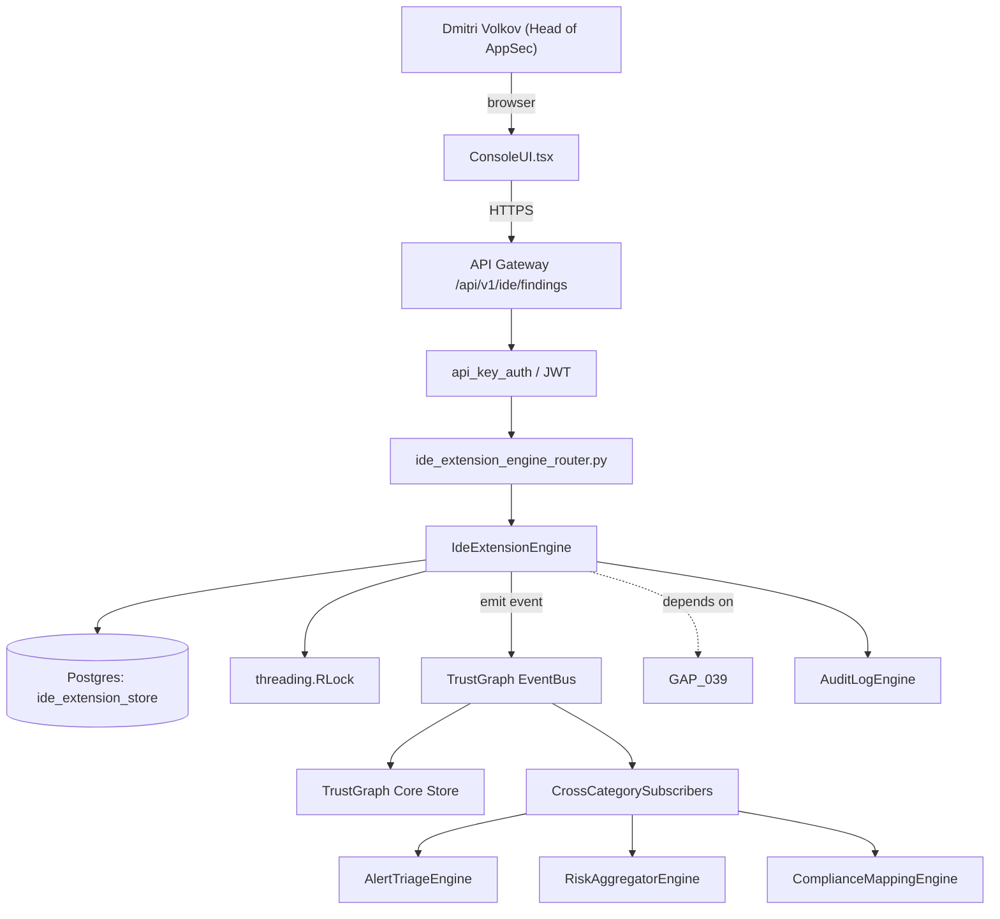

# US-0014: Ship VS Code + JetBrains IDE extensions surfacing Fixops findings inline with one-click autofix

## Sub-Epic: ASPM
**Master Goal**: ALDECI — tiered $199-$1,499/mo enterprise security intelligence platform replacing $50K-$500K/yr tools

## User Story
As a **Dmitri Volkov (Head of AppSec)**, I need to ship VS Code + JetBrains IDE extensions surfacing Fixops findings inline with one-click autofix so that Fixops matches Apiiro/Cycode ASPM depth and wins replacement deals.

## Why This Matters
Per competitor-aspm.md §1 §2 and competitor-sonatype.md §7, every ASPM incumbent ships first-class IDE plugins. Fixops has zero. Build VS Code (TS) + JetBrains (Kotlin) extensions that authenticate via User Token (GAP-039), surface open findings in-file, and trigger AutoFix.

This work is called out as a P1 gap in `competitor-aspm.md, competitor-sonatype.md`. Shipping it is load-bearing for ALDECI's tiered $199-$1,499/mo positioning against $50K-$500K/yr incumbents: every delayed gap becomes a displacement deal we lose.

## Architecture

## Current State: 0% — MISSING (new engine)
- [ ] Engine module `suite-core/core/ide_extension_engine.py` does not exist yet
- [ ] Router `suite-api/apps/api/ide_extension_engine_router.py` does not exist yet
- [ ] DB tables listed under Data Model do not exist yet
- [ ] Frontend screens listed under Key Functions do not exist yet
- [ ] No TrustGraph events emitted yet

## Key Functions
**Backend (engine methods):**
- `get_findings()` — backs `GET /api/v1/ide/findings?repo=&file=`
- `create_authenticate_token()` — backs `POST /api/v1/ide/authenticate-token`
- `create_autofix()` — backs `POST /api/v1/ide/autofix`
- `get_user_snapshot()` — backs `GET /api/v1/ide/user-snapshot`

## API Endpoints
| Method | Path | Auth | Purpose |
|--------|------|------|---------|
| GET | `/api/v1/ide/findings?repo=&file=` | api_key_auth | ide findings?repo=&file= |
| POST | `/api/v1/ide/authenticate-token` | api_key_auth | ide authenticate token |
| POST | `/api/v1/ide/autofix` | api_key_auth | ide autofix |
| GET | `/api/v1/ide/user-snapshot` | api_key_auth | ide user snapshot |

## Data Model
- No schema changes (reuses existing tables).

## Dependencies
**Depends on**: GAP-039
**Depended by**: Router layer, TrustGraph EventBus, CrossCategorySubscribers, CrossCategoryEvidenceBuilder, AuditLogEngine
**New engine module**: `suite-core/core/ide_extension_engine.py`
**New router module**: `suite-api/apps/api/ide_extension_engine_router.py`
**Master gap id**: `GAP-014` (priority P1, effort L)

## Tasks Remaining
1. Implement endpoint GET /api/v1/ide/findings?repo=&file= (6h)
2. Implement endpoint POST /api/v1/ide/authenticate-token (6h)
3. Implement endpoint POST /api/v1/ide/autofix (6h)
4. Implement endpoint GET /api/v1/ide/user-snapshot (6h)
5. Write 5 pytest cases: test_vscode_extension_finds_displayed_inline, test_autofix_diff_applied_and_rollback… (6h)
6. Wire TrustGraph event emission + CrossCategorySubscriber consumers (4h)
7. Persona walkthrough + integration test (3h)
8. Docs + API reference update (2h)

## Definition of Done
- [ ] Given VS Code with the Fixops extension and a valid User Token, When the user opens a project with open findings, Then matched findings appear as inline squigglies with a hover card showing severity, summary, and Autofix button.
- [ ] Given a user clicks Autofix on a supported finding, When the action runs, Then the autofix_engine returns a diff, the IDE applies it, runs the user's test command if configured, and surfaces a rollback option on failure.
- [ ] Given JetBrains IDEs (IntelliJ, PyCharm), When the extension is installed and authenticated, Then the Findings tool-window lists findings in the current file and project.
- [ ] Given an expired User Token, When the extension calls an API, Then it prompts re-auth and does not silently fail.
- [ ] Given network offline, When the extension opens, Then it uses a cached snapshot not older than 24 hours.
- [ ] Given the marketplace publish pipeline, When a release is cut, Then extensions are published to VS Code Marketplace and JetBrains Marketplace within the release job.
- [ ] All endpoints are org-scoped (no hardcoded org_id) and gated by `api_key_auth`.
- [ ] TrustGraph emits at least one event type for this engine and a CrossCategorySubscriber consumes it.
- [ ] `Dmitri Volkov (Head of AppSec)` can execute the full workflow in the 30-persona walkthrough.

## Tests Required
- `test_vscode_extension_finds_displayed_inline`
- `test_autofix_diff_applied_and_rollback`
- `test_jetbrains_toolwindow_lists_findings`
- `test_expired_token_reauth_prompt`
- `test_offline_cached_snapshot_used`

## Sprint: Wave 46 (est. May 13-May 19, 2026)

## Citation
Source research: `competitor-aspm.md, competitor-sonatype.md` (gap `GAP-014`, priority `P1`, effort `L`)
