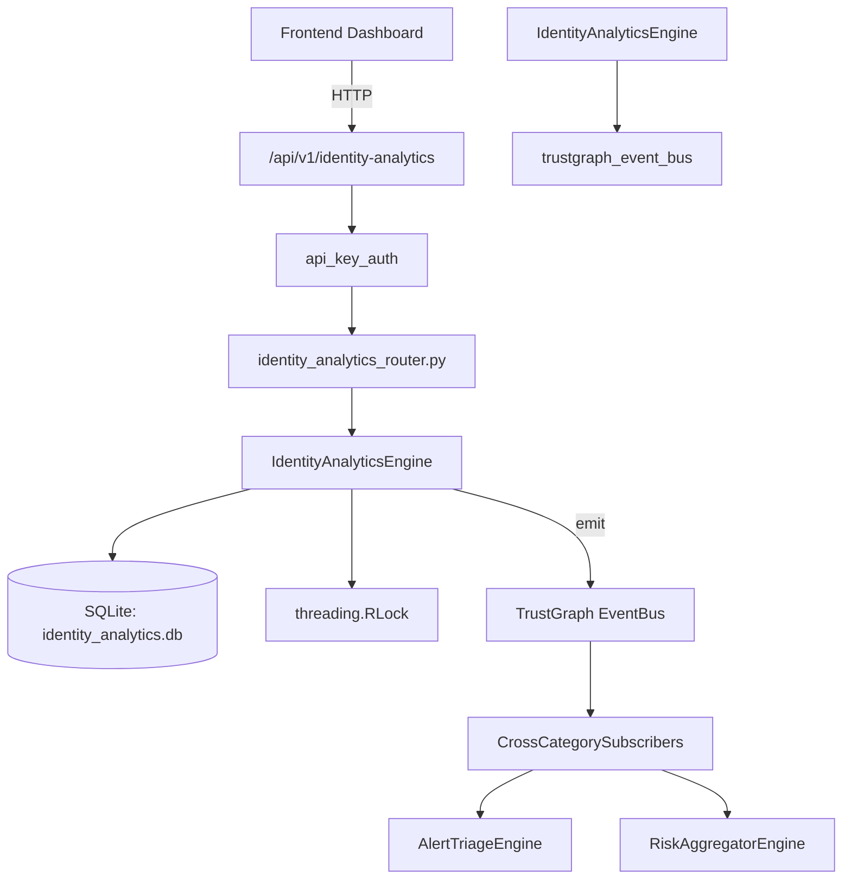

# US-0125: Identity Analytics

## Sub-Epic: Identity
**Master Goal**: ALDECI — $35/mo enterprise security intelligence platform replacing $50K-500K/yr tools

## User Story
As a **Maria Lopez (IT Director)**, I need to manage identity analytics and risk
so that the platform delivers enterprise-grade identity capabilities at 1/1000th the cost of legacy tools.

## Why This Matters
Identity Analytics replaces functionality found in enterprise tools like CrowdStrike, Wiz, Snyk, and Rapid7.
By building this into ALDECI's $35/mo stack, customers save $50K+/yr on standalone Identity tooling.

## Architecture

## Current State: 95% Complete
- ✅ `register_identity()` — Register a new identity profile. (line 169)
- ✅ `list_identities()` — List identity profiles with optional filters. (line 222)
- ✅ `ingest_login_event()` — Ingest a login event and auto-detect risks. (line 258)
- ✅ `list_login_events()` — List login events with optional filters. Deserializes risk_indicators JSON. (line 381)
- ✅ `flag_risk()` — Manually flag an identity risk. (line 435)
- ✅ `list_risks()` — List identity risks. By default returns unresolved only. (line 468)
- ❌ TrustGraph event emission — not yet verified

## Key Functions (from `suite-core/core/identity_analytics_engine.py` — 632 lines)
- `IdentityAnalyticsEngine.register_identity()` — Register a new identity profile. (line 169)
- `IdentityAnalyticsEngine.list_identities()` — List identity profiles with optional filters. (line 222)
- `IdentityAnalyticsEngine.ingest_login_event()` — Ingest a login event and auto-detect risks. (line 258)
- `IdentityAnalyticsEngine.list_login_events()` — List login events with optional filters. Deserializes risk_indicators JSON. (line 381)
- `IdentityAnalyticsEngine.flag_risk()` — Manually flag an identity risk. (line 435)
- `IdentityAnalyticsEngine.list_risks()` — List identity risks. By default returns unresolved only. (line 468)
- `IdentityAnalyticsEngine.resolve_risk()` — Mark a risk as resolved. Returns True if a row was updated. (line 494)
- `IdentityAnalyticsEngine.create_certification()` — Create an access certification record. (line 509)

## Dependencies
- **Depends on**: trustgraph_event_bus
- **Depended by**: Routers, TrustGraph EventBus, CrossCategorySubscribers
- **TrustGraph**: Event emission wired via ResponseInterceptorMiddleware
- **Source file**: `suite-core/core/identity_analytics_engine.py` (632 lines)
- **Router file**: `suite-api/apps/api/identity_analytics_router.py`

## API Endpoints
| Method | Path | Description |
|--------|------|-------------|
| POST | `/api/v1/identity-analytics/identities` | register identity |
| GET | `/api/v1/identity-analytics/identities` | list identities |
| POST | `/api/v1/identity-analytics/identities/{identity_id}/events` | ingest login event |
| GET | `/api/v1/identity-analytics/events` | list login events |
| POST | `/api/v1/identity-analytics/identities/{identity_id}/risks` | flag risk |
| GET | `/api/v1/identity-analytics/risks` | list risks |
| POST | `/api/v1/identity-analytics/risks/{risk_id}/resolve` | resolve risk |
| POST | `/api/v1/identity-analytics/identities/{identity_id}/certifications` | create certification |
| GET | `/api/v1/identity-analytics/certifications` | list certifications |
| GET | `/api/v1/identity-analytics/stats` | get identity stats |

## Tasks Remaining
1. Verify TrustGraph event emission works end-to-end (2h)
2. Add integration test with real persona workflow (2h)
3. Wire CrossCategorySubscriber consumer chain (1h)
4. Validate with 30-persona walkthrough (1h)
5. Optimize query performance for large datasets (2h)
6. Expand test coverage to edge cases (2h)

## Definition of Done
- [ ] Maria Lopez (IT Director) can access /api/v1/identity-analytics and get meaningful data
- [ ] All CRUD operations return correct HTTP status codes
- [ ] TrustGraph receives events from this engine
- [ ] 34+ tests passing in `tests/test_identity_analytics_engine.py`
- [ ] 30-persona walkthrough includes this endpoint at 100%
- [ ] No hardcoded org_id — all queries are org-scoped

## Sprint: Wave 46 (est. April 22-24, 2026)

## Test Coverage
- **Test file**: `tests/test_identity_analytics_engine.py`
- **Tests**: 34 tests
- **Status**: Passing
