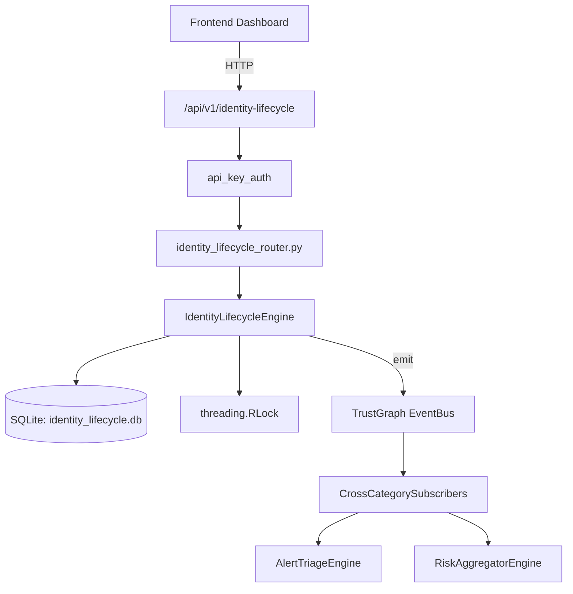

# US-0127: Identity Lifecycle

## Sub-Epic: Identity
**Master Goal**: ALDECI — $35/mo enterprise security intelligence platform replacing $50K-500K/yr tools

## User Story
As a **Maria Lopez (IT Director)**, I need to manage identity analytics and risk
so that the platform delivers enterprise-grade identity capabilities at 1/1000th the cost of legacy tools.

## Why This Matters
Identity Lifecycle replaces functionality found in enterprise tools like CrowdStrike, Wiz, Snyk, and Rapid7.
By building this into ALDECI's $35/mo stack, customers save $50K+/yr on standalone Identity tooling.

## Architecture

## Current State: 95% Complete
- ✅ `provision_account()` — Create and activate a new identity account. (line 151)
- ✅ `deprovision_account()` — Deprovision account and revoke all entitlements. (line 188)
- ✅ `suspend_account()` — Suspend an active account. (line 217)
- ✅ `reactivate_account()` — Reactivate a suspended or deprovisioned account. (line 237)
- ✅ `update_last_active()` — Update last_active timestamp for an account. (line 257)
- ✅ `grant_access()` — Grant system access entitlement to an account. (line 270)
- ❌ TrustGraph event emission — not yet verified

## Key Functions (from `suite-core/core/identity_lifecycle_engine.py` — 458 lines)
- `IdentityLifecycleEngine.provision_account()` — Create and activate a new identity account. (line 151)
- `IdentityLifecycleEngine.deprovision_account()` — Deprovision account and revoke all entitlements. (line 188)
- `IdentityLifecycleEngine.suspend_account()` — Suspend an active account. (line 217)
- `IdentityLifecycleEngine.reactivate_account()` — Reactivate a suspended or deprovisioned account. (line 237)
- `IdentityLifecycleEngine.update_last_active()` — Update last_active timestamp for an account. (line 257)
- `IdentityLifecycleEngine.grant_access()` — Grant system access entitlement to an account. (line 270)
- `IdentityLifecycleEngine.revoke_access()` — Revoke a specific entitlement. (line 310)
- `IdentityLifecycleEngine.get_account()` — Fetch account with its events and active entitlements. (line 352)

## Dependencies
- **Depends on**: standalone
- **Depended by**: Routers, TrustGraph EventBus, CrossCategorySubscribers
- **TrustGraph**: Event emission wired via ResponseInterceptorMiddleware
- **Source file**: `suite-core/core/identity_lifecycle_engine.py` (458 lines)
- **Router file**: `suite-api/apps/api/identity_lifecycle_router.py`

## API Endpoints
| Method | Path | Description |
|--------|------|-------------|
| POST | `/api/v1/identity-lifecycle/accounts` | provision account |
| GET | `/api/v1/identity-lifecycle/accounts` | list accounts |
| GET | `/api/v1/identity-lifecycle/accounts/{account_id}` | get account |
| POST | `/api/v1/identity-lifecycle/accounts/{account_id}/deprovision` | deprovision account |
| POST | `/api/v1/identity-lifecycle/accounts/{account_id}/suspend` | suspend account |
| POST | `/api/v1/identity-lifecycle/accounts/{account_id}/reactivate` | reactivate account |
| POST | `/api/v1/identity-lifecycle/accounts/{account_id}/access` | grant access |
| POST | `/api/v1/identity-lifecycle/entitlements/{entitlement_id}/revoke` | revoke access |
| GET | `/api/v1/identity-lifecycle/orphans` | get orphan accounts |
| GET | `/api/v1/identity-lifecycle/summary` | get entitlement summary |

## Tasks Remaining
1. Verify TrustGraph event emission works end-to-end (2h)
2. Add integration test with real persona workflow (2h)
3. Wire CrossCategorySubscriber consumer chain (1h)
4. Validate with 30-persona walkthrough (1h)
5. Optimize query performance for large datasets (2h)
6. Expand test coverage to edge cases (2h)

## Definition of Done
- [ ] Maria Lopez (IT Director) can access /api/v1/identity-lifecycle and get meaningful data
- [ ] All CRUD operations return correct HTTP status codes
- [ ] TrustGraph receives events from this engine
- [ ] 49+ tests passing in `tests/test_identity_lifecycle_engine.py`
- [ ] 30-persona walkthrough includes this endpoint at 100%
- [ ] No hardcoded org_id — all queries are org-scoped

## Sprint: Wave 46 (est. April 22-24, 2026)

## Test Coverage
- **Test file**: `tests/test_identity_lifecycle_engine.py`
- **Tests**: 49 tests
- **Status**: Passing
