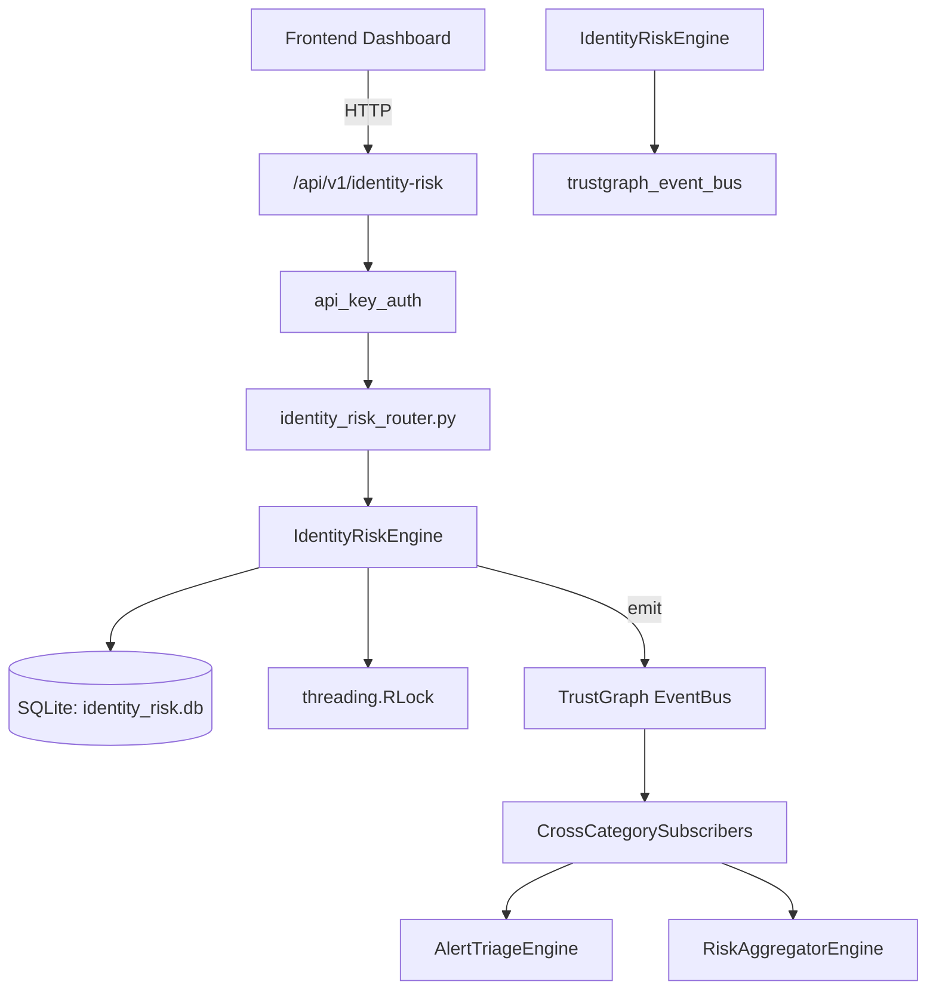

# US-0128: Identity Risk

## Sub-Epic: Identity
**Master Goal**: ALDECI — $35/mo enterprise security intelligence platform replacing $50K-500K/yr tools

## User Story
As a **Maria Lopez (IT Director)**, I need to manage identity analytics and risk
so that the platform delivers enterprise-grade identity capabilities at 1/1000th the cost of legacy tools.

## Why This Matters
Identity Risk replaces functionality found in enterprise tools like CrowdStrike, Wiz, Snyk, and Rapid7.
By building this into ALDECI's $35/mo stack, customers save $50K+/yr on standalone Identity tooling.

## Architecture

## Current State: 95% Complete
- ✅ `register_identity()` — Register a new identity. (line 170)
- ✅ `list_identities()` — List identities with optional filters. (line 226)
- ✅ `get_identity()` — Get a single identity by id, scoped to org. (line 250)
- ✅ `update_risk_score()` — Update risk_score and auto-compute risk_level. Clamps 0-100. (line 259)
- ✅ `record_risk_factor()` — Record a risk factor for an identity. (line 287)
- ✅ `list_risk_factors()` — List risk factors with optional filters. (line 339)
- ❌ TrustGraph event emission — not yet verified

## Key Functions (from `suite-core/core/identity_risk_engine.py` — 511 lines)
- `IdentityRiskEngine.register_identity()` — Register a new identity. (line 170)
- `IdentityRiskEngine.list_identities()` — List identities with optional filters. (line 226)
- `IdentityRiskEngine.get_identity()` — Get a single identity by id, scoped to org. (line 250)
- `IdentityRiskEngine.update_risk_score()` — Update risk_score and auto-compute risk_level. Clamps 0-100. (line 259)
- `IdentityRiskEngine.record_risk_factor()` — Record a risk factor for an identity. (line 287)
- `IdentityRiskEngine.list_risk_factors()` — List risk factors with optional filters. (line 339)
- `IdentityRiskEngine.mitigate_factor()` — Set a risk factor status to mitigated. (line 363)
- `IdentityRiskEngine.record_access_review()` — Record an access review decision. (line 386)

## Dependencies
- **Depends on**: trustgraph_event_bus
- **Depended by**: Routers, TrustGraph EventBus, CrossCategorySubscribers
- **TrustGraph**: Event emission wired via ResponseInterceptorMiddleware
- **Source file**: `suite-core/core/identity_risk_engine.py` (511 lines)
- **Router file**: `suite-api/apps/api/identity_risk_router.py`

## API Endpoints
| Method | Path | Description |
|--------|------|-------------|
| POST | `/api/v1/identity-risk/identities` | register identity |
| GET | `/api/v1/identity-risk/identities` | list identities |
| GET | `/api/v1/identity-risk/identities/{identity_id}` | get identity |
| PUT | `/api/v1/identity-risk/identities/{identity_id}/risk-score` | update risk score |
| POST | `/api/v1/identity-risk/risk-factors` | record risk factor |
| GET | `/api/v1/identity-risk/risk-factors` | list risk factors |
| PUT | `/api/v1/identity-risk/risk-factors/{factor_id}/mitigate` | mitigate factor |
| POST | `/api/v1/identity-risk/access-reviews` | record access review |
| GET | `/api/v1/identity-risk/access-reviews` | list access reviews |
| GET | `/api/v1/identity-risk/stats` | get identity risk stats |

## Tasks Remaining
1. Verify TrustGraph event emission works end-to-end (2h)
2. Add integration test with real persona workflow (2h)
3. Wire CrossCategorySubscriber consumer chain (1h)
4. Validate with 30-persona walkthrough (1h)
5. Optimize query performance for large datasets (2h)
6. Expand test coverage to edge cases (2h)

## Definition of Done
- [ ] Maria Lopez (IT Director) can access /api/v1/identity-risk and get meaningful data
- [ ] All CRUD operations return correct HTTP status codes
- [ ] TrustGraph receives events from this engine
- [ ] 46+ tests passing in `tests/test_identity_risk_engine.py`
- [ ] 30-persona walkthrough includes this endpoint at 100%
- [ ] No hardcoded org_id — all queries are org-scoped

## Sprint: Wave 46 (est. April 22-24, 2026)

## Test Coverage
- **Test file**: `tests/test_identity_risk_engine.py`
- **Tests**: 46 tests
- **Status**: Passing
