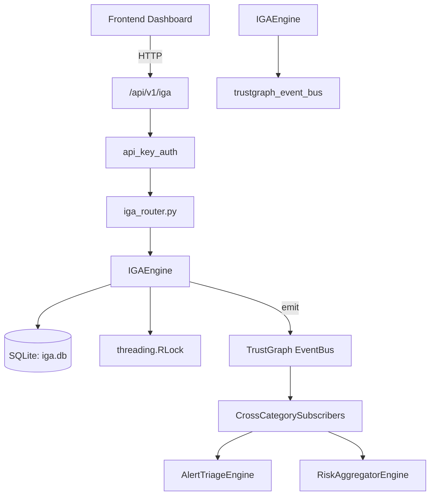

# US-0129: Iga

## Sub-Epic: Identity
**Master Goal**: ALDECI — $35/mo enterprise security intelligence platform replacing $50K-500K/yr tools

## User Story
As a **Maria Lopez (IT Director)**, I need to govern identity access lifecycle
so that the platform delivers enterprise-grade identity capabilities at 1/1000th the cost of legacy tools.

## Why This Matters
Iga replaces functionality found in enterprise tools like CrowdStrike, Wiz, Snyk, and Rapid7.
By building this into ALDECI's $35/mo stack, customers save $50K+/yr on standalone Identity tooling.

## Architecture

## Current State: 95% Complete
- ✅ `create_access_review()` — Create an access review campaign. (line 208)
- ✅ `list_access_reviews()` — List all access reviews for an org. (line 308)
- ✅ `get_review_items()` — Return all access items to certify/revoke for a review. (line 339)
- ✅ `certify_access()` — Submit a certification decision for a review item. (line 353)
- ✅ `upsert_identity()` — Insert or update an identity in the catalog. (line 398)
- ✅ `get_orphaned_accounts()` — Return accounts with no owner or from departed employees. (line 452)
- ❌ TrustGraph event emission — not yet verified

## Key Functions (from `suite-core/core/iga_engine.py` — 748 lines)
- `IGAEngine.create_access_review()` — Create an access review campaign. (line 208)
- `IGAEngine.list_access_reviews()` — List all access reviews for an org. (line 308)
- `IGAEngine.get_review_items()` — Return all access items to certify/revoke for a review. (line 339)
- `IGAEngine.certify_access()` — Submit a certification decision for a review item. (line 353)
- `IGAEngine.upsert_identity()` — Insert or update an identity in the catalog. (line 398)
- `IGAEngine.get_orphaned_accounts()` — Return accounts with no owner or from departed employees. (line 452)
- `IGAEngine.get_excessive_privileges()` — Return users holding more privileged roles than their role requires. (line 504)
- `IGAEngine.get_segregation_violations()` — Return SoD violations — conflicting roles held by the same user. (line 567)

## Dependencies
- **Depends on**: trustgraph_event_bus
- **Depended by**: Routers, TrustGraph EventBus, CrossCategorySubscribers
- **TrustGraph**: Event emission wired via ResponseInterceptorMiddleware
- **Source file**: `suite-core/core/iga_engine.py` (748 lines)
- **Router file**: `suite-api/apps/api/iga_router.py`

## API Endpoints
| Method | Path | Description |
|--------|------|-------------|
| POST | `/api/v1/iga/reviews` | create access review |
| GET | `/api/v1/iga/reviews` | list access reviews |
| GET | `/api/v1/iga/reviews/{review_id}/items` | get review items |
| POST | `/api/v1/iga/reviews/{review_id}/items/{item_id}/certify` | certify access |
| GET | `/api/v1/iga/orphaned-accounts` | get orphaned accounts |
| GET | `/api/v1/iga/excessive-privileges` | get excessive privileges |
| GET | `/api/v1/iga/sod-violations` | get sod violations |
| GET | `/api/v1/iga/stats` | get certification stats |
| POST | `/api/v1/iga/provisioning-check` | run provisioning check |

## Tasks Remaining
1. Verify TrustGraph event emission works end-to-end (2h)
2. Add integration test with real persona workflow (2h)
3. Wire CrossCategorySubscriber consumer chain (1h)
4. Validate with 30-persona walkthrough (1h)
5. Optimize query performance for large datasets (2h)
6. Expand test coverage to edge cases (2h)

## Definition of Done
- [ ] Maria Lopez (IT Director) can access /api/v1/iga and get meaningful data
- [ ] All CRUD operations return correct HTTP status codes
- [ ] TrustGraph receives events from this engine
- [ ] 35+ tests passing in `tests/test_iga_engine.py`
- [ ] 30-persona walkthrough includes this endpoint at 100%
- [ ] No hardcoded org_id — all queries are org-scoped

## Sprint: Wave 46 (est. April 22-24, 2026)

## Test Coverage
- **Test file**: `tests/test_iga_engine.py`
- **Tests**: 35 tests
- **Status**: Passing
