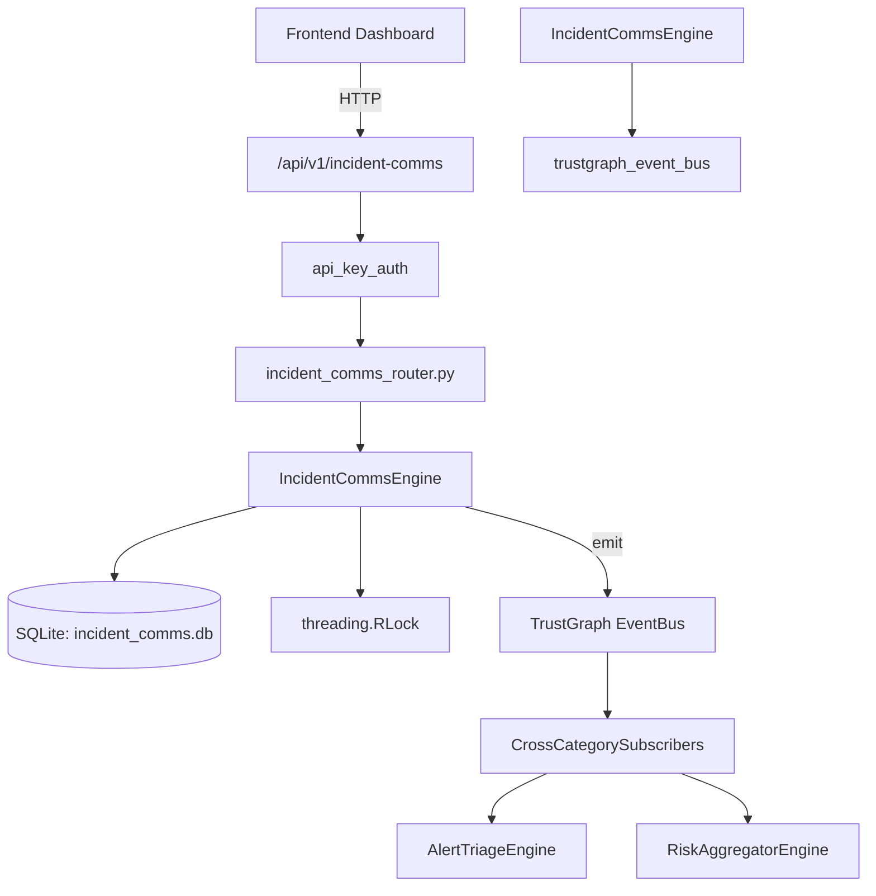

# US-0130: Incident Comms

## Sub-Epic: SOC
**Master Goal**: ALDECI — $35/mo enterprise security intelligence platform replacing $50K-500K/yr tools

## User Story
As a **Karen Taylor (IR Lead)**, I need to manage incident response lifecycle
so that the platform delivers enterprise-grade soc capabilities at 1/1000th the cost of legacy tools.

## Why This Matters
Incident Comms replaces functionality found in enterprise tools like CrowdStrike, Wiz, Snyk, and Rapid7.
By building this into ALDECI's $35/mo stack, customers save $50K+/yr on standalone SOC tooling.

## Architecture

## Current State: 95% Complete
- ✅ `create_comm()` — Create a new incident communication. subject and body are required. (line 126)
- ✅ `list_comms()` — List communications with optional filters. (line 198)
- ✅ `get_comm()` — Return a single communication or None. (line 223)
- ✅ `send_comm()` — Mark a communication as sent and update delivery counts. (line 232)
- ✅ `record_acknowledgment()` — Record that a recipient acknowledged a communication. (line 270)
- ✅ `list_acknowledgments()` — List all acknowledgments for a specific communication. (line 298)
- ❌ TrustGraph event emission — not yet verified

## Key Functions (from `suite-core/core/incident_comms_engine.py` — 438 lines)
- `IncidentCommsEngine.create_comm()` — Create a new incident communication. subject and body are required. (line 126)
- `IncidentCommsEngine.list_comms()` — List communications with optional filters. (line 198)
- `IncidentCommsEngine.get_comm()` — Return a single communication or None. (line 223)
- `IncidentCommsEngine.send_comm()` — Mark a communication as sent and update delivery counts. (line 232)
- `IncidentCommsEngine.record_acknowledgment()` — Record that a recipient acknowledged a communication. (line 270)
- `IncidentCommsEngine.list_acknowledgments()` — List all acknowledgments for a specific communication. (line 298)
- `IncidentCommsEngine.create_template()` — Create a reusable communication template. (line 316)
- `IncidentCommsEngine.list_templates()` — List templates with optional filters. (line 357)

## Dependencies
- **Depends on**: trustgraph_event_bus
- **Depended by**: Routers, TrustGraph EventBus, CrossCategorySubscribers
- **TrustGraph**: Event emission wired via ResponseInterceptorMiddleware
- **Source file**: `suite-core/core/incident_comms_engine.py` (438 lines)
- **Router file**: `suite-api/apps/api/incident_comms_router.py`

## API Endpoints
| Method | Path | Description |
|--------|------|-------------|
| POST | `/api/v1/incident-comms/comms` | create comm |
| GET | `/api/v1/incident-comms/comms` | list comms |
| GET | `/api/v1/incident-comms/comms/{comm_id}` | get comm |
| POST | `/api/v1/incident-comms/comms/{comm_id}/send` | send comm |
| POST | `/api/v1/incident-comms/comms/{comm_id}/acknowledge` | record acknowledgment |
| GET | `/api/v1/incident-comms/comms/{comm_id}/acknowledgments` | list acknowledgments |
| POST | `/api/v1/incident-comms/templates` | create template |
| GET | `/api/v1/incident-comms/templates` | list templates |
| GET | `/api/v1/incident-comms/stats` | get comms stats |

## Tasks Remaining
1. Verify TrustGraph event emission works end-to-end (2h)
2. Add integration test with real persona workflow (2h)
3. Wire CrossCategorySubscriber consumer chain (1h)
4. Validate with 30-persona walkthrough (1h)
5. Optimize query performance for large datasets (2h)
6. Expand test coverage to edge cases (2h)

## Definition of Done
- [ ] Karen Taylor (IR Lead) can access /api/v1/incident-comms and get meaningful data
- [ ] All CRUD operations return correct HTTP status codes
- [ ] TrustGraph receives events from this engine
- [ ] 41+ tests passing in `tests/test_incident_comms_engine.py`
- [ ] 30-persona walkthrough includes this endpoint at 100%
- [ ] No hardcoded org_id — all queries are org-scoped

## Sprint: Wave 46 (est. April 22-24, 2026)

## Test Coverage
- **Test file**: `tests/test_incident_comms_engine.py`
- **Tests**: 41 tests
- **Status**: Passing
