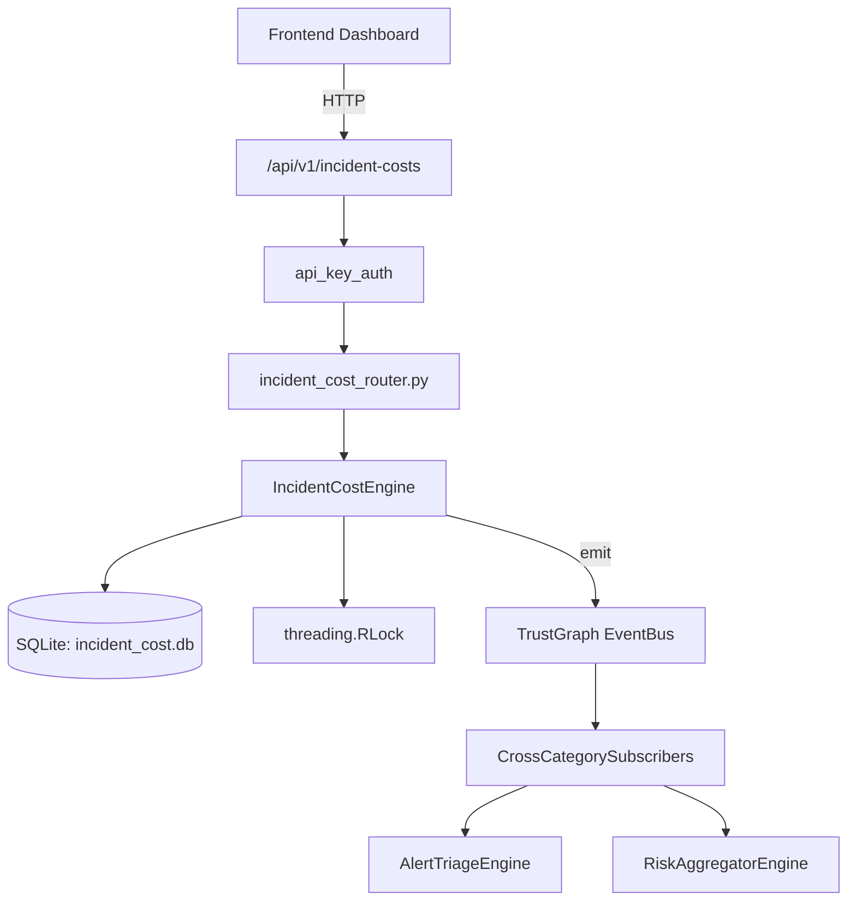

# US-0131: Incident Cost

## Sub-Epic: SOC
**Master Goal**: ALDECI — $35/mo enterprise security intelligence platform replacing $50K-500K/yr tools

## User Story
As a **Karen Taylor (IR Lead)**, I need to manage incident response lifecycle
so that the platform delivers enterprise-grade soc capabilities at 1/1000th the cost of legacy tools.

## Why This Matters
Incident Cost replaces functionality found in enterprise tools like CrowdStrike, Wiz, Snyk, and Rapid7.
By building this into ALDECI's $35/mo stack, customers save $50K+/yr on standalone SOC tooling.

## Architecture

## Current State: 95% Complete
- ✅ `record_cost()` — Record a cost line-item for a security incident. (line 162)
- ✅ `finalize_incident()` — Compute totals and save/update an incident summary. (line 228)
- ✅ `get_incident_costs()` — Return all cost records for an incident. (line 313)
- ✅ `get_incident_summary()` — Return the summary for a finalized incident, with parsed cost_categories. (line 326)
- ✅ `add_benchmark()` — Add an industry cost benchmark for an incident type. (line 348)
- ✅ `compare_to_benchmark()` — Compare incident total cost to industry benchmark. (line 390)
- ❌ TrustGraph event emission — not yet verified

## Key Functions (from `suite-core/core/incident_cost_engine.py` — 554 lines)
- `IncidentCostEngine.record_cost()` — Record a cost line-item for a security incident. (line 162)
- `IncidentCostEngine.finalize_incident()` — Compute totals and save/update an incident summary. (line 228)
- `IncidentCostEngine.get_incident_costs()` — Return all cost records for an incident. (line 313)
- `IncidentCostEngine.get_incident_summary()` — Return the summary for a finalized incident, with parsed cost_categories. (line 326)
- `IncidentCostEngine.add_benchmark()` — Add an industry cost benchmark for an incident type. (line 348)
- `IncidentCostEngine.compare_to_benchmark()` — Compare incident total cost to industry benchmark. (line 390)
- `IncidentCostEngine.get_cost_analytics()` — Return cost analytics: totals, by type, by category, avg per incident, most expe (line 467)
- `IncidentCostEngine.list_summaries()` — List finalized incident summaries with optional filters. (line 515)

## Dependencies
- **Depends on**: standalone
- **Depended by**: Routers, TrustGraph EventBus, CrossCategorySubscribers
- **TrustGraph**: Event emission wired via ResponseInterceptorMiddleware
- **Source file**: `suite-core/core/incident_cost_engine.py` (554 lines)
- **Router file**: `suite-api/apps/api/incident_cost_router.py`

## API Endpoints
| Method | Path | Description |
|--------|------|-------------|
| POST | `/api/v1/incident-costs/costs` | record cost |
| POST | `/api/v1/incident-costs/incidents/{incident_id}/finalize` | finalize incident |
| GET | `/api/v1/incident-costs/incidents/{incident_id}/costs` | get incident costs |
| GET | `/api/v1/incident-costs/incidents/{incident_id}/summary` | get incident summary |
| POST | `/api/v1/incident-costs/benchmarks` | add benchmark |
| GET | `/api/v1/incident-costs/incidents/{incident_id}/benchmark-compare` | compare to benchmark |
| GET | `/api/v1/incident-costs/analytics` | get cost analytics |
| GET | `/api/v1/incident-costs/summaries` | list summaries |

## Tasks Remaining
1. Verify TrustGraph event emission works end-to-end (2h)
2. Add integration test with real persona workflow (2h)
3. Wire CrossCategorySubscriber consumer chain (1h)
4. Validate with 30-persona walkthrough (1h)
5. Optimize query performance for large datasets (2h)
6. Expand test coverage to edge cases (2h)

## Definition of Done
- [ ] Karen Taylor (IR Lead) can access /api/v1/incident-costs and get meaningful data
- [ ] All CRUD operations return correct HTTP status codes
- [ ] TrustGraph receives events from this engine
- [ ] 36+ tests passing in `tests/test_incident_cost_engine.py`
- [ ] 30-persona walkthrough includes this endpoint at 100%
- [ ] No hardcoded org_id — all queries are org-scoped

## Sprint: Wave 46 (est. April 22-24, 2026)

## Test Coverage
- **Test file**: `tests/test_incident_cost_engine.py`
- **Tests**: 36 tests
- **Status**: Passing
