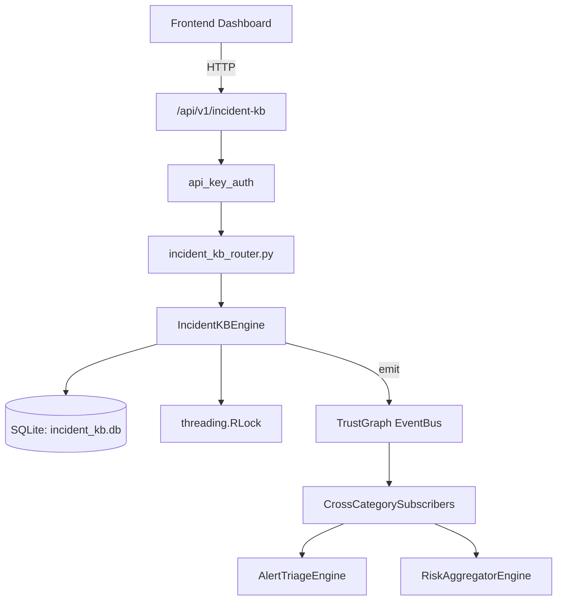

# US-0132: Incident Kb

## Sub-Epic: SOC
**Master Goal**: ALDECI — $35/mo enterprise security intelligence platform replacing $50K-500K/yr tools

## User Story
As a **Karen Taylor (IR Lead)**, I need to manage incident response lifecycle
so that the platform delivers enterprise-grade soc capabilities at 1/1000th the cost of legacy tools.

## Why This Matters
Incident Kb replaces functionality found in enterprise tools like CrowdStrike, Wiz, Snyk, and Rapid7.
By building this into ALDECI's $35/mo stack, customers save $50K+/yr on standalone SOC tooling.

## Architecture

## Current State: 95% Complete
- ✅ `create_article()` — Create a new KB article. Tags stored as comma-separated string. (line 119)
- ✅ `update_article()` — Update article content and tags. (line 158)
- ✅ `view_article()` — Increment view_count and return the article. (line 193)
- ✅ `mark_helpful()` — Increment helpful_count for an article. (line 212)
- ✅ `search_articles()` — Case-insensitive LIKE search on title, content, and tags. (line 231)
- ✅ `create_runbook()` — Create a new runbook. Steps stored as JSON string. (line 274)
- ❌ TrustGraph event emission — not yet verified

## Key Functions (from `suite-core/core/incident_kb_engine.py` — 421 lines)
- `IncidentKBEngine.create_article()` — Create a new KB article. Tags stored as comma-separated string. (line 119)
- `IncidentKBEngine.update_article()` — Update article content and tags. (line 158)
- `IncidentKBEngine.view_article()` — Increment view_count and return the article. (line 193)
- `IncidentKBEngine.mark_helpful()` — Increment helpful_count for an article. (line 212)
- `IncidentKBEngine.search_articles()` — Case-insensitive LIKE search on title, content, and tags. (line 231)
- `IncidentKBEngine.create_runbook()` — Create a new runbook. Steps stored as JSON string. (line 274)
- `IncidentKBEngine.execute_runbook()` — Record a runbook execution and recompute rolling success_rate. (line 310)
- `IncidentKBEngine.get_recommended_runbooks()` — Return runbooks for incident_type sorted by success_rate DESC. (line 345)

## Dependencies
- **Depends on**: standalone
- **Depended by**: Routers, TrustGraph EventBus, CrossCategorySubscribers
- **TrustGraph**: Event emission wired via ResponseInterceptorMiddleware
- **Source file**: `suite-core/core/incident_kb_engine.py` (421 lines)
- **Router file**: `suite-api/apps/api/incident_kb_router.py`

## API Endpoints
| Method | Path | Description |
|--------|------|-------------|
| POST | `/api/v1/incident-kb/articles` | create article |
| PUT | `/api/v1/incident-kb/articles/{article_id}` | update article |
| POST | `/api/v1/incident-kb/articles/{article_id}/view` | view article |
| POST | `/api/v1/incident-kb/articles/{article_id}/helpful` | mark helpful |
| GET | `/api/v1/incident-kb/search` | search articles |
| POST | `/api/v1/incident-kb/runbooks` | create runbook |
| POST | `/api/v1/incident-kb/runbooks/{runbook_id}/execute` | execute runbook |
| GET | `/api/v1/incident-kb/runbooks/recommended` | get recommended runbooks |
| GET | `/api/v1/incident-kb/stats` | get kb stats |

## Tasks Remaining
1. Verify TrustGraph event emission works end-to-end (2h)
2. Add integration test with real persona workflow (2h)
3. Wire CrossCategorySubscriber consumer chain (1h)
4. Validate with 30-persona walkthrough (1h)
5. Optimize query performance for large datasets (2h)
6. Expand test coverage to edge cases (2h)

## Definition of Done
- [ ] Karen Taylor (IR Lead) can access /api/v1/incident-kb and get meaningful data
- [ ] All CRUD operations return correct HTTP status codes
- [ ] TrustGraph receives events from this engine
- [ ] 37+ tests passing in `tests/test_incident_kb_engine.py`
- [ ] 30-persona walkthrough includes this endpoint at 100%
- [ ] No hardcoded org_id — all queries are org-scoped

## Sprint: Wave 46 (est. April 22-24, 2026)

## Test Coverage
- **Test file**: `tests/test_incident_kb_engine.py`
- **Tests**: 37 tests
- **Status**: Passing
