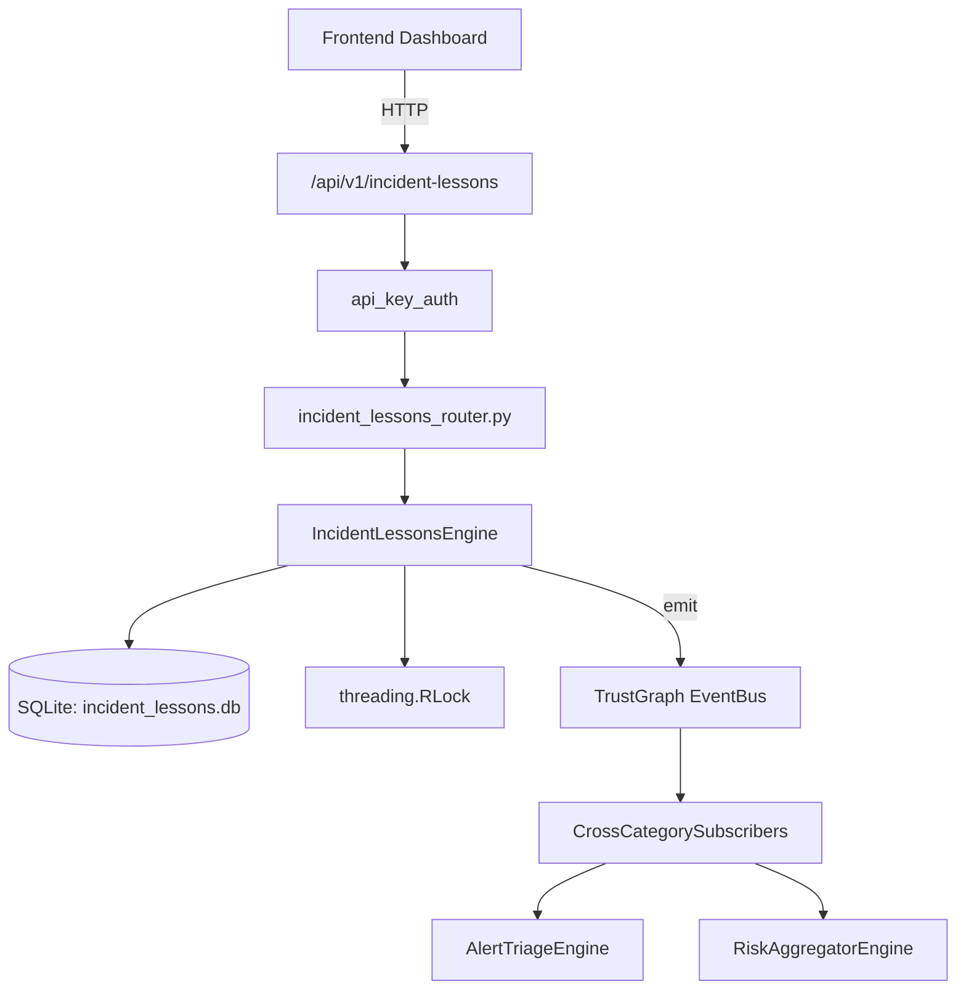

# US-0133: Incident Lessons

## Sub-Epic: SOC
**Master Goal**: ALDECI — $35/mo enterprise security intelligence platform replacing $50K-500K/yr tools

## User Story
As a **Karen Taylor (IR Lead)**, I need to manage incident response lifecycle
so that the platform delivers enterprise-grade soc capabilities at 1/1000th the cost of legacy tools.

## Why This Matters
Incident Lessons replaces functionality found in enterprise tools like CrowdStrike, Wiz, Snyk, and Rapid7.
By building this into ALDECI's $35/mo stack, customers save $50K+/yr on standalone SOC tooling.

## Architecture

## Current State: 95% Complete
- ✅ `create_lesson()` — Create a new lessons-learned entry. (line 132)
- ✅ `get_lesson()` — Get a lesson with its action_items and reviews. (line 184)
- ✅ `list_lessons()` — List lessons with optional filters. (line 206)
- ✅ `add_action_item()` — Add an action item to a lesson. (line 230)
- ✅ `complete_action()` — Mark an action item as completed. Auto-implements lesson when all done. (line 290)
- ✅ `review_lesson()` — Create a review record and mark lesson as reviewed. (line 329)
- ❌ TrustGraph event emission — not yet verified

## Key Functions (from `suite-core/core/incident_lessons_engine.py` — 439 lines)
- `IncidentLessonsEngine.create_lesson()` — Create a new lessons-learned entry. (line 132)
- `IncidentLessonsEngine.get_lesson()` — Get a lesson with its action_items and reviews. (line 184)
- `IncidentLessonsEngine.list_lessons()` — List lessons with optional filters. (line 206)
- `IncidentLessonsEngine.add_action_item()` — Add an action item to a lesson. (line 230)
- `IncidentLessonsEngine.complete_action()` — Mark an action item as completed. Auto-implements lesson when all done. (line 290)
- `IncidentLessonsEngine.review_lesson()` — Create a review record and mark lesson as reviewed. (line 329)
- `IncidentLessonsEngine.get_overdue_actions()` — Return action items past their due_date and not yet completed. (line 383)
- `IncidentLessonsEngine.get_implementation_rate()` — Return % of lessons where all action items are completed (implemented). (line 395)

## Dependencies
- **Depends on**: standalone
- **Depended by**: Routers, TrustGraph EventBus, CrossCategorySubscribers
- **TrustGraph**: Event emission wired via ResponseInterceptorMiddleware
- **Source file**: `suite-core/core/incident_lessons_engine.py` (439 lines)
- **Router file**: `suite-api/apps/api/incident_lessons_router.py`

## API Endpoints
| Method | Path | Description |
|--------|------|-------------|
| POST | `/api/v1/incident-lessons/lessons` | create lesson |
| GET | `/api/v1/incident-lessons/lessons` | list lessons |
| GET | `/api/v1/incident-lessons/lessons/{lesson_id}` | get lesson |
| POST | `/api/v1/incident-lessons/lessons/{lesson_id}/actions` | add action item |
| POST | `/api/v1/incident-lessons/lessons/{lesson_id}/actions/{action_id}/complete` | complete action |
| POST | `/api/v1/incident-lessons/lessons/{lesson_id}/reviews` | review lesson |
| GET | `/api/v1/incident-lessons/overdue-actions` | get overdue actions |
| GET | `/api/v1/incident-lessons/implementation-rate` | get implementation rate |
| GET | `/api/v1/incident-lessons/summary` | get summary |

## Tasks Remaining
1. Verify TrustGraph event emission works end-to-end (2h)
2. Add integration test with real persona workflow (2h)
3. Wire CrossCategorySubscriber consumer chain (1h)
4. Validate with 30-persona walkthrough (1h)
5. Optimize query performance for large datasets (2h)
6. Expand test coverage to edge cases (2h)

## Definition of Done
- [ ] Karen Taylor (IR Lead) can access /api/v1/incident-lessons and get meaningful data
- [ ] All CRUD operations return correct HTTP status codes
- [ ] TrustGraph receives events from this engine
- [ ] 41+ tests passing in `tests/test_incident_lessons_engine.py`
- [ ] 30-persona walkthrough includes this endpoint at 100%
- [ ] No hardcoded org_id — all queries are org-scoped

## Sprint: Wave 46 (est. April 22-24, 2026)

## Test Coverage
- **Test file**: `tests/test_incident_lessons_engine.py`
- **Tests**: 41 tests
- **Status**: Passing
