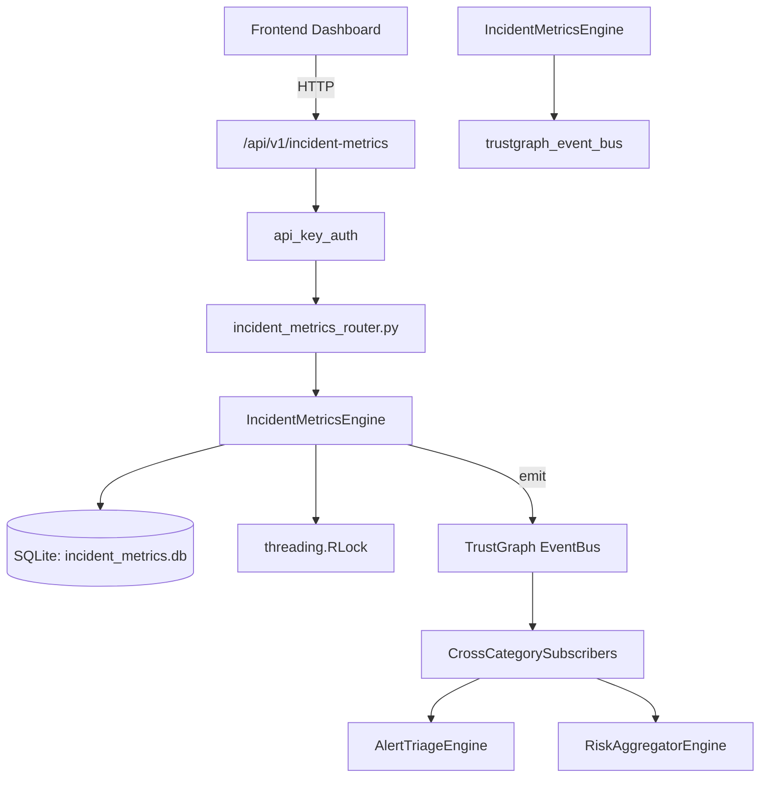

# US-0134: Incident Metrics

## Sub-Epic: SOC
**Master Goal**: ALDECI — $35/mo enterprise security intelligence platform replacing $50K-500K/yr tools

## User Story
As a **Karen Taylor (IR Lead)**, I need to manage incident response lifecycle
so that the platform delivers enterprise-grade soc capabilities at 1/1000th the cost of legacy tools.

## Why This Matters
Incident Metrics replaces functionality found in enterprise tools like CrowdStrike, Wiz, Snyk, and Rapid7.
By building this into ALDECI's $35/mo stack, customers save $50K+/yr on standalone SOC tooling.

## Architecture

## Current State: 95% Complete
- ✅ `record_incident()` — Record a new security incident. (line 169)
- ✅ `update_incident_timeline()` — Set a timeline timestamp (responded/contained/resolved/closed). (line 233)
- ✅ `escalate_incident()` — Mark an incident as escalated. (line 275)
- ✅ `list_incidents()` — List incidents with optional filters, ordered by detected_at DESC. (line 295)
- ✅ `get_incident()` — Get an incident by its incident_id field (external ref). (line 320)
- ✅ `compute_metrics()` — Compute incident metrics and save a daily snapshot. (line 333)
- ❌ TrustGraph event emission — not yet verified

## Key Functions (from `suite-core/core/incident_metrics_engine.py` — 527 lines)
- `IncidentMetricsEngine.record_incident()` — Record a new security incident. (line 169)
- `IncidentMetricsEngine.update_incident_timeline()` — Set a timeline timestamp (responded/contained/resolved/closed). (line 233)
- `IncidentMetricsEngine.escalate_incident()` — Mark an incident as escalated. (line 275)
- `IncidentMetricsEngine.list_incidents()` — List incidents with optional filters, ordered by detected_at DESC. (line 295)
- `IncidentMetricsEngine.get_incident()` — Get an incident by its incident_id field (external ref). (line 320)
- `IncidentMetricsEngine.compute_metrics()` — Compute incident metrics and save a daily snapshot. (line 333)
- `IncidentMetricsEngine.set_sla_config()` — Upsert SLA config for a severity level. (line 408)
- `IncidentMetricsEngine.get_sla_config()` — Get SLA config for a severity. Returns None if not set. (line 448)

## Dependencies
- **Depends on**: trustgraph_event_bus
- **Depended by**: Routers, TrustGraph EventBus, CrossCategorySubscribers
- **TrustGraph**: Event emission wired via ResponseInterceptorMiddleware
- **Source file**: `suite-core/core/incident_metrics_engine.py` (527 lines)
- **Router file**: `suite-api/apps/api/incident_metrics_router.py`

## API Endpoints
| Method | Path | Description |
|--------|------|-------------|
| POST | `/api/v1/incident-metrics/incidents` | record incident |
| GET | `/api/v1/incident-metrics/incidents` | list incidents |
| GET | `/api/v1/incident-metrics/incidents/{incident_id}` | get incident |
| PUT | `/api/v1/incident-metrics/incidents/{incident_id}/timeline` | update timeline |
| PUT | `/api/v1/incident-metrics/incidents/{incident_id}/escalate` | escalate incident |
| POST | `/api/v1/incident-metrics/compute-metrics` | compute metrics |
| POST | `/api/v1/incident-metrics/sla-config` | set sla config |
| GET | `/api/v1/incident-metrics/sla-config/{severity}` | get sla config |
| GET | `/api/v1/incident-metrics/stats` | get stats |

## Tasks Remaining
1. Verify TrustGraph event emission works end-to-end (2h)
2. Add integration test with real persona workflow (2h)
3. Wire CrossCategorySubscriber consumer chain (1h)
4. Validate with 30-persona walkthrough (1h)
5. Optimize query performance for large datasets (2h)
6. Expand test coverage to edge cases (2h)

## Definition of Done
- [ ] Karen Taylor (IR Lead) can access /api/v1/incident-metrics and get meaningful data
- [ ] All CRUD operations return correct HTTP status codes
- [ ] TrustGraph receives events from this engine
- [ ] 36+ tests passing in `tests/test_incident_metrics_engine.py`
- [ ] 30-persona walkthrough includes this endpoint at 100%
- [ ] No hardcoded org_id — all queries are org-scoped

## Sprint: Wave 46 (est. April 22-24, 2026)

## Test Coverage
- **Test file**: `tests/test_incident_metrics_engine.py`
- **Tests**: 36 tests
- **Status**: Passing
