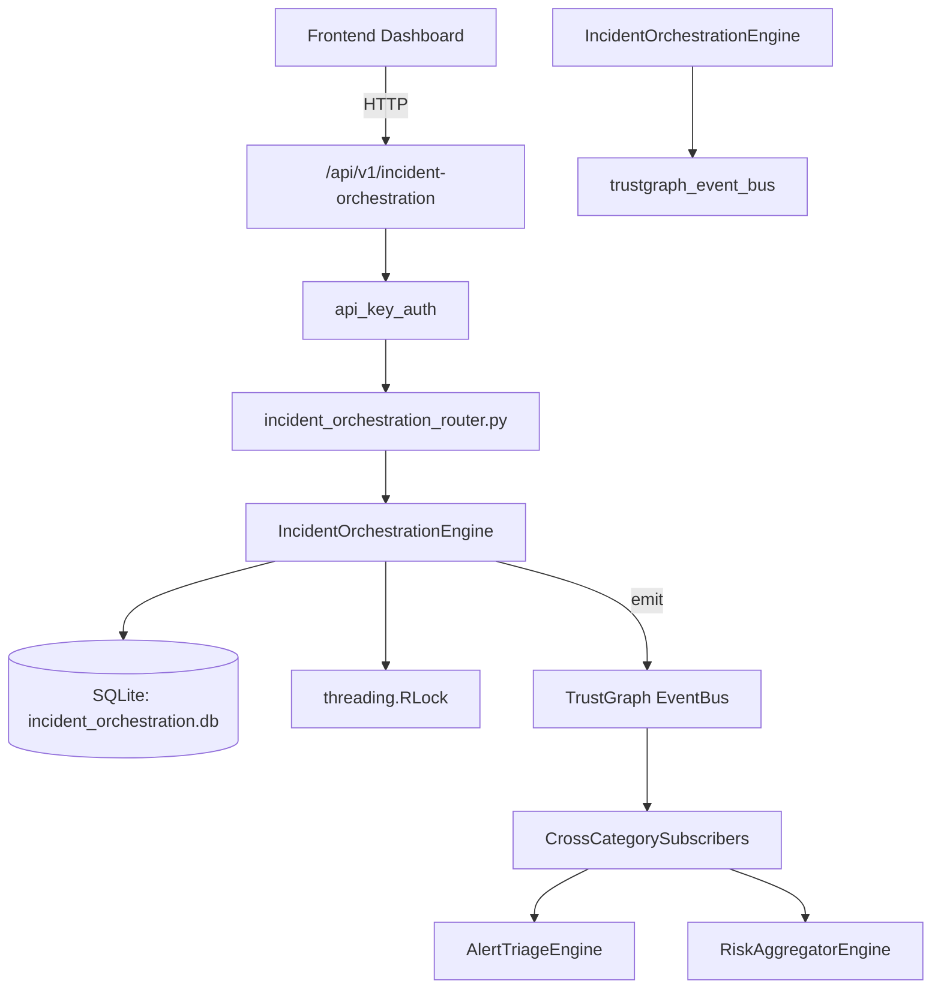

# US-0135: Incident Orchestration

## Sub-Epic: SOC
**Master Goal**: ALDECI — $35/mo enterprise security intelligence platform replacing $50K-500K/yr tools

## User Story
As a **Karen Taylor (IR Lead)**, I need to manage incident response lifecycle
so that the platform delivers enterprise-grade soc capabilities at 1/1000th the cost of legacy tools.

## Why This Matters
Incident Orchestration replaces functionality found in enterprise tools like CrowdStrike, Wiz, Snyk, and Rapid7.
By building this into ALDECI's $35/mo stack, customers save $50K+/yr on standalone SOC tooling.

## Architecture

## Current State: 95% Complete
- ✅ `create_incident()` — Create a new incident. (line 122)
- ✅ `list_incidents()` — List incidents with optional filters. (line 174)
- ✅ `get_incident()` — Retrieve a single incident by ID. Returns None if not found. (line 195)
- ✅ `update_incident_status()` — Update incident status and optionally append notes. (line 204)
- ✅ `assign_incident()` — Assign an incident to a user/team. Returns None if not found. (line 250)
- ✅ `add_timeline_event()` — Add a timeline event to an incident. Returns None if incident not found. (line 274)
- ❌ TrustGraph event emission — not yet verified

## Key Functions (from `suite-core/core/incident_orchestration_engine.py` — 444 lines)
- `IncidentOrchestrationEngine.create_incident()` — Create a new incident. (line 122)
- `IncidentOrchestrationEngine.list_incidents()` — List incidents with optional filters. (line 174)
- `IncidentOrchestrationEngine.get_incident()` — Retrieve a single incident by ID. Returns None if not found. (line 195)
- `IncidentOrchestrationEngine.update_incident_status()` — Update incident status and optionally append notes. (line 204)
- `IncidentOrchestrationEngine.assign_incident()` — Assign an incident to a user/team. Returns None if not found. (line 250)
- `IncidentOrchestrationEngine.add_timeline_event()` — Add a timeline event to an incident. Returns None if incident not found. (line 274)
- `IncidentOrchestrationEngine.get_timeline()` — Get the full ordered timeline for an incident. (line 309)
- `IncidentOrchestrationEngine.get_incident_context()` — Query TrustGraph for cross-domain context about an incident. (line 323)

## Dependencies
- **Depends on**: trustgraph_event_bus
- **Depended by**: Routers, TrustGraph EventBus, CrossCategorySubscribers
- **TrustGraph**: Event emission wired via ResponseInterceptorMiddleware
- **Source file**: `suite-core/core/incident_orchestration_engine.py` (444 lines)
- **Router file**: `suite-api/apps/api/incident_orchestration_router.py`

## API Endpoints
| Method | Path | Description |
|--------|------|-------------|
| POST | `/api/v1/incident-orchestration/incidents` | create incident |
| GET | `/api/v1/incident-orchestration/incidents` | list incidents |
| GET | `/api/v1/incident-orchestration/incidents/{incident_id}` | get incident |
| PATCH | `/api/v1/incident-orchestration/incidents/{incident_id}/status` | update incident status |
| PATCH | `/api/v1/incident-orchestration/incidents/{incident_id}/assign` | assign incident |
| POST | `/api/v1/incident-orchestration/incidents/{incident_id}/timeline` | add timeline event |
| GET | `/api/v1/incident-orchestration/incidents/{incident_id}/timeline` | get timeline |
| GET | `/api/v1/incident-orchestration/metrics` | get incident metrics |
| GET | `/api/v1/incident-orchestration/incidents/{incident_id}/context` | get incident context |

## Tasks Remaining
1. Verify TrustGraph event emission works end-to-end (2h)
2. Add integration test with real persona workflow (2h)
3. Wire CrossCategorySubscriber consumer chain (1h)
4. Validate with 30-persona walkthrough (1h)
5. Optimize query performance for large datasets (2h)
6. Expand test coverage to edge cases (2h)

## Definition of Done
- [ ] Karen Taylor (IR Lead) can access /api/v1/incident-orchestration and get meaningful data
- [ ] All CRUD operations return correct HTTP status codes
- [ ] TrustGraph receives events from this engine
- [ ] 39+ tests passing in `tests/test_incident_orchestration_engine.py`
- [ ] 30-persona walkthrough includes this endpoint at 100%
- [ ] No hardcoded org_id — all queries are org-scoped

## Sprint: Wave 46 (est. April 22-24, 2026)

## Test Coverage
- **Test file**: `tests/test_incident_orchestration_engine.py`
- **Tests**: 39 tests
- **Status**: Passing
