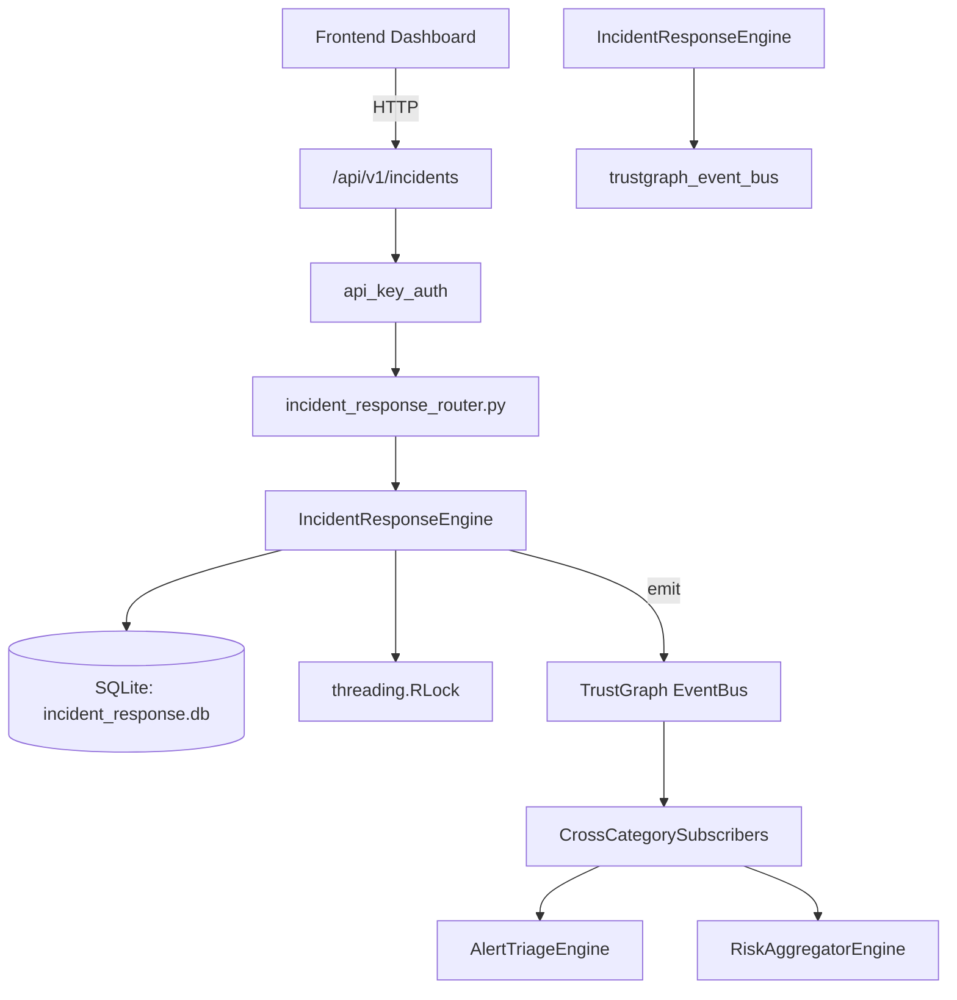

# US-0136: Incident Response

## Sub-Epic: SOC
**Master Goal**: ALDECI — $35/mo enterprise security intelligence platform replacing $50K-500K/yr tools

## User Story
As a **Karen Taylor (IR Lead)**, I need to manage incident response lifecycle
so that the platform delivers enterprise-grade soc capabilities at 1/1000th the cost of legacy tools.

## Why This Matters
Incident Response replaces functionality found in enterprise tools like CrowdStrike, Wiz, Snyk, and Rapid7.
By building this into ALDECI's $35/mo stack, customers save $50K+/yr on standalone SOC tooling.

## Architecture

## Current State: 95% Complete
- ✅ `create_incident()` — Create a new incident. Returns the full incident record. (line 166)
- ✅ `list_incidents()` — List incidents for an org, optionally filtered by status/severity. (line 222)
- ✅ `get_incident()` — Fetch a single incident by ID, enforcing org isolation. (line 244)
- ✅ `update_incident()` — Update mutable incident fields. Returns True if a row was updated. (line 254)
- ✅ `add_task()` — Add a task to an incident. Returns the full task record. (line 290)
- ✅ `list_tasks()` — List all tasks for an incident. (line 328)
- ❌ TrustGraph event emission — not yet verified

## Key Functions (from `suite-core/core/incident_response_engine.py` — 541 lines)
- `IncidentResponseEngine.create_incident()` — Create a new incident. Returns the full incident record. (line 166)
- `IncidentResponseEngine.list_incidents()` — List incidents for an org, optionally filtered by status/severity. (line 222)
- `IncidentResponseEngine.get_incident()` — Fetch a single incident by ID, enforcing org isolation. (line 244)
- `IncidentResponseEngine.update_incident()` — Update mutable incident fields. Returns True if a row was updated. (line 254)
- `IncidentResponseEngine.add_task()` — Add a task to an incident. Returns the full task record. (line 290)
- `IncidentResponseEngine.list_tasks()` — List all tasks for an incident. (line 328)
- `IncidentResponseEngine.complete_task()` — Mark a task as completed. Returns True if updated. (line 342)
- `IncidentResponseEngine.add_timeline_event()` — Record a timeline event for an incident. (line 361)

## Dependencies
- **Depends on**: trustgraph_event_bus
- **Depended by**: Routers, TrustGraph EventBus, CrossCategorySubscribers
- **TrustGraph**: Event emission wired via ResponseInterceptorMiddleware
- **Source file**: `suite-core/core/incident_response_engine.py` (541 lines)
- **Router file**: `suite-api/apps/api/incident_response_router.py`

## API Endpoints
| Method | Path | Description |
|--------|------|-------------|
| POST | `/api/v1/incidents` | create incident |
| GET | `/api/v1/incidents/stats` | get stats |
| GET | `/api/v1/incidents/templates/{incident_type}` | get playbook template |
| GET | `/api/v1/incidents` | list incidents |
| GET | `/api/v1/incidents/{incident_id}` | get incident |
| PUT | `/api/v1/incidents/{incident_id}/status` | update status |
| POST | `/api/v1/incidents/{incident_id}/steps/{step_order}/assign` | assign step |
| POST | `/api/v1/incidents/{incident_id}/steps/{step_order}/complete` | complete step |
| POST | `/api/v1/incidents/{incident_id}/timeline` | add timeline event |
| POST | `/api/v1/incidents/{incident_id}/post-mortem` | create post mortem |
| GET | `/api/v1/incidents/{incident_id}/post-mortem` | get post mortem |

## Tasks Remaining
1. Verify TrustGraph event emission works end-to-end (2h)
2. Add integration test with real persona workflow (2h)
3. Wire CrossCategorySubscriber consumer chain (1h)
4. Validate with 30-persona walkthrough (1h)
5. Optimize query performance for large datasets (2h)
6. Expand test coverage to edge cases (2h)

## Definition of Done
- [ ] Karen Taylor (IR Lead) can access /api/v1/incidents and get meaningful data
- [ ] All CRUD operations return correct HTTP status codes
- [ ] TrustGraph receives events from this engine
- [ ] 24+ tests passing in `tests/test_incident_response_engine.py`
- [ ] 30-persona walkthrough includes this endpoint at 100%
- [ ] No hardcoded org_id — all queries are org-scoped

## Sprint: Wave 46 (est. April 22-24, 2026)

## Test Coverage
- **Test file**: `tests/test_incident_response_engine.py`
- **Tests**: 24 tests
- **Status**: Passing
